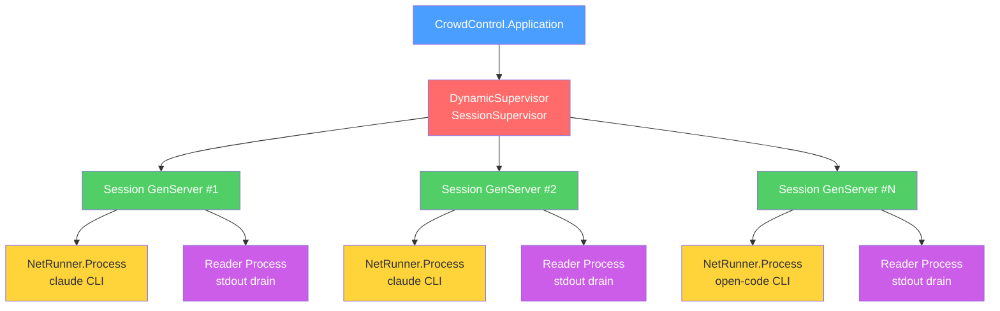
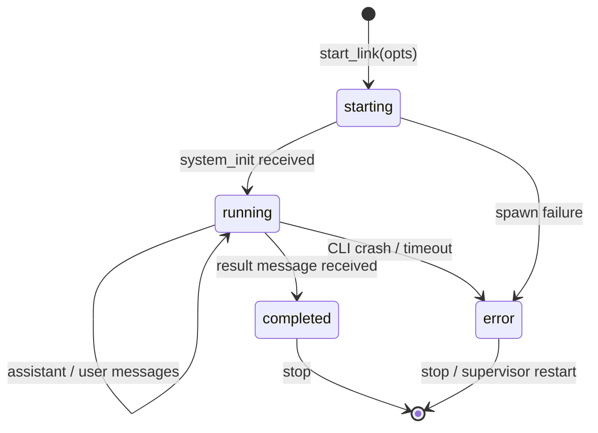
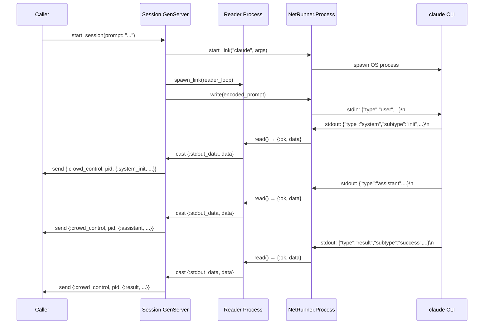
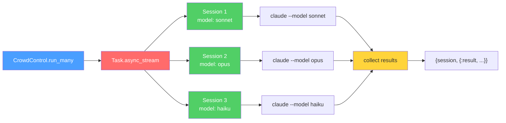
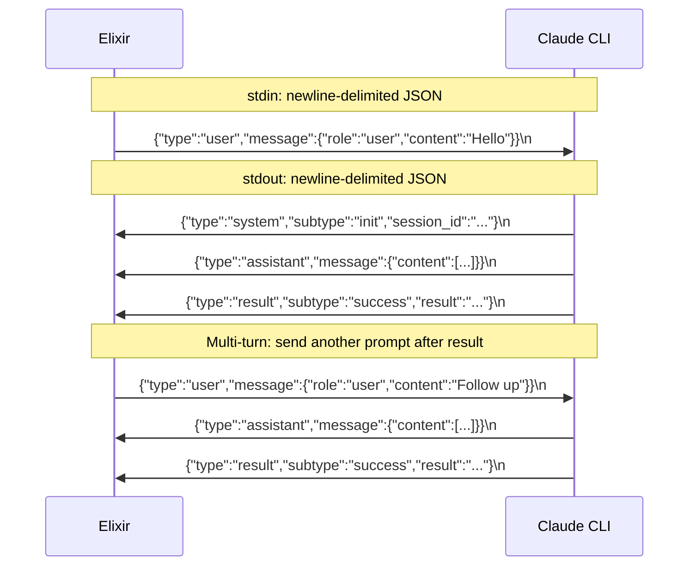
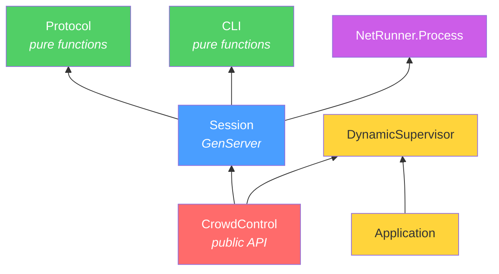
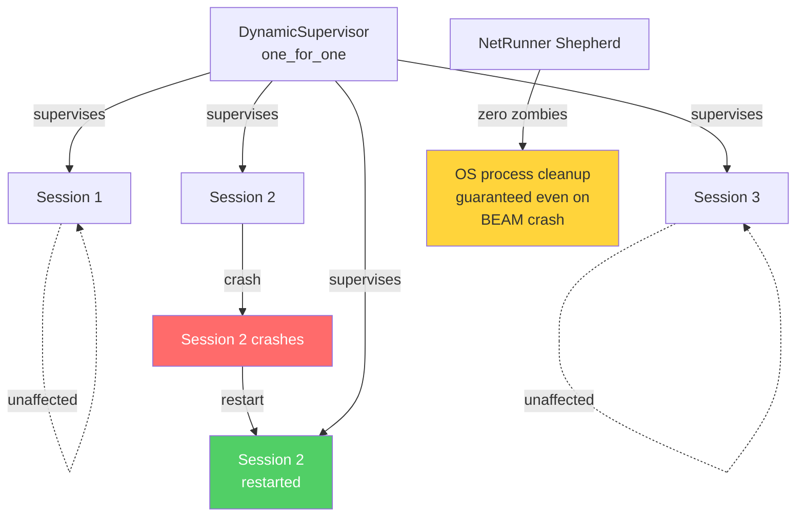

# CrowdControl

Orchestrate many Claude Code / Open Code CLI instances in parallel from Elixir.

Built on [net_runner](https://hex.pm/packages/net_runner) for zero-zombie subprocess management with NIF-based backpressure.

## Installation

```elixir
def deps do
  [
    {:crowd_control, "~> 0.1.0"}
  ]
end
```

## Quick Start

### Single session

```elixir
# Fire-and-forget single prompt
result = CrowdControl.run("Explain GenServer in one sentence",
  permission_mode: "bypassPermissions"
)
# => {:result, "success", %{"result" => "GenServer is...", "total_cost_usd" => 0.003}}
```

### Parallel sessions

```elixir
# Run 5 sessions with different prompts
opts_list = Enum.map(1..5, fn i ->
  [prompt: "Write a haiku about the number #{i}", permission_mode: "bypassPermissions"]
end)

{:ok, sessions} = CrowdControl.start_sessions(opts_list)
results = CrowdControl.collect(sessions, 120_000)
CrowdControl.stop_all(sessions)

# results is [{session_pid, {:result, "success", %{...}}}, ...]
```

### Same prompt, different models

```elixir
results = CrowdControl.run_many("What is the meaning of life?", [
  [model: "sonnet", permission_mode: "bypassPermissions"],
  [model: "opus", permission_mode: "bypassPermissions"],
  [model: "haiku", permission_mode: "bypassPermissions"]
])
```

### Multi-turn conversation

```elixir
{:ok, session} = CrowdControl.start_session(
  prompt: "You are a code reviewer. Wait for code to review.",
  permission_mode: "bypassPermissions"
)

CrowdControl.Session.subscribe(session)

# Wait for initial result, then send follow-up
receive do
  {:crowd_control, ^session, {:result, _, _}} -> :ok
end

CrowdControl.Session.send_prompt(session, "Review this: def add(a, b), do: a + b")

receive do
  {:crowd_control, ^session, {:result, _, %{"result" => review}}} ->
    IO.puts(review)
end

CrowdControl.Session.stop(session)
```

### Subscribing to streaming messages

```elixir
{:ok, session} = CrowdControl.start_session(
  prompt: "Write a short poem",
  permission_mode: "bypassPermissions",
  include_partial_messages: true
)

CrowdControl.Session.subscribe(session)

# Receive all messages as they stream
defmodule Listener do
  def loop do
    receive do
      {:crowd_control, _pid, {:system_init, %{"session_id" => sid}}} ->
        IO.puts("Session started: #{sid}")
        loop()

      {:crowd_control, _pid, {:assistant, %{"message" => msg}}} ->
        IO.puts("Assistant: #{inspect(msg["content"])}")
        loop()

      {:crowd_control, _pid, {:result, "success", %{"result" => text}}} ->
        IO.puts("Done: #{text}")

      {:crowd_control, _pid, {:exit, status}} ->
        IO.puts("Exited with status: #{status}")
    after
      30_000 -> IO.puts("Timeout")
    end
  end
end

Listener.loop()
```

### Using Open Code

```elixir
CrowdControl.run("Hello", executable: "open-code", permission_mode: "bypassPermissions")
```

## CLI Options

All options from `CrowdControl.CLI.build_command/1` can be passed to `start_session`, `run`, and `run_many`:

| Option | Description |
|--------|-------------|
| `:executable` | CLI binary name or path (default: `"claude"`) |
| `:prompt` | Initial prompt to send |
| `:model` | Model to use (`"sonnet"`, `"opus"`, `"haiku"`) |
| `:system_prompt` | Custom system prompt |
| `:allowed_tools` | List of allowed tool names |
| `:permission_mode` | Permission mode string |
| `:max_budget_usd` | Spending ceiling |
| `:session_id` | Session ID for new sessions |
| `:resume` | Session ID to resume |
| `:continue` | `true` to continue most recent session |
| `:add_dir` | Additional project directory |
| `:include_partial_messages` | `true` for streaming deltas |
| `:no_session_persistence` | `true` to skip saving to disk |
| `:extra_args` | List of additional CLI arguments |

## Architecture

### Supervision Tree



### Session Lifecycle



### Message Flow



### Parallel Execution



### Wire Protocol (stream-json)



### Module Dependency



### Fault Tolerance


