# CrowdControl

[](https://github.com/nikoma/crowd_control/actions/workflows/ci.yml)
[](https://hex.pm/packages/crowd_control)
[](https://hexdocs.pm/crowd_control)
[](https://github.com/nyo16/CrowdControl/blob/master/LICENSE)

Orchestrate many [Claude Code](https://github.com/anthropics/claude-code) / [Open Code](https://github.com/anthropics/open-code) / [omp](https://omp.sh/) CLI instances in parallel from Elixir.

Built on [net_runner](https://hex.pm/packages/net_runner) for zero-zombie subprocess management with NIF-based backpressure. Security disclosures: see [`SECURITY.md`](SECURITY.md). Contributing guide: [`CONTRIBUTING.md`](CONTRIBUTING.md). Runnable examples: [`examples/`](https://github.com/nyo16/CrowdControl/tree/master/examples).

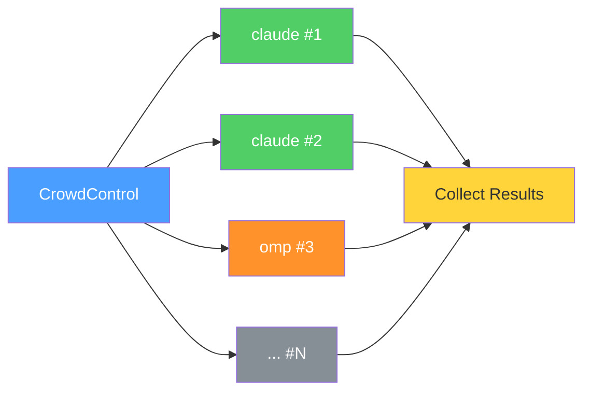

## Features

- Run N Claude Code / Open Code / omp sessions in parallel
- Fan-out the same prompt across different models
- Multi-turn conversations with subscriber-based message delivery
- Fault-isolated sessions via OTP DynamicSupervisor
- Zero zombie OS processes guaranteed by net_runner's Shepherd
- Docker support with project directory mounting
- Sandbox each session in a container, a Compose stack or a GCE spot VM — one transport, pluggable [providers](#sandbox-providers)
- Works with the `claude`, `open-code` and `omp` CLIs — one message contract for all three
- **Security hardened**: non-root Docker container, API key protection, capability dropping, resource limits
- Configurable session concurrency limits and timeouts
- Input validation and structured logging

## Installation

### As a dependency

```elixir
def deps do
  [
    {:crowd_control, "~> 0.1.0"}
  ]
end
```

### From source

```bash
git clone git@github.com:nyo16/CrowdControl.git
cd CrowdControl
mix deps.get
mix compile
```

## Quick Start

### Single session

```elixir
result = CrowdControl.run("Explain GenServer in one sentence",
  permission_mode: "bypassPermissions"
)
# => {:result, "success", %{"result" => "GenServer is...", "total_cost_usd" => 0.003}}
```

### Parallel sessions

```elixir
# Run 5 sessions with different prompts
opts_list = Enum.map(1..5, fn i ->
  [prompt: "Write a haiku about the number #{i}", permission_mode: "bypassPermissions"]
end)

{:ok, sessions} = CrowdControl.start_sessions(opts_list)
results = CrowdControl.collect(sessions, 120_000)
CrowdControl.stop_all(sessions)

# results is [{session_pid, {:result, "success", %{...}}}, ...]
```

### Same prompt, different models

```elixir
results = CrowdControl.run_many("What is the meaning of life?", [
  [model: "sonnet", permission_mode: "bypassPermissions"],
  [model: "opus", permission_mode: "bypassPermissions"],
  [model: "haiku", permission_mode: "bypassPermissions"]
])
```

### Multi-turn conversation

```elixir
{:ok, session} = CrowdControl.start_session(
  prompt: "You are a code reviewer. Wait for code to review.",
  permission_mode: "bypassPermissions"
)

CrowdControl.Session.subscribe(session)

# Wait for initial result, then send follow-up
receive do
  {:crowd_control, ^session, {:result, _, _}} -> :ok
end

CrowdControl.Session.send_prompt(session, "Review this: def add(a, b), do: a + b")

receive do
  {:crowd_control, ^session, {:result, _, %{"result" => review}}} ->
    IO.puts(review)
end

CrowdControl.Session.stop(session)
```

### Subscribing to streaming messages

```elixir
{:ok, session} = CrowdControl.start_session(
  prompt: "Write a short poem",
  permission_mode: "bypassPermissions",
  include_partial_messages: true
)

CrowdControl.Session.subscribe(session)

# Receive all messages as they stream
defmodule Listener do
  def loop do
    receive do
      {:crowd_control, _pid, {:system_init, %{"session_id" => sid}}} ->
        IO.puts("Session started: #{sid}")
        loop()

      {:crowd_control, _pid, {:assistant, %{"message" => msg}}} ->
        IO.puts("Assistant: #{inspect(msg["content"])}")
        loop()

      {:crowd_control, _pid, {:result, "success", %{"result" => text}}} ->
        IO.puts("Done: #{text}")

      {:crowd_control, _pid, {:exit, status}} ->
        IO.puts("Exited with status: #{status}")
    after
      30_000 -> IO.puts("Timeout")
    end
  end
end

Listener.loop()
```

### Using Open Code

```elixir
# Single session with open-code
CrowdControl.run("Hello", executable: "open-code", permission_mode: "bypassPermissions")

# Mix claude and open-code in the same parallel run
CrowdControl.run_many("Explain recursion", [
  [executable: "claude", model: "sonnet", permission_mode: "bypassPermissions"],
  [executable: "open-code", permission_mode: "bypassPermissions"]
])
```

### Using omp (Oh My Pi)

[omp](https://omp.sh/) speaks its own JSON-RPC protocol over stdio, so it gets
its own adapter (`CrowdControl.Agent.Omp`). Select it with `agent: :omp` — or
just name the binary, which infers the adapter:

```elixir
# Single omp session (agent inferred from the executable)
CrowdControl.run("Hello", executable: "omp", permission_mode: "bypassPermissions")

# Explicit adapter, omp-native options
CrowdControl.run("Summarize this repo",
  agent: :omp,
  model: "anthropic/claude-haiku-4-5",
  approval_mode: "yolo",
  thinking: "off",
  no_session_persistence: true
)

# Fan the same prompt across all three CLIs
CrowdControl.run_many("Explain recursion", [
  [executable: "claude", model: "sonnet", permission_mode: "bypassPermissions"],
  [executable: "open-code", permission_mode: "bypassPermissions"],
  [agent: :omp, permission_mode: "bypassPermissions"]
])
```

The messages are the same for every agent: `{:system_init, %{"session_id" => id}}`
once the CLI is up, `{:assistant, _}` / `{:stream_event, _}` while it works, and
`{:result, "success", %{"result" => text, "total_cost_usd" => cost}}` at the end
of a turn. `CrowdControl.collect/2` therefore works across a mixed fan-out.

Behind the scenes the adapter runs `omp --mode rpc`, asks for `get_state` to
surface the session id, and treats a terminal `agent_end` frame as the end of a
turn. Claude Code's `:permission_mode` is translated to omp's approval modes
(`"bypassPermissions"` => `yolo`, `"acceptEdits"` => `write`, `"default"` =>
`always-ask`); Claude-Code-only options such as `:mcp_config` or
`:max_budget_usd` raise instead of being silently dropped. See
`CrowdControl.Agent.Omp` for the full option list.

### Custom providers: vLLM, LiteLLM, any OpenAI-compatible endpoint

omp reads a provider's `baseUrl` from `models.yml` under its agent directory —
there is no CLI flag for it. `:custom_provider` renders that file into a
private `0700` temp directory and points the session at it:

```elixir
# Self-hosted vLLM, no auth. Models are discovered from /v1/models,
# including vLLM's max_model_len as the context window.
CrowdControl.run("Review this diff",
  agent: :omp,
  custom_provider: [base_url: "http://10.0.0.5:8000/v1"],
  model: "vllm/Qwen/Qwen3-Coder-30B",
  approval_mode: "yolo"
)

# Authenticated endpoint. The key is passed through the same 0600 env-file
# channel as every other credential — it is never written into models.yml
# and never appears in argv or `ps`.
CrowdControl.run("Review this diff",
  agent: :omp,
  custom_provider: [
    id: "my-gateway",
    base_url: "https://gateway.internal/v1",
    api_key: System.fetch_env!("GATEWAY_KEY")
  ],
  model: "my-gateway/qwen3-coder"
)

# A server without /v1/models: declare the models yourself.
CrowdControl.run("Review this diff",
  agent: :omp,
  custom_provider: [
    base_url: "http://10.0.0.5:8000/v1",
    models: [[id: "Qwen/Qwen3-Coder-30B", context_window: 262_144, max_tokens: 65_536]]
  ],
  model: "vllm/Qwen/Qwen3-Coder-30B"
)
```

Fan out across several vLLM hosts, or mix local and hosted models in one run:

```elixir
CrowdControl.run_many("Explain recursion", [
  [agent: :omp, custom_provider: [base_url: "http://gpu-a:8000/v1"], model: "vllm/qwen3-coder"],
  [agent: :omp, custom_provider: [base_url: "http://gpu-b:8000/v1"], model: "vllm/llama-3.3-70b"],
  [agent: :omp, model: "anthropic/claude-haiku-4-5"]
])
```

Spec keys: `:base_url` (required), `:id` (default `"vllm"`, and the `provider/`
prefix in `:model`), `:api` (`"openai-completions"`, `"openai-responses"`, or
`"anthropic-messages"`), `:api_key`, `:api_key_env`, `:models`, `:headers`.

The generated directory is content-addressed, so every session in a fan-out
sharing one spec shares one directory. Build it yourself with
`CrowdControl.Agent.Omp.provider_dir!/1` and pass `:agent_dir` to own the
lifecycle, and `remove_provider_dir/1` to delete it.

> **`PI_CODING_AGENT_DIR` relocates more than `models.yml`.** It moves the whole
> `~/.omp/agent` base for that session — `config.yml`, the auth store, saved
> sessions — so a custom-provider session starts with none of your global omp
> settings and none of your stored logins. Usually what you want for an isolated
> endpoint; add `inherit_auth: true` when you want the logins back (see
> [Authentication](#authentication)). `~/.omp` itself (skills, plugins) is
> unaffected. For the Docker and Kubernetes backends the directory must exist
> *inside* the sandbox: mount your own and pass `:agent_dir`.

### Tuning prefill against a self-hosted endpoint

A coding agent sends its whole system prompt and tool schema on every turn. On a
hosted provider that is absorbed by prompt caching and priced at a discount; on
your own GPU it is prefill you pay for in latency.

Both CLIs default to a large prompt, and both can be trimmed. Measured against
one vLLM box (`deepseek-v4-flash`), three runs per row, prompt tokens and
request count read from vLLM's own `/metrics`:

| Configuration | Prompt tokens | Requests/turn | Wall time |
|---|---|---|---|
| `agent: :claude`, default | 28,631 | 1 | ~2.0s |
| `agent: :claude` + `CLAUDE_CODE_DISABLE_NONESSENTIAL_TRAFFIC=1` | **23,850** (−17%) | 1 | ~1.7s |
| `agent: :omp`, default | 20,641 | 1, **sometimes 2** | 1.8–2.6s |
| `agent: :omp` + `no_extensions: true` | 20,641 | **1** | ~1.2s |
| `agent: :omp` + `no_extensions`, `no_skills`, `no_rules` | **17,072** (−17%) | 1 | ~1.2s |

```elixir
# omp, trimmed
CrowdControl.run("…", agent: :omp,
  custom_provider: [base_url: "http://10.0.0.5:8000/v1"],
  model: "vllm/…",
  no_extensions: true, no_skills: true, no_rules: true)

# Claude Code, trimmed
CrowdControl.run("…", api_url: "http://10.0.0.5:8000", auth_token: key,
  model: "…", env: %{"CLAUDE_CODE_DISABLE_NONESSENTIAL_TRAFFIC" => "1"})
```

Two things worth knowing before you go hunting further:

- **Prefix caching is not the problem.** Both agents sat at a **99% vLLM
  prefix-cache hit rate** out of the box, across separate sessions. Nothing in
  either CLI's default configuration defeats it.
- **`DISABLE_PROMPT_CACHING=1` does nothing here.** It controls the Anthropic
  `cache_control` breakpoints in the request body; vLLM ignores those and does
  its own automatic, content-addressed prefix caching. Measured identical
  (99.2%, 28,631 tokens) with and without it.

The omp "sometimes 2 requests" row is the one real trap: a discovered extension
fires a second full-size (~20k token) call on some turns, roughly doubling
prefill. `no_extensions: true` removes it and makes latency stable.

`no_skills`/`no_rules`/`no_extensions` trade capability for prefill — drop them
if a session actually needs those. Numbers are from one model on one box; re-measure
with `curl $BASE/metrics | grep prefix_cache` on yours.

### Working with project directories

```elixir
# Point sessions at a specific project
CrowdControl.run("Find and fix the failing test",
  add_dir: "/path/to/my/project",
  permission_mode: "bypassPermissions",
  allowed_tools: ["Read", "Edit", "Bash"]
)

# Fan out across multiple repos
repos = [
  "/home/user/api-service",
  "/home/user/web-frontend",
  "/home/user/mobile-app"
]

opts_list = Enum.map(repos, fn repo ->
  [
    prompt: "List all TODO comments in the codebase",
    add_dir: repo,
    permission_mode: "bypassPermissions"
  ]
end)

{:ok, sessions} = CrowdControl.start_sessions(opts_list)
results = CrowdControl.collect(sessions)
```

### Custom API URL and token

```elixir
# Use a custom API key per session
CrowdControl.run("Hello",
  api_key: "sk-ant-your-key-here",
  permission_mode: "bypassPermissions"
)

# Point to a custom API endpoint (proxy, gateway, self-hosted)
CrowdControl.run("Hello",
  api_url: "https://your-proxy.example.com/v1",
  api_key: "sk-ant-your-key-here",
  permission_mode: "bypassPermissions"
)

# Different keys per session (e.g. separate billing)
CrowdControl.run_many("Summarize this repo", [
  [api_key: "sk-team-alpha", model: "sonnet"],
  [api_key: "sk-team-beta", model: "opus"]
])

# Arbitrary environment variables
CrowdControl.run("Debug this",
  env: %{
    "ANTHROPIC_API_KEY" => "sk-custom",
    "ANTHROPIC_BASE_URL" => "https://gateway.internal/v1",
    "HTTP_PROXY" => "http://proxy:8080",
    "NODE_OPTIONS" => "--max-old-space-size=4096"
  },
  permission_mode: "bypassPermissions"
)
```

### Settings and config files

```elixir
# Load a custom settings JSON file
CrowdControl.run("Fix the tests",
  settings: "/config/claude_settings.json",
  add_dir: "/workspace",
  permission_mode: "bypassPermissions"
)

# Inline settings as JSON string
CrowdControl.run("Audit this code",
  settings: ~s({"permissions":{"allow":["Read","Bash(git:*)"],"deny":["Edit","Write"]}}),
  add_dir: "/workspace"
)

# Load MCP server configs
CrowdControl.run("Search the GitHub repo for issues",
  mcp_config: "/config/mcp_servers.json",
  strict_mcp_config: true,
  permission_mode: "bypassPermissions"
)

# Load multiple MCP configs
CrowdControl.run("Analyze the project",
  mcp_config: ["/config/mcp_filesystem.json", "/config/mcp_github.json"],
  permission_mode: "bypassPermissions"
)

# Custom agents per session
CrowdControl.run_many("Review this PR", [
  [
    agents: %{
      "security" => %{
        "description" => "Security reviewer",
        "prompt" => "Focus only on security vulnerabilities and data leaks."
      }
    },
    add_dir: "/workspace"
  ],
  [
    agents: %{
      "perf" => %{
        "description" => "Performance reviewer",
        "prompt" => "Focus only on performance bottlenecks and N+1 queries."
      }
    },
    add_dir: "/workspace"
  ]
])

# Bare mode (skip hooks, LSP, plugins, auto-memory)
CrowdControl.run("Quick analysis",
  bare: true,
  settings: "/config/claude_settings_permissive.json",
  add_dir: "/workspace",
  permission_mode: "bypassPermissions"
)

# Control which setting sources are loaded
CrowdControl.run("Check the code",
  setting_sources: ["user", "project"],
  add_dir: "/workspace"
)

# Load plugins from a directory
CrowdControl.run("Process this",
  plugin_dir: "/plugins/my-plugin",
  permission_mode: "bypassPermissions"
)
```

### Budget control

```elixir
# Cap spending per session
CrowdControl.run_many("Refactor this module for clarity", [
  [add_dir: "/path/to/project", model: "sonnet", max_budget_usd: 0.50],
  [add_dir: "/path/to/project", model: "opus", max_budget_usd: 2.00]
])
```

### Resource limits

Each session bounds its own memory and lifetime so a misbehaving CLI can't
exhaust the host. All limits are per-session options with safe defaults:

```elixir
CrowdControl.start_session(
  # ceiling on a single TURN. Armed at start, re-armed by send_prompt/2 --
  # not by output, so a turn that streams for longer is still killed
  # mid-flight. Size it against the slowest turn, not the conversation.
  timeout: 300_000,
  # reject prompts larger than this with {:error, :prompt_too_large}
  max_prompt_size: 1_000_000,
  # a single newline-free output line over this kills the subprocess and
  # broadcasts {:error, :line_too_large} instead of buffering unbounded.
  # Defaults to 1 MiB, matching the maxFrameBytes omp advertises.
  max_line_bytes: 1_048_576,
  # cap on messages kept for get_messages/1 (oldest dropped past the cap);
  # live subscribers still receive every message
  max_messages: 10_000
)
```

## Authentication

Every credential below reaches the CLI through the session's **environment**, never
through argv: a `0600` env file that is sourced and deleted before the CLI starts
(`Backend.Local`), or the exec `Env` array (Docker, Kubernetes). Nothing shows up in
`ps`.

### Which option do I pass?

| You have | `agent: :claude` / `:open_code` | `agent: :omp` |
|---|---|---|
| **API key** (pay-per-use) | `api_key: "sk-ant-…"` → `ANTHROPIC_API_KEY` | same |
| **Subscription**, headless (Pro/Max/Team) | `oauth_token: "…"` from `claude setup-token` → `CLAUDE_CODE_OAUTH_TOKEN` | `oauth_token: "…"` → `ANTHROPIC_OAUTH_TOKEN` |
| **Subscription**, already logged in on this host | `env: %{"CLAUDE_CONFIG_DIR" => "/home/me/.claude"}` | nothing — omp reads `~/.omp/agent/agent.db` automatically |
| **Self-hosted endpoint** (vLLM, SGLang, LiteLLM) | `api_url:` + `auth_token:` — **only if it serves `/v1/messages`** | `custom_provider: [base_url: …, api_key: …]` |
| **Another hosted provider** (OpenAI, Groq, …) | only through an Anthropic-compatible gateway | `env: %{"OPENAI_API_KEY" => …}` |
| **Gateway / proxy** | `api_url:` + (`auth_token:` for Bearer, `api_key:` for `x-api-key`) | `custom_provider: [base_url: …, api_key: …]` |

The difference in that first row is the wire protocol, not the vendor. **Claude
Code speaks only the Anthropic Messages API**, so an endpoint has to serve
`/v1/messages`; an OpenAI-only `/v1/chat/completions` server will not work with
it. **omp speaks OpenAI-compatible** through `:custom_provider` (and
`api: "anthropic-messages"` when you want the other shape). Recent vLLM builds
serve both, so either agent can drive them:

```bash
# does this endpoint speak Anthropic?
curl -sS $BASE/v1/messages -H "Authorization: Bearer $KEY" \
  -H 'content-type: application/json' \
  -d '{"model":"…","max_tokens":16,"messages":[{"role":"user","content":"hi"}]}'
# a body with "type": "message" => Claude Code can drive it
```

```elixir
# Claude Code against a self-hosted Anthropic-compatible endpoint
CrowdControl.run("Summarize this repo",
  api_url: "http://10.0.0.5:8000",        # no /v1 -- the CLI appends it
  auth_token: System.fetch_env!("VLLM_KEY"),
  model: "deepseek-v4-flash"
)

# omp against the OpenAI-compatible side of the same server
CrowdControl.run("Summarize this repo",
  agent: :omp,
  custom_provider: [base_url: "http://10.0.0.5:8000/v1", api_key: System.fetch_env!("VLLM_KEY")],
  model: "vllm/deepseek-v4-flash"
)
```

`:api_key` sends `x-api-key`, `:auth_token` sends `Authorization: Bearer` — most
self-hosted servers want the latter. `"total_cost_usd"` is meaningless on a
self-hosted model: Claude Code prices it against Anthropic's table, omp reports
`0.0`. For a hosted provider under omp that is not Anthropic, use `:env` with the
variable that provider documents.

### Subscription passthrough, in one line each

```elixir
# omp, host already logged in: nothing to pass.
CrowdControl.run("Explain this repo", agent: :omp)

# omp, headless (CI, container, another user):
CrowdControl.run("Explain this repo", agent: :omp, oauth_token: System.fetch_env!("OMP_OAUTH"))

# Claude Code, headless: token from `claude setup-token`
CrowdControl.run("Explain this repo", oauth_token: System.fetch_env!("CLAUDE_OAUTH"))

# Claude Code, inherit an existing ~/.claude login
CrowdControl.run("Explain this repo", env: %{"CLAUDE_CONFIG_DIR" => "/home/me/.claude"})
```

A subscription and a self-hosted endpoint can coexist in **one** omp session. The
catch: `:custom_provider` relocates omp's agent directory, which is where the stored
login lives, so opt back in with `inherit_auth: true`:

```elixir
CrowdControl.run("Compare these two approaches",
  agent: :omp,
  custom_provider: [base_url: "http://10.0.0.5:8000/v1", inherit_auth: true],
  model: "anthropic/claude-haiku-4-5"   # or "vllm/…" — both resolve
)
```

> `inherit_auth` symlinks your OAuth store into a directory the session's own `bash`
> tool can read, while that session may be talking to a third-party endpoint. It is
> off by default for that reason. Turn it on for endpoints you trust.

### Claude Code auth methods

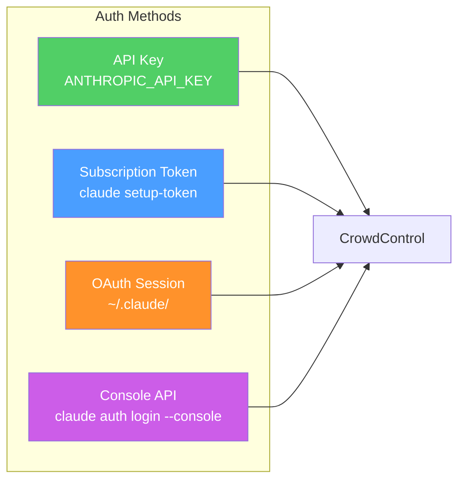

### API key (pay-per-use)

The simplest method. Set per-session or via environment:

```elixir
# Via environment variable (all sessions inherit)
# export ANTHROPIC_API_KEY=sk-ant-...

# Or per-session
CrowdControl.run("Hello", api_key: "sk-ant-your-key-here")

# Different keys per session (separate billing)
CrowdControl.run_many("Summarize this", [
  [api_key: "sk-team-alpha"],
  [api_key: "sk-team-beta"]
])
```

### Claude subscription (Pro/Max/Team)

For subscription-based billing without an API key. Two options:

**Option 1: Interactive login (local machine)**

```bash
# Login once — stores OAuth token in ~/.claude/
claude auth login
```

Then pass your `~/.claude` directory so sessions pick up the token:

```elixir
# Sessions inherit the subscription auth from ~/.claude
CrowdControl.run("Hello",
  env: %{"CLAUDE_CONFIG_DIR" => "/home/crowdctl/.claude"},
  permission_mode: "bypassPermissions"
)
```

**Option 2: Setup token (headless / Docker / CI)**

```bash
# Generate a long-lived token (requires Claude subscription)
claude setup-token
# Paste the token when prompted — stored in ~/.claude/
```

For Docker, mount `~/.claude` into the container:

```bash
docker run -it \
  -v ~/.claude:/home/crowdctl/.claude \
  -v "$(pwd)":/workspace \
  crowd_control
```

### Console API (Anthropic Console billing)

```bash
claude auth login --console
```

Works the same as subscription — mount `~/.claude/` to share the session.

### Auth in Docker

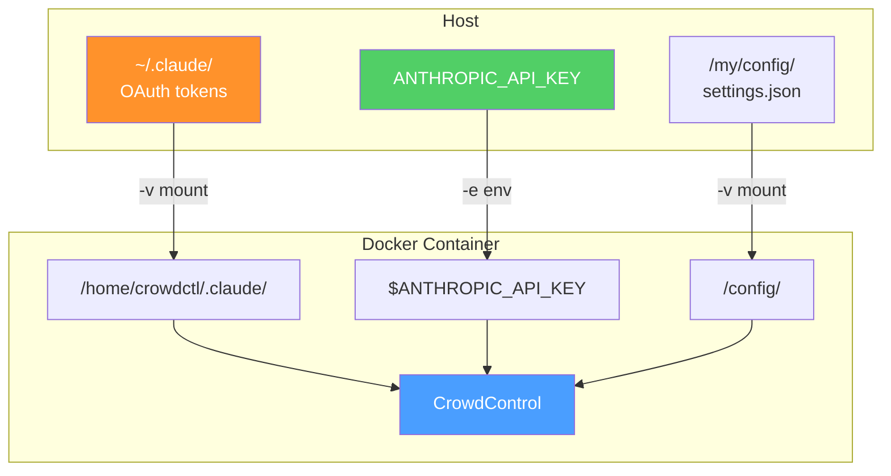

| Method | Docker flag | Notes |
|--------|-------------|-------|
| API key | `-e ANTHROPIC_API_KEY=sk-...` | Simplest, pay-per-use |
| Subscription | `-v ~/.claude:/home/crowdctl/.claude` | Mount OAuth tokens |
| Setup token | `-v ~/.claude:/home/crowdctl/.claude` | For CI/headless |
| Per-session key | Set via `:api_key` option in IEx | Different keys per session |

## Docker

Run CrowdControl in a hardened Linux container with your project directory and config mounted in.

The container is security-hardened out of the box:

- **Non-root user**: runs as `crowdctl` (not root)
- **Capabilities dropped**: all Linux capabilities removed (`cap_drop: ALL`)
- **No privilege escalation**: `no-new-privileges` security option
- **Read-only filesystem**: root FS is read-only with tmpfs for `/tmp`, `~/.claude`, `~/.npm`
- **Resource limits**: memory and CPU limits configured in docker-compose
- **Health check**: built-in `HEALTHCHECK` via `CrowdControl.healthy?/0`
- **Pinnable CLI version**: `CLAUDE_CODE_VERSION` build arg for reproducible builds

### Build the image

```bash
# Build with latest Claude Code CLI
docker build -t crowd_control .

# Pin a specific Claude Code version
docker build --build-arg CLAUDE_CODE_VERSION=1.0.16 -t crowd_control .
```

### Run with API key

```bash
docker run -it \
  -e ANTHROPIC_API_KEY=$ANTHROPIC_API_KEY \
  -v "$(pwd)":/workspace \
  crowd_control
```

### Run with subscription auth

```bash
docker run -it \
  -v ~/.claude:/home/crowdctl/.claude \
  -v "$(pwd)":/workspace \
  crowd_control
```

### Mount custom config files

```bash
docker run -it \
  -e ANTHROPIC_API_KEY=$ANTHROPIC_API_KEY \
  -v "$(pwd)":/workspace \
  -v /path/to/my/configs:/config \
  crowd_control
```

The container has built-in template configs at `/config/templates/`:

| Template | Description |
|----------|-------------|
| `claude_settings.json` | Default settings with common tool permissions |
| `claude_settings_permissive.json` | Permissive settings (all tools allowed) |
| `mcp_servers.json` | MCP server config (filesystem + GitHub) |
| `agents.json` | Pre-built agents (reviewer, refactorer, documenter, tester) |
| `opencode_settings.json` | Open Code provider/tool configuration |

Use them directly or as a starting point:

```elixir
# Use built-in template
CrowdControl.run("Review this",
  settings: "/config/templates/claude_settings_permissive.json",
  add_dir: "/workspace"
)

# Use your own mounted config
CrowdControl.run("Analyze with MCP tools",
  settings: "/config/my_settings.json",
  mcp_config: "/config/my_mcp.json",
  add_dir: "/workspace"
)
```

### Mount everything (full setup)

```bash
docker run -it \
  -v ~/.claude:/home/crowdctl/.claude \
  -v "$(pwd)":/workspace \
  -v /path/to/configs:/config \
  -v /path/to/plugins:/plugins \
  crowd_control
```

```elixir
# Full-featured session with subscription auth, config, MCP, and plugins
CrowdControl.run("Deep code review",
  settings: "/config/claude_settings.json",
  mcp_config: "/config/mcp_servers.json",
  plugin_dir: "/plugins/my-plugin",
  add_dir: "/workspace",
  permission_mode: "bypassPermissions"
)
```

This drops you into an IEx shell. Your project is available at `/workspace`:

```elixir
CrowdControl.run("Analyze the code in /workspace",
  add_dir: "/workspace",
  permission_mode: "bypassPermissions"
)
```

### Custom API endpoint

```bash
docker run -it \
  -e ANTHROPIC_API_KEY=$ANTHROPIC_API_KEY \
  -e ANTHROPIC_BASE_URL=https://your-proxy.example.com/v1 \
  -v "$(pwd)":/workspace \
  crowd_control
```

Or set per-session inside IEx:

```elixir
# Each session can target a different API endpoint
CrowdControl.run_many("Hello", [
  [api_url: "https://gateway-us.internal/v1", api_key: "sk-us-key"],
  [api_url: "https://gateway-eu.internal/v1", api_key: "sk-eu-key"]
])
```

### Mount a different directory

```bash
docker run -it \
  -e ANTHROPIC_API_KEY=$ANTHROPIC_API_KEY \
  -v /path/to/your/project:/workspace \
  crowd_control
```

### Mount multiple project directories

```bash
docker run -it \
  -e ANTHROPIC_API_KEY=$ANTHROPIC_API_KEY \
  -v /home/user/api:/projects/api \
  -v /home/user/web:/projects/web \
  -v /home/user/docs:/projects/docs \
  crowd_control
```

Then inside IEx:

```elixir
# Scan all three repos in parallel
opts_list = [
  [prompt: "Find security issues", add_dir: "/projects/api"],
  [prompt: "Find security issues", add_dir: "/projects/web"],
  [prompt: "Check for outdated links", add_dir: "/projects/docs"]
]
|> Enum.map(&Keyword.merge(&1, permission_mode: "bypassPermissions"))

{:ok, sessions} = CrowdControl.start_sessions(opts_list)
results = CrowdControl.collect(sessions, 300_000)
```

### Docker Compose

```bash
# Mount current directory
ANTHROPIC_API_KEY=sk-... docker compose run crowd_control

# Mount a specific project
ANTHROPIC_API_KEY=sk-... PROJECT_DIR=/path/to/project docker compose run crowd_control

# Run multiple isolated workers
ANTHROPIC_API_KEY=sk-... WORKER_COUNT=5 docker compose up worker
```

### Docker architecture

```mermaid
graph TD
    subgraph Host
        PD1[Project Dir A]
        PD2[Project Dir B]
        KEY[ANTHROPIC_API_KEY]
    end

    subgraph Docker Container
        IEX[IEx Shell]
        CC[CrowdControl]
        CC --> S1[Session 1<br/>claude CLI]
        CC --> S2[Session 2<br/>claude CLI]
        CC --> S3[Session 3<br/>open-code CLI]

        WS1[/workspace]
        WS2[/projects/api]
        WS3[/projects/web]
    end

    PD1 -->|"-v mount"| WS1
    PD1 -->|"-v mount"| WS2
    PD2 -->|"-v mount"| WS3
    KEY -->|"-e env"| CC

    S1 --> WS2
    S2 --> WS3
    S3 --> WS1

    style CC fill:#4a9eff,color:#fff
    style S1 fill:#51cf66,color:#fff
    style S2 fill:#51cf66,color:#fff
    style S3 fill:#ff922b,color:#fff
```

## Sandbox Backends

> **Not the same as the "Docker" section above.** That section is about running
> *CrowdControl itself* inside a container. This section is about CrowdControl
> putting *each CLI session* inside its own container. They are independent —
> you can use either, both, or neither.

By default a session runs the CLI as a local subprocess. A `backend` option
swaps that for something else:

```elixir
# Default — a local subprocess, exactly as before.
CrowdControl.start_session(prompt: "hi")

# Each session gets its own container.
CrowdControl.start_session(
  backend: {CrowdControl.Backend.Docker, image: "my-cli:latest"},
  prompt: "hi"
)
```

Implement `CrowdControl.Backend` for anything else: nine required callbacks,
plus `scrub/1` — optional in the behaviour, but mandatory in practice for any
backend whose handle carries credentials — and `push_workspace/2` /
`pull_artifacts/2`, which no backend ships yet.

| Backend | Sandbox | Survives a VM restart? |
|---------|---------|------------------------|
| `Backend.Local` (default) | local subprocess | no — dies with the VM |
| `Backend.Docker` | container | yes — reattachable |
| `Backend.Kubernetes` | Pod, over the API server | yes — reattachable |
| `Backend.Sandboxd` | whatever its **provider** supplies — a container, a stack, or a VM | yes — reattachable |

`Backend.Sandboxd` is the odd one out: it is a transport with no substrate of
its own, and pairs with a `CrowdControl.Provider` that supplies one. If you want
a Compose stack or a cloud VM rather than a single container, that is the section
you want — see [Sandbox Providers](#sandbox-providers).

### Docker backend

Requires the optional `:req` dependency:

```elixir
{:req, "~> 0.5"}
```

```elixir
CrowdControl.start_session(
  backend: {CrowdControl.Backend.Docker,
    image: "my-cli:latest",
    network_mode: "none",
    cpus: 1.5,
    memory: 512 * 1024 * 1024,
    max_stream_bytes: 100 * 1024 * 1024
  },
  prompt: "Refactor lib/foo.ex"
)
```

| Option | Default | Notes |
|--------|---------|-------|
| `:image` | — | **Required.** Needs the CLI and `sh` on `PATH` |
| `:docker_host` | `unix:///var/run/docker.sock` | `tcp://host:port` also works |
| `:network_mode` | `"none"` | **Required** when `:proxy_url`/`:api_url` is set — see below |
| `:cpus` | unset | Fractional, e.g. `1.5` |
| `:memory` | unset | Bytes |
| `:tee_path` | `/var/log/cc/out.jsonl` | Where output is recorded |
| `:fifo_path` | `/var/run/cc.fifo` | Where prompts are written |
| `:max_stream_bytes` | `nil` (unbounded) | Destroys the sandbox past this much total output |
| `:max_inflight_bytes` | 4 MiB | Reader backpressure watermark |
| `:proxy_url`, `:session_token` | unset | Egress proxy — see [SECURITY.md](SECURITY.md#egress-proxy-contract) |

Hardening:

| Option | Default | Notes |
|--------|---------|-------|
| `:cap_drop` | `["ALL"]` | On by default; a CLI needs no capabilities |
| `:security_opt` | `["no-new-privileges:true"]` | On by default |
| `:pids_limit` | `512` | On by default — `:memory`/`:cpus` do **not** bound PIDs |
| `:user` | image default | Opt-in, e.g. `"1000:1000"`; recommended |
| `:readonly_rootfs` | `false` | Opt-in; `:tmpfs` keeps the fifo and tee writable |

The three capability settings default on because the sandbox runs untrusted
model-driven code and none of them breaks an ordinary CLI. `:user` and
`:readonly_rootfs` are opt-in because both genuinely break images that expect
root or write outside the tmpfs mounts — enable them where your image allows.

No custom image is required beyond having the CLI and `sh` available —
CrowdControl injects everything else it needs at provision time.

**Networking is never inferred.** Setting `:proxy_url` or `:api_url` without an
explicit `:network_mode` returns `{:error, {:docker, :network_mode_required}}`
rather than silently picking `bridge`, which would give the sandbox general
outbound access and make an egress proxy advisory rather than enforcing.

### Kubernetes backend

Requires the optional `:kubereq` dependency:

```elixir
{:kubereq, "~> 0.4.4"}
```

One Pod per session, driven over the API server. Session-facing behaviour is
indistinguishable from the Docker backend — same FIFO/tee I/O, same byte-exact
resume, same reader contract, `reattachable?/0 == true`.

```elixir
CrowdControl.start_session(
  backend: {CrowdControl.Backend.Kubernetes,
    image: "my-cli:latest",
    namespace: "sandboxes",
    network: :deny_all,
    cpus: 1.5,
    memory: 512 * 1024 * 1024
  },
  prompt: "Refactor lib/foo.ex"
)
```

| Option | Default | Notes |
|--------|---------|-------|
| `:image` | — | **Required.** Needs the CLI plus `sh`, `tail`, `tee` and `head` on `PATH` — busybox and coreutils both suffice |
| `:namespace` | kubeconfig context's namespace, else `"default"` | |
| `:kubeconfig` | `Kubereq.Kubeconfig.Default` | A `%Kubereq.Kubeconfig{}`, a pipeline module, or `{module, opts}`. The default covers both a developer's `~/.kube/config` and an in-cluster ServiceAccount |
| `:network` | — | `:deny_all` \| `{:policy, name}` \| `:unrestricted`. **Required** when `:proxy_url`/`:api_url` is set — see below |
| `:network_probe` | `true` | `false` skips the `:deny_all` enforcement probe, for callers who already know their CNI enforces |
| `:network_probe_image` | `"busybox:1.36"` | Image the enforcement probe runs |
| `:network_probe_url` | unset | Probe *internet* egress instead of the default, which is a TCP connect to the API server's ClusterIP. The default needs no DNS and no internet, so a security decision does not depend on external reachability — see [SECURITY.md](SECURITY.md) |
| `:cpus` | unset | Fractional, e.g. `1.5` |
| `:memory` | unset | Bytes |
| `:tee_path` | `/var/log/cc/out.jsonl` | Where output is recorded |
| `:fifo_path` | `/var/run/cc.fifo` | Where prompts are written |
| `:env_path` | `/var/run/cc.env` | Env file, written over exec stdin and unlinked before the CLI starts |
| `:timeout` | 30s | HTTP receive timeout |
| `:exec_timeout` | 15s | Wall-clock bound on every short exec |
| `:provision_timeout` | 120s | Wall-clock bound on reaching `Running` |
| `:pod_poll_ms` | 60s | Reader's idle Pod-liveness poll |
| `:max_inflight_bytes` | 4 MiB | Reader backpressure watermark |
| `:proxy_url`, `:session_token` | unset | Egress proxy — see [SECURITY.md](SECURITY.md#egress-proxy-contract) |

Hardening:

| Option | Default | Notes |
|--------|---------|-------|
| `:cap_drop` | `["ALL"]` | On by default; the sandbox container adds nothing back |
| `:allow_privilege_escalation` | `false` | On by default |
| `:run_as_user` / `:run_as_group` | image default | Opt-in; also sets `runAsNonRoot` (for a non-zero uid) and the Pod's `fsGroup`, so the `emptyDir` volumes are writable |
| `:readonly_rootfs` | `false` | Opt-in. The fifo and tee directories are `emptyDir` volumes either way (the init container has to hand the FIFO across), so this is a pure toggle: it makes them in-memory (`medium: Memory`) and adds `/tmp` |
| `:volume_sizes` | `64Mi`, `/var/run` `8Mi` | `sizeLimit` per mount path; used only under `:readonly_rootfs` |

`automountServiceAccountToken: false` and `enableServiceLinks: false` are not
options — a projected API token inside a sandbox running untrusted model-driven
code is a sandbox escape, and service links map the namespace into its
environment. Two Docker hardening measures also have **no Kubernetes
equivalent**: there is no `PidsLimit` (`podPidsLimit` is node-level kubelet
config) and `emptyDir` cannot be mounted `noexec,nosuid`. Both are stated in
[SECURITY.md](SECURITY.md#the-kubernetes-backend) rather than silently dropped;
read that before running this against untrusted output.

**Network posture is never inferred.** A Pod always has cluster networking —
there is no `NetworkMode: "none"` here — so `:network` is explicit, and omitting
it while setting `:proxy_url`/`:api_url` returns
`{:error, {:k8s, :network_policy_required}}`. Under `:deny_all` the backend also
*proves* the policy is enforced with a one-time per-cluster probe, and refuses
to provision with `{:error, {:k8s, :network_policy_not_enforced}}` if it is not.
Any API server accepts a NetworkPolicy object; only a CNI with a policy
controller acts on one.

RBAC the backend's identity needs, in `:namespace`:

    pods            create, get, list, delete
    pods/exec       create
    networkpolicies create, get, delete     # only under network: :deny_all

Reaper configuration is the same shape as Docker's — the backend entry needs
whatever `list_live/1` requires to reach the cluster and rebuild handles:

```elixir
config :crowd_control,
  store: {CrowdControl.Store.DETS, path: "/var/lib/crowd_control/sessions.dets"},
  owner_id: "worker-1",

  reaper: [
    backends: [
      {CrowdControl.Backend.Kubernetes,
       image: "my-cli:latest", namespace: "sandboxes", network: :deny_all}
    ],
    sweep_interval: :timer.minutes(5),
    reap_grace_ms: 60_000
  ]
```

Pods are selected by a `crowd_control.owner_hash` label rather than the raw
owner, because `nonode@nohost` is not a legal label value. The raw owner rides
along in a `crowd_control.owner` annotation, so the reaper's local ownership
re-check still compares exact strings.

### Durability and reattach

A container outlives the session that created it, which is the whole reason
the rest of this machinery exists.

```elixir
config :crowd_control,
  # Where session records live. ETS (default) survives a session crash;
  # DETS also survives a node restart.
  store: {CrowdControl.Store.DETS, path: "/var/lib/crowd_control/sessions.dets"},

  # Scopes ownership. Defaults to the node name.
  owner_id: "worker-1",

  reaper: [
    backends: [{CrowdControl.Backend.Docker, image: "my-cli:latest"}],
    sweep_interval: :timer.minutes(5),
    reap_grace_ms: 60_000
  ]
```

`CrowdControl.Reaper` reconciles live containers against stored records at
boot and on a timer:

| live? | stored? | action |
|-------|---------|--------|
| yes | yes | reattach a session to it |
| yes | no | orphan — destroy it |
| no | yes | stale record — delete it |

Only `Backend.Local` writes nothing to the store: a local subprocess dies with
the VM, so there is nothing to reattach and the per-chunk write would be pure
overhead.

Two safety properties are worth knowing about, because both are load-bearing:

- A backend whose container listing **fails** is skipped, never read as
  "nothing is live". The latter would destroy every running sandbox.
- Containers are labelled with `:owner_id` and the reaper only destroys its
  own. Two nodes cannot reap each other's work.

### The tee-file contract

This is the part to understand before changing anything in the Docker backend.

Each session's output is appended to a single file inside the container
(`:tee_path`), and the session persists a **byte offset** into that file plus
whatever partial line it was holding. Resuming means reading the file from that
offset and re-joining the partial line — so a session interrupted in the middle
of a JSON line resumes byte-exactly, with nothing lost and nothing duplicated.

That only holds while offsets stay valid, which is why:

- **Containers are created with `RestartPolicy: no`.** A restart truncates the
  tee file and invalidates every persisted offset.
- **The tee file is capped, never rotated.** `:max_stream_bytes` destroys the
  sandbox when output grows too large. Rotation would silently invalidate every
  offset — corrupting resume in exactly the way the offset cursor exists to
  prevent. A hard cap is the correct answer for a bounded resource.

If you are tempted to add log rotation here, this is the reason not to.

## Sandbox Providers

A **backend** moves bytes; a **provider** owns the sandbox those bytes come out
of. Every backend above pairs one transport with one substrate, so a new
substrate meant writing a new transport too — and a VM has no exec API to build
one on. `CrowdControl.Backend.Sandboxd` breaks that pairing: it speaks one HTTP
protocol to one in-sandbox agent, and `CrowdControl.Provider` supplies the
substrate, so adding a substrate is provisioning code and nothing else.

```elixir
CrowdControl.start_session(
  backend:
    {CrowdControl.Backend.Sandboxd,
     provider: {CrowdControl.Provider.Docker, image: "crowd_control/sandbox:dev", egress: :allow}},
  prompt: "Refactor lib/foo.ex"
)
```

`Backend.Docker` is not deprecated and is not going anywhere: it works with any
image that has `sh` and `tail`, while this path needs an image containing the
agent. That is the trade.

| Provider | Sandbox | Reattach | Egress blocked? |
|----------|---------|----------|-----------------|
| `Provider.Docker` | one container | yes | **no** — see below |
| `Provider.Compose` | a per-session stack | yes | yes, structurally |
| `Provider.Gce` | a Compute Engine spot VM | yes | n/a — VM-level |

All three require `:req`, and a configured secret the agent token is derived
from:

```elixir
config :crowd_control, sandboxd_secret: System.fetch_env!("CC_SANDBOXD_SECRET")
```

Use at least 32 random bytes and keep it stable across restarts. It is never
persisted and never sent anywhere; each sandbox's token is
`HMAC-SHA256(secret, session_key)`, recomputed on reattach from the session key
the store already holds. Rotating it therefore fails reattach closed for every
existing sandbox — the deliberate cost of keeping no credential at rest.

### The sandboxd agent

`sandboxd` is a small OTP release (nested Mix project in `sandboxd/`, four
dependencies) that runs inside the sandbox and exposes seven routes:

| Method | Path | Notes |
|--------|------|-------|
| `GET` | `/v1/health` | readiness; the only unauthenticated route, returns `{"ok": true}` and nothing else |
| `POST` | `/v1/exec` | `{executable, args, env}` — env in the **body**, never argv; one exec per sandbox |
| `POST` | `/v1/stdin` | `{data: base64}` |
| `GET` | `/v1/stream` | `?offset=N`, chunked, **0-indexed** |
| `GET` | `/v1/status` | `{alive, exit_status, bytes}`, long-polled with `?wait_ms=` |
| `PUT` | `/v1/files/*path` | raw bytes, `?mode=0600`; traversal refused |
| `POST` | `/v1/shutdown` | kills the CLI; destroying the *sandbox* is the provider's job |

Build an image containing it:

```sh
# minimal, for exercising the transport
docker build --target sandbox-dev -t crowd_control/sandbox:dev .

# the full image, which also carries the agent CLI
docker build -t crowd_control:latest .
```

The release embeds its own ERTS, so it also runs on a bare VM with no Erlang
installed — that is what the GCE provider depends on. It needs `libssl3` present
(ERTS's crypto NIF links against the system OpenSSL) and reads its entire
configuration from the environment: `CC_SANDBOXD_TOKEN` (required; boot fails
without it), `CC_SANDBOXD_PORT`, `CC_SANDBOXD_BIND`, `CC_SANDBOXD_CAPTURE`.

The capture file is byte-for-byte the same artifact as the Docker backend's tee
file, so [the tee-file contract](#the-tee-file-contract) applies here unchanged
— including the reason it is capped and never rotated.

### Docker provider

```elixir
{CrowdControl.Provider.Docker,
  image: "crowd_control/sandbox:dev",
  egress: :allow,
  cpus: 1.5,
  memory: 512 * 1024 * 1024}
```

| Option | Default | Notes |
|--------|---------|-------|
| `:image` | — | **Required.** Must contain the sandboxd release |
| `:egress` | — | **Required.** `:allow` or `:no_nat`; never inferred |
| `:agent_port` | `8080` | Port the agent listens on inside the container |
| `:capture_path` | `/var/log/cc/out.jsonl` | |
| `:ready_timeout` | `30_000` | How long `acquire/1` waits for `GET /v1/health` |
| `:docker_host`, `:timeout` | as `Backend.Docker` | |
| `:agent_env` | `%{}` | Extra env for the *agent*, not the CLI |

Hardening options are identical to the Docker backend's and come from the same
module, so the two cannot drift.

**This provider does not block egress, and does not claim to.** On one
container, `Internal: true` and a published port are mutually exclusive:
publishing requires a non-internal endpoint, and attaching one restores full
internet access. That is measured, not assumed, and the failure is silent —
Docker answers `201` with no warning and simply discards the binding. So
`:egress` is required, exactly as `Backend.Docker` requires an explicit
`:network_mode`:

- `egress: :allow` — a private per-sandbox bridge, full outbound access.
- `egress: :no_nat` — masquerade disabled. Blocks the internet, but the Docker
  host, sibling containers and embedded DNS stay reachable. It is "no NAT", not
  "dropped" — see [SECURITY.md](SECURITY.md#the-docker-provider).

For a structural egress block *and* a reachable agent, use the Compose
provider; it takes a second container to get both.

### Compose provider

A per-session stack over the Engine API. There is no `docker compose` CLI
dependency and there never will be one — the Engine API has no compose
endpoints, so the stack is synthesized directly.

```elixir
{CrowdControl.Provider.Compose,
  image: "crowd_control/sandbox:dev",
  services: [
    %{name: "proxy", image: "cc/egress-proxy:1.2.3", egress: :allow, port: 8080}
  ],
  proxy_service: "proxy",
  volumes: [%{name: "workspace"}]}
```

| Option | Default | Notes |
|--------|---------|-------|
| `:services` | `[]` | Sidecar specs; a spec named `:sandbox_service` *is* the sandbox |
| `:sandbox_service` | `"sandbox"` | |
| `:forwarder_service` / `:forwarder_image` | `"forwarder"` / `alpine/socat:1.8.1.3` | Always synthesized, never caller-supplied |
| `:network` | `[internal: true, driver: "bridge"]` | |
| `:volumes` | `[]` | Named `<project>-<name>`, destroyed with the stack |
| `:ready` | `%{}` | Per-service healthchecks, gating start order |
| `:project_name` | `cc-<session_key>` | |
| `:proxy_service` | unset | Sidecar fronting the egress proxy |
| `:health_timeout` | `60_000` | |

Agent and hardening options are the Docker provider's, and hardening applies to
**every** container in the stack — there are deliberately no per-service
overrides, because a sidecar quietly weaker than the sandbox it shares a network
with is not a useful thing to express.

The sandbox sits on an `Internal: true` network with no port bindings at all: no
default route exists, so the internet, the Docker host, sibling containers and
embedded DNS are unreachable structurally rather than by a missing NAT rule. A
synthesized `socat` forwarder is dual-homed onto a publishing bridge and is the
only part of the stack the host can reach. `:egress` is required on every
sidecar and refused on the sandbox. Services address each other by name.

### GCE provider

Requires the optional `:gcp_compute` dependency:

```elixir
{:gcp_compute, "~> 0.2"}
```

```elixir
{CrowdControl.Provider.Gce,
  project: "my-project",
  zone: "us-central1-a",
  sandboxd_url: "https://github.com/.../sandboxd-linux-amd64.tar.gz",
  sandboxd_sha256: "…",
  machine_type: "e2-standard-2",
  spot: true}
```

| Option | Default | Notes |
|--------|---------|-------|
| `:project`, `:zone`, `:token_provider` | — | Or a ready `%GcpCompute.Config{}` as `:gce_config` |
| `:sandboxd_url` | — | **Required.** Release tarball |
| `:sandboxd_sha256` | — | **Required and never skipped** |
| `:bootstrap_script` | unset | Shell run as root before the agent installs |
| `:spot` | `true` | |
| `:external_ip` | `true` | The agent stays on loopback regardless — see below |
| `:max_run_duration` | `ready_timeout + session timeout + 5 min` | Server-side orphan backstop |
| `:ready_timeout` | `300_000` | Boot → healthy agent |
| `:ssh_port` | `22` | |
| `:host_key_fp` | unset | Pin the VM's host key |

The agent binds the VM's **loopback** and is reached through an OTP `:ssh`
local-port-forward, using a per-session ed25519 key generated in memory that
never touches disk. Port 22 is the only reachable port. `external_ip: false` is
the hardened mode and needs same-VPC connectivity plus Cloud NAT.

`max_run_duration` with `instanceTerminationAction: DELETE` is a **server-side**
backstop: the reaper runs on the BEAM, so if the node dies mid-provision nothing
local knows the VM exists, and a leaked spot VM bills forever. No service
account is attached unless you ask for one — with one, the sandboxed CLI can
mint project credentials from the metadata server.

> `:ready_timeout`'s default is an **estimate, not a measurement.** The billable
> end-to-end spike that would have measured operation-DONE → SSH-ready →
> agent-healthy was never run. Measure it against your own image and machine
> type before trusting it in production.

See [SECURITY.md](SECURITY.md#sandbox-agent-transport) for the full posture of
all three, including the regressions each carries relative to the others.

## CLI Options

Every session picks an **agent adapter** (`CrowdControl.Agent`), which decides
both the argv the CLI is launched with and the wire format it speaks:

| `:agent` | Adapter | CLI |
|----------|---------|-----|
| `:claude` (default), `:claude_code` | `CrowdControl.Agent.ClaudeCode` | `claude` — `--output-format stream-json` |
| `:open_code`, `:opencode` | `CrowdControl.Agent.ClaudeCode` | `open-code` — same wire format |
| `:omp` | `CrowdControl.Agent.Omp` | `omp --mode rpc` — see [Using omp](#using-omp-oh-my-pi) |

Omit `:agent` and it is inferred from the `:executable` basename (`"omp"` =>
the omp adapter), defaulting to Claude Code.

The options below come from `CrowdControl.CLI.build_command/1` (Claude Code)
and can be passed to `start_session`, `run`, and `run_many`. The omp adapter
accepts the shared subset plus its own flags, and raises on Claude-Code-only
options — see `CrowdControl.Agent.Omp`.

| Option | Description |
|--------|-------------|
| `:agent` | Agent adapter (see table above) |
| `:executable` | CLI binary name or path (default: `"claude"`, or `"omp"` for `agent: :omp`) |
| `:prompt` | Initial prompt to send |
| `:model` | Model to use (`"sonnet"`, `"opus"`, `"haiku"`) |
| `:system_prompt` | Custom system prompt |
| `:allowed_tools` | List of allowed tool names |
| `:permission_mode` | Permission mode string |
| `:max_budget_usd` | Spending ceiling |
| `:session_id` | Session ID for new sessions |
| `:resume` | Session ID to resume |
| `:continue` | `true` to continue most recent session |
| `:add_dir` | Additional project directory |
| `:include_partial_messages` | `true` for streaming deltas |
| `:no_session_persistence` | `true` to skip saving to disk |
| `:settings` | Path to settings JSON file or inline JSON string |
| `:setting_sources` | List of setting sources to load (`["user", "project", "local"]`) |
| `:mcp_config` | Path to MCP config JSON file(s) (string or list) |
| `:strict_mcp_config` | `true` to only use MCP servers from `:mcp_config` |
| `:agents` | JSON string or map defining custom agents |
| `:plugin_dir` | Path to a plugin directory |
| `:bare` | `true` for minimal mode (skip hooks, LSP, plugins, auto-memory) |
| `:extra_args` | List of additional CLI arguments |
| `:api_key` | Anthropic API key (sets `ANTHROPIC_API_KEY` for the subprocess) |
| `:oauth_token` | Claude subscription token (`CLAUDE_CODE_OAUTH_TOKEN` for Claude Code, `ANTHROPIC_OAUTH_TOKEN` for omp) |
| `:auth_token` | Bearer credential for a gateway or self-hosted endpoint (`ANTHROPIC_AUTH_TOKEN`; Claude Code only) |
| `:api_url` | Custom API base URL (sets `ANTHROPIC_BASE_URL` for the subprocess) |
| `:env` | Map of arbitrary environment variables for the subprocess |
| `:timeout` | Session timeout in milliseconds (default: `nil` / no timeout) |
| `:max_prompt_size` | Maximum prompt size in bytes (default: `nil` / no limit) |

## API Reference

### CrowdControl (orchestration)

| Function | Description |
|----------|-------------|
| `run(prompt, opts)` | Single-shot: start session, send prompt, collect result, stop |
| `run_many(prompt, opts_list)` | Same prompt across N sessions with different options |
| `start_session(opts)` | Start one supervised session (returns `{:error, :max_sessions_reached}` at limit) |
| `start_sessions(opts_list)` | Start N sessions in parallel |
| `broadcast(sessions, prompt)` | Send the same prompt to all sessions |
| `collect(sessions, timeout)` | Wait for result messages from all sessions |
| `stop_all(sessions)` | Gracefully stop all sessions |
| `healthy?()` | Returns `true` if the session supervisor is alive |

### CrowdControl.Session (per-instance)

| Function | Description |
|----------|-------------|
| `send_prompt(session, prompt)` | Send a user prompt |
| `subscribe(session)` | Receive messages as `{:crowd_control, pid, msg}` |
| `get_status(session)` | Returns `:starting`, `:running`, `:completed`, or `:error` |
| `get_session_id(session)` | CLI-assigned session ID |
| `get_messages(session)` | All accumulated messages |
| `current_turn(session)` | Turn currently in flight (prompts written so far) |
| `stop(session)` | Graceful shutdown |

### Message types

Subscribers receive `{:crowd_control, session_pid, message}` where message is
the same shape for every agent adapter:

| Message | When |
|---------|------|
| `{:system_init, map}` | CLI initialized, contains `session_id`, `tools`, `model` |
| `{:assistant, map}` | Assistant response with `content` blocks |
| `{:user, map}` | Tool execution results |
| `{:result, subtype, map}` | Turn complete. Subtype: `"success"`, `"error_max_turns"`, `"error_max_budget_usd"` (Claude Code), `"error_prompt_failed"` (omp). `map["turn"]` is the 1-based turn the result belongs to; omp adds `map["local_only"]` for slash commands answered without a model call |
| `{:stream_event, map}` | Partial message delta (Claude Code: requires `:include_partial_messages`; omp: always) |
| `{:timeout, :session_expired}` | Session timed out (requires `:timeout` option) |
| `{:exit, status}` | CLI process exited with OS status code |

## Architecture

### Supervision Tree

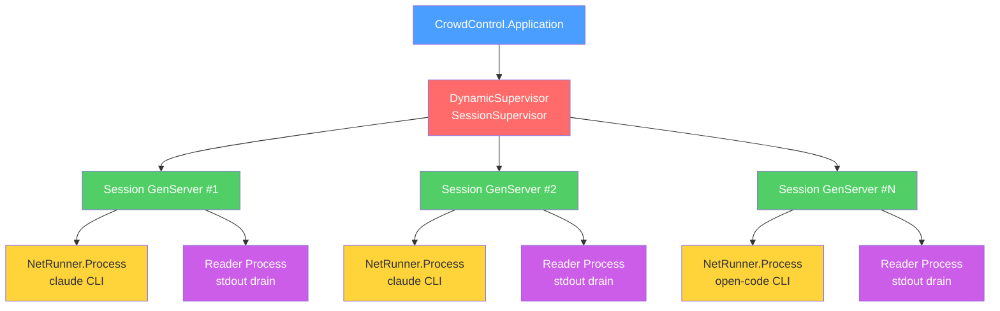

### Session Lifecycle

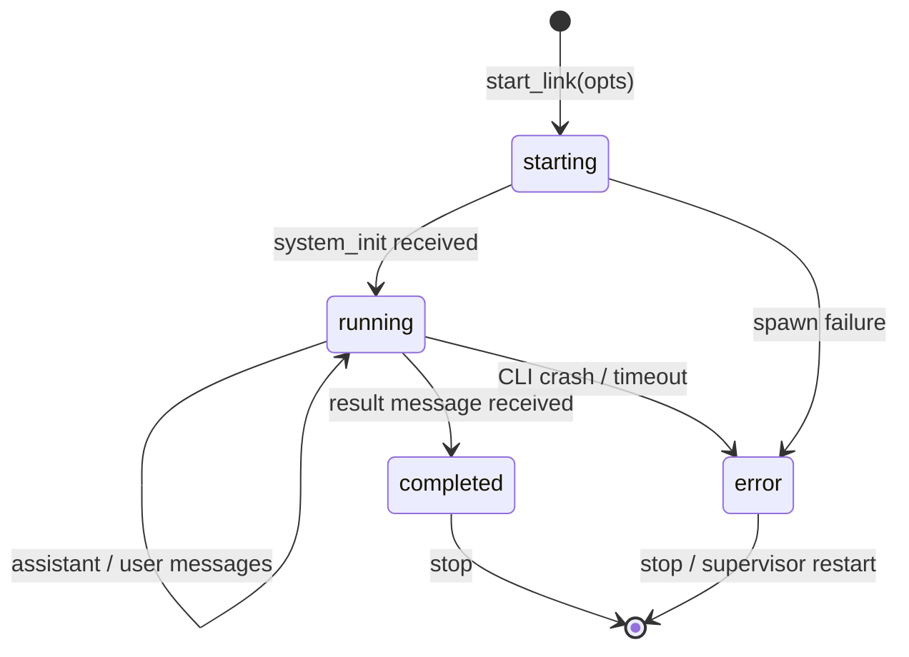

### Message Flow

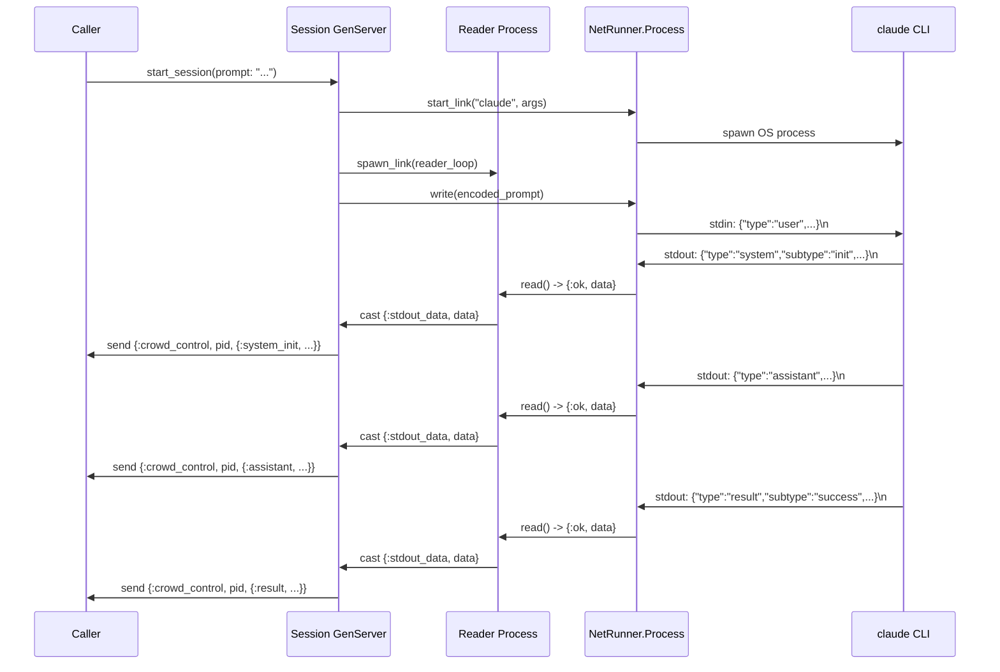

### Parallel Execution

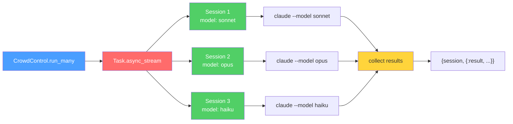

### Wire Protocol — Claude Code (stream-json)

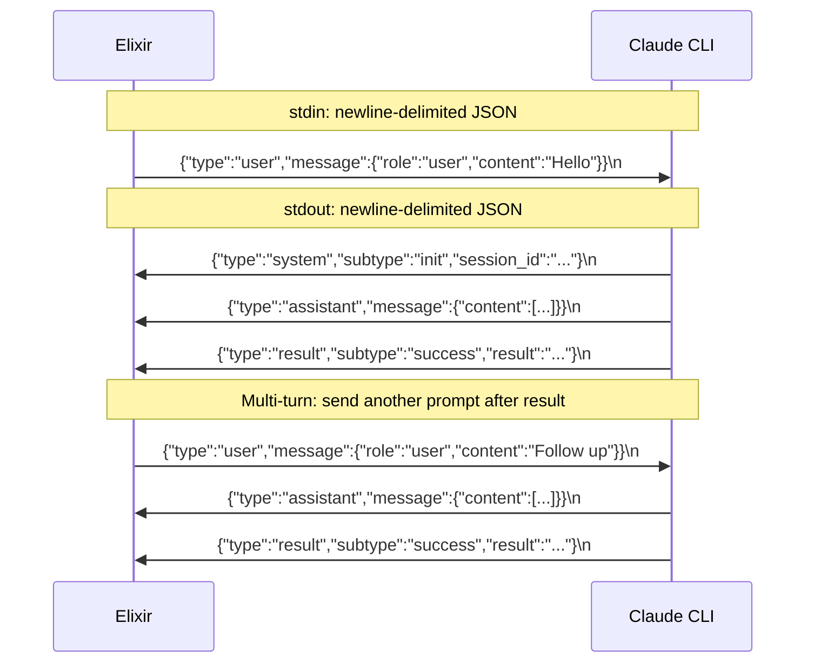

### Wire Protocol — omp (`--mode rpc`)

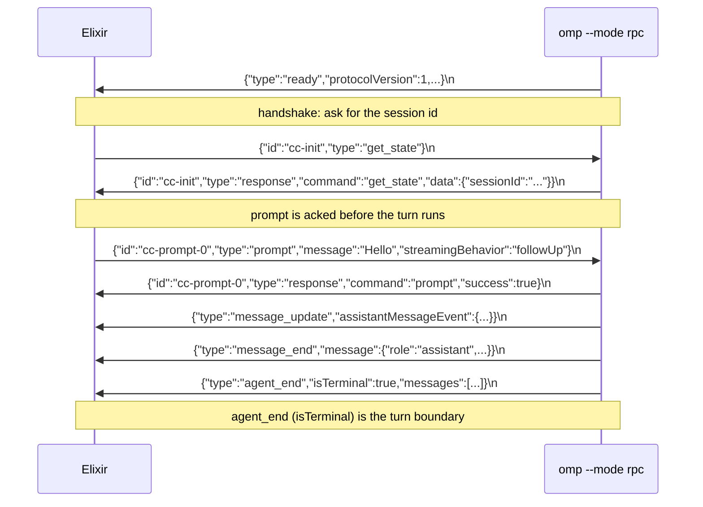

### Module Dependency

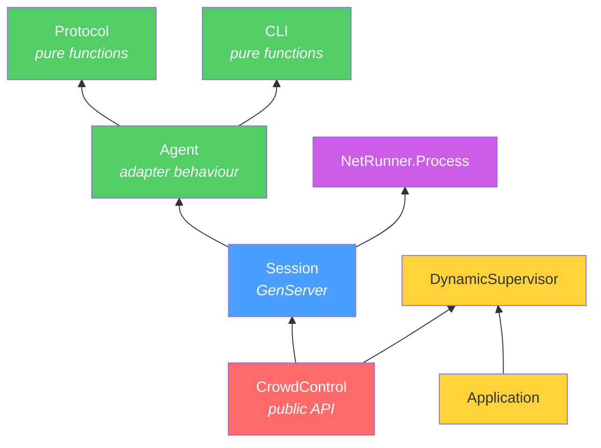

### Fault Tolerance

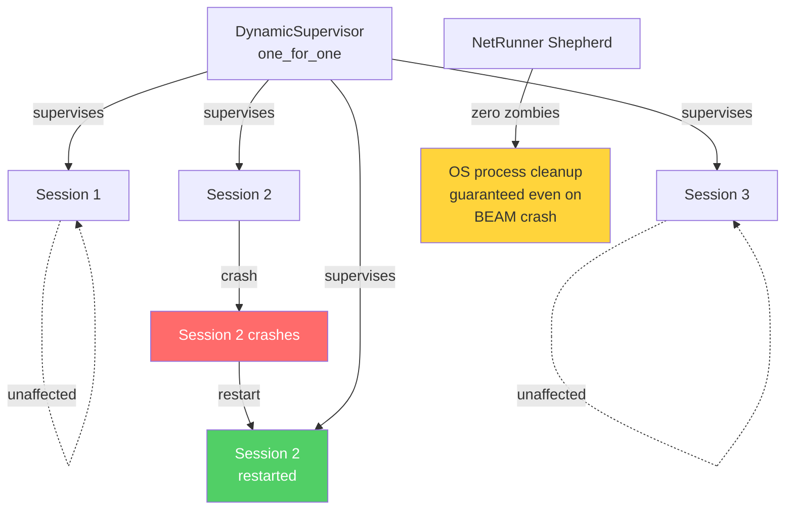

## Security

### API key protection

Per-session API keys (passed via `:api_key` or `:env`) are written to a temporary file with `0600` permissions, sourced by the shell, and deleted before the CLI process starts. Keys never appear in process arguments or `ps` output.

### Session limits

The `DynamicSupervisor` enforces a maximum number of concurrent sessions (default: 50). Configure via application environment:

```elixir
# config/runtime.exs
config :crowd_control, max_sessions: 100
```

When the limit is reached, `start_session/1` returns `{:error, :max_sessions_reached}`.

### Session timeouts

Sessions can be configured with an automatic timeout to prevent runaway processes:

```elixir
# A turn gets 5 minutes to finish
CrowdControl.run("Analyze this code",
  timeout: 300_000,
  add_dir: "/workspace"
)
```

The timer is armed at start and re-armed by each `send_prompt/2` call — it is **not** refreshed by output, so a single turn that streams for longer than the timeout is killed mid-flight. Size it against the slowest turn you expect rather than the length of the conversation; long autonomous tasks against a self-hosted model routinely need more than the default. On expiry, subscribers receive `{:timeout, :session_expired}` and the session shuts down.

### Input validation

- `send_prompt/2` rejects non-string prompts with `{:error, :invalid_prompt}`
- Optional `:max_prompt_size` (bytes) returns `{:error, :prompt_too_large}` when exceeded

### Docker security

See the [Docker](#docker) section for container hardening details (non-root user, capability dropping, read-only filesystem, resource limits).

## Requirements

- Elixir >= 1.18
- Erlang/OTP >= 27
- C compiler (gcc or clang) for net_runner NIF
- At least one agent CLI: `claude` ([install](https://docs.anthropic.com/en/docs/claude-code)), `open-code`, or `omp` ([omp.sh](https://omp.sh/))
- `ANTHROPIC_API_KEY` environment variable set

## License

Apache License 2.0. See [LICENSE](https://github.com/nyo16/CrowdControl/blob/master/LICENSE).
