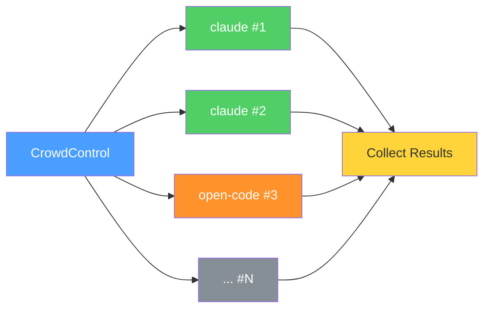
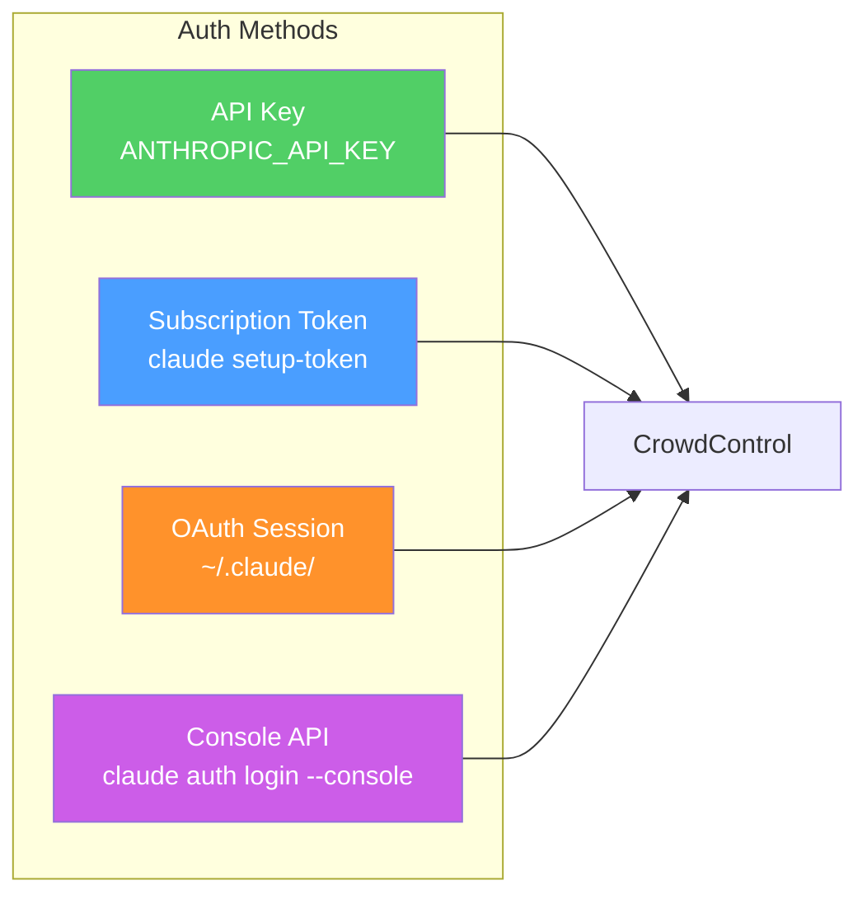
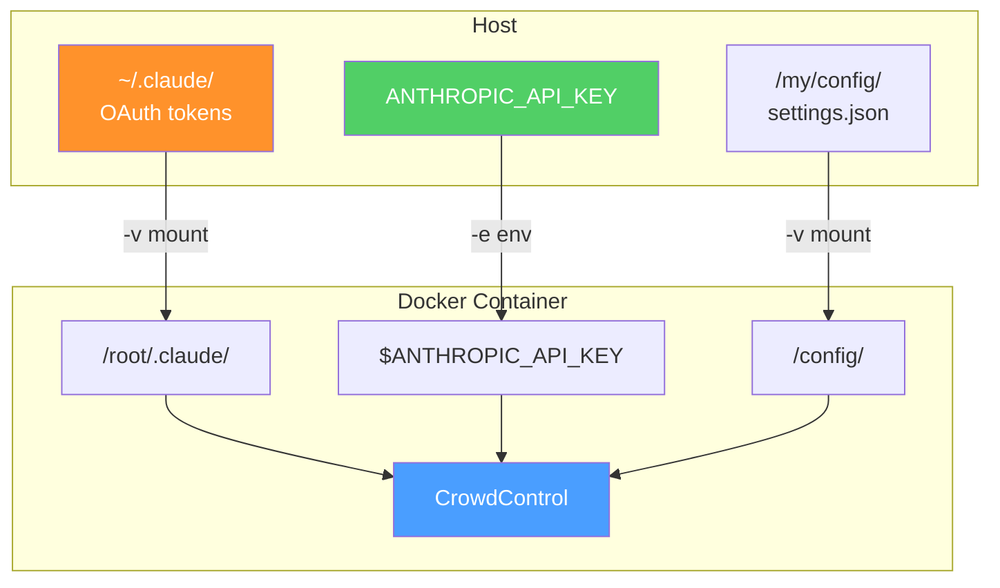
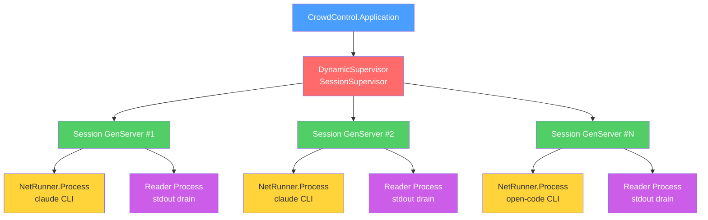
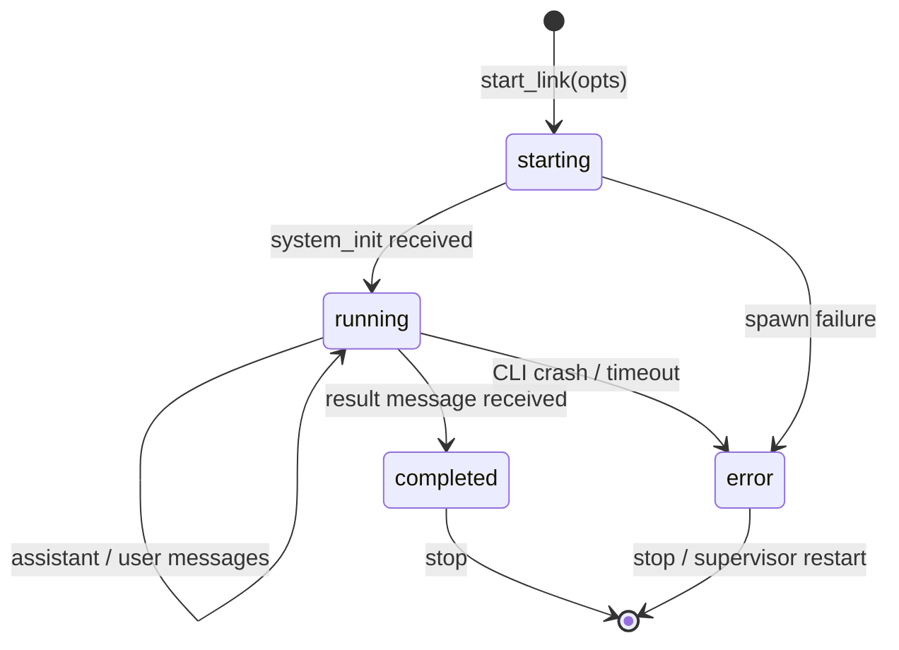
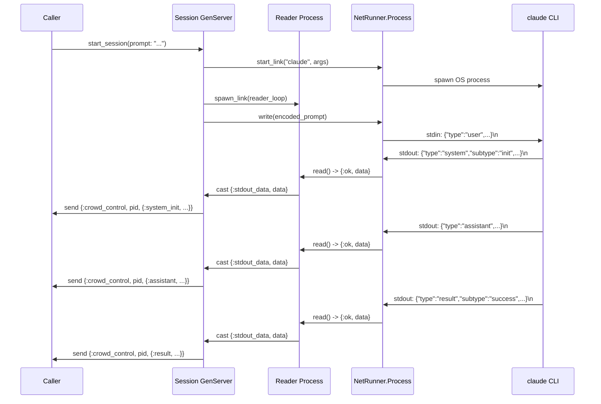
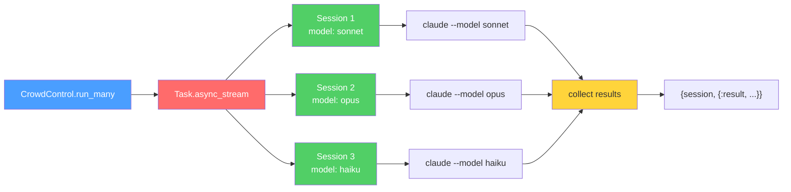
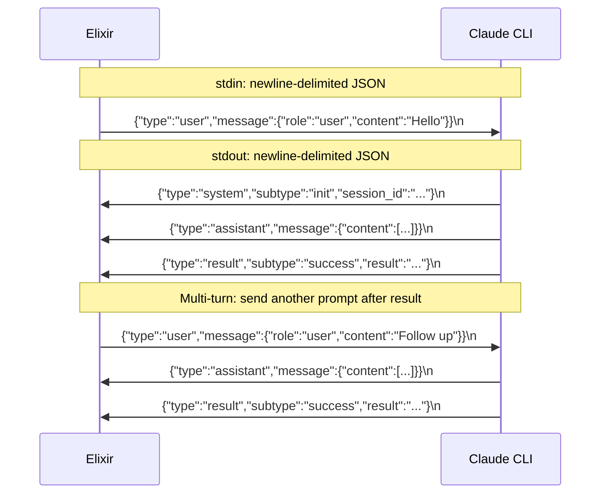
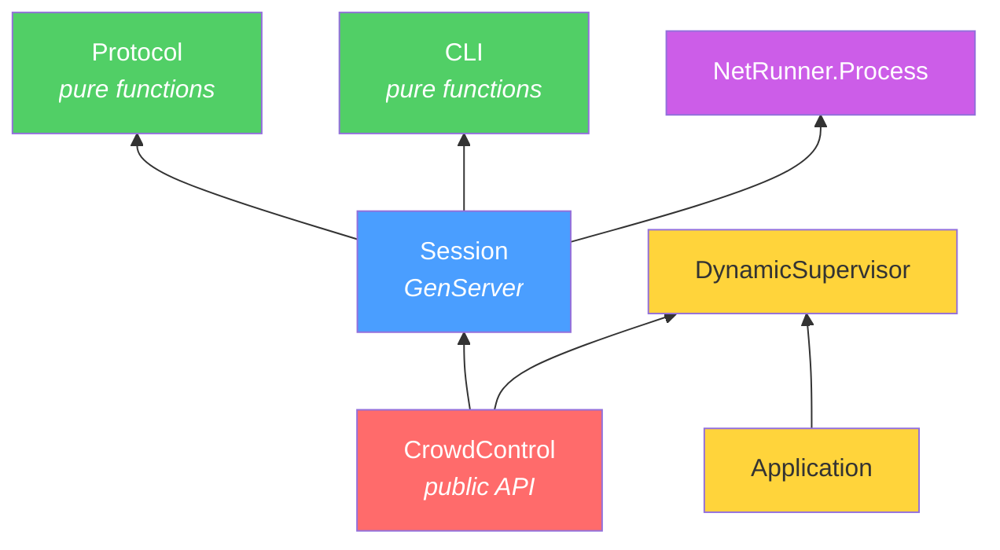
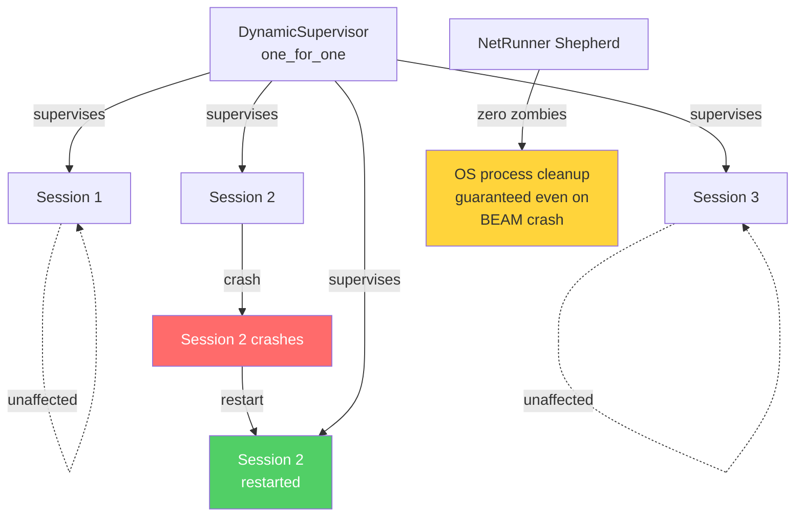

# CrowdControl

Orchestrate many [Claude Code](https://github.com/anthropics/claude-code) / [Open Code](https://github.com/anthropics/open-code) CLI instances in parallel from Elixir.

Built on [net_runner](https://hex.pm/packages/net_runner) for zero-zombie subprocess management with NIF-based backpressure.



## Features

- Run N Claude Code / Open Code sessions in parallel
- Fan-out the same prompt across different models
- Multi-turn conversations with subscriber-based message delivery
- Fault-isolated sessions via OTP DynamicSupervisor
- Zero zombie OS processes guaranteed by net_runner's Shepherd
- Docker support with project directory mounting
- Works with both `claude` and `open-code` CLIs

## Installation

### As a dependency

```elixir
def deps do
  [
    {:crowd_control, "~> 0.1.0"}
  ]
end
```

### From source

```bash
git clone git@github.com:nyo16/CrowdControl.git
cd CrowdControl
mix deps.get
mix compile
```

## Quick Start

### Single session

```elixir
result = CrowdControl.run("Explain GenServer in one sentence",
  permission_mode: "bypassPermissions"
)
# => {:result, "success", %{"result" => "GenServer is...", "total_cost_usd" => 0.003}}
```

### Parallel sessions

```elixir
# Run 5 sessions with different prompts
opts_list = Enum.map(1..5, fn i ->
  [prompt: "Write a haiku about the number #{i}", permission_mode: "bypassPermissions"]
end)

{:ok, sessions} = CrowdControl.start_sessions(opts_list)
results = CrowdControl.collect(sessions, 120_000)
CrowdControl.stop_all(sessions)

# results is [{session_pid, {:result, "success", %{...}}}, ...]
```

### Same prompt, different models

```elixir
results = CrowdControl.run_many("What is the meaning of life?", [
  [model: "sonnet", permission_mode: "bypassPermissions"],
  [model: "opus", permission_mode: "bypassPermissions"],
  [model: "haiku", permission_mode: "bypassPermissions"]
])
```

### Multi-turn conversation

```elixir
{:ok, session} = CrowdControl.start_session(
  prompt: "You are a code reviewer. Wait for code to review.",
  permission_mode: "bypassPermissions"
)

CrowdControl.Session.subscribe(session)

# Wait for initial result, then send follow-up
receive do
  {:crowd_control, ^session, {:result, _, _}} -> :ok
end

CrowdControl.Session.send_prompt(session, "Review this: def add(a, b), do: a + b")

receive do
  {:crowd_control, ^session, {:result, _, %{"result" => review}}} ->
    IO.puts(review)
end

CrowdControl.Session.stop(session)
```

### Subscribing to streaming messages

```elixir
{:ok, session} = CrowdControl.start_session(
  prompt: "Write a short poem",
  permission_mode: "bypassPermissions",
  include_partial_messages: true
)

CrowdControl.Session.subscribe(session)

# Receive all messages as they stream
defmodule Listener do
  def loop do
    receive do
      {:crowd_control, _pid, {:system_init, %{"session_id" => sid}}} ->
        IO.puts("Session started: #{sid}")
        loop()

      {:crowd_control, _pid, {:assistant, %{"message" => msg}}} ->
        IO.puts("Assistant: #{inspect(msg["content"])}")
        loop()

      {:crowd_control, _pid, {:result, "success", %{"result" => text}}} ->
        IO.puts("Done: #{text}")

      {:crowd_control, _pid, {:exit, status}} ->
        IO.puts("Exited with status: #{status}")
    after
      30_000 -> IO.puts("Timeout")
    end
  end
end

Listener.loop()
```

### Using Open Code

```elixir
# Single session with open-code
CrowdControl.run("Hello", executable: "open-code", permission_mode: "bypassPermissions")

# Mix claude and open-code in the same parallel run
CrowdControl.run_many("Explain recursion", [
  [executable: "claude", model: "sonnet", permission_mode: "bypassPermissions"],
  [executable: "open-code", permission_mode: "bypassPermissions"]
])
```

### Working with project directories

```elixir
# Point sessions at a specific project
CrowdControl.run("Find and fix the failing test",
  add_dir: "/path/to/my/project",
  permission_mode: "bypassPermissions",
  allowed_tools: ["Read", "Edit", "Bash"]
)

# Fan out across multiple repos
repos = [
  "/home/user/api-service",
  "/home/user/web-frontend",
  "/home/user/mobile-app"
]

opts_list = Enum.map(repos, fn repo ->
  [
    prompt: "List all TODO comments in the codebase",
    add_dir: repo,
    permission_mode: "bypassPermissions"
  ]
end)

{:ok, sessions} = CrowdControl.start_sessions(opts_list)
results = CrowdControl.collect(sessions)
```

### Custom API URL and token

```elixir
# Use a custom API key per session
CrowdControl.run("Hello",
  api_key: "sk-ant-your-key-here",
  permission_mode: "bypassPermissions"
)

# Point to a custom API endpoint (proxy, gateway, self-hosted)
CrowdControl.run("Hello",
  api_url: "https://your-proxy.example.com/v1",
  api_key: "sk-ant-your-key-here",
  permission_mode: "bypassPermissions"
)

# Different keys per session (e.g. separate billing)
CrowdControl.run_many("Summarize this repo", [
  [api_key: "sk-team-alpha", model: "sonnet"],
  [api_key: "sk-team-beta", model: "opus"]
])

# Arbitrary environment variables
CrowdControl.run("Debug this",
  env: %{
    "ANTHROPIC_API_KEY" => "sk-custom",
    "ANTHROPIC_BASE_URL" => "https://gateway.internal/v1",
    "HTTP_PROXY" => "http://proxy:8080",
    "NODE_OPTIONS" => "--max-old-space-size=4096"
  },
  permission_mode: "bypassPermissions"
)
```

### Settings and config files

```elixir
# Load a custom settings JSON file
CrowdControl.run("Fix the tests",
  settings: "/config/claude_settings.json",
  add_dir: "/workspace",
  permission_mode: "bypassPermissions"
)

# Inline settings as JSON string
CrowdControl.run("Audit this code",
  settings: ~s({"permissions":{"allow":["Read","Bash(git:*)"],"deny":["Edit","Write"]}}),
  add_dir: "/workspace"
)

# Load MCP server configs
CrowdControl.run("Search the GitHub repo for issues",
  mcp_config: "/config/mcp_servers.json",
  strict_mcp_config: true,
  permission_mode: "bypassPermissions"
)

# Load multiple MCP configs
CrowdControl.run("Analyze the project",
  mcp_config: ["/config/mcp_filesystem.json", "/config/mcp_github.json"],
  permission_mode: "bypassPermissions"
)

# Custom agents per session
CrowdControl.run_many("Review this PR", [
  [
    agents: %{
      "security" => %{
        "description" => "Security reviewer",
        "prompt" => "Focus only on security vulnerabilities and data leaks."
      }
    },
    add_dir: "/workspace"
  ],
  [
    agents: %{
      "perf" => %{
        "description" => "Performance reviewer",
        "prompt" => "Focus only on performance bottlenecks and N+1 queries."
      }
    },
    add_dir: "/workspace"
  ]
])

# Bare mode (skip hooks, LSP, plugins, auto-memory)
CrowdControl.run("Quick analysis",
  bare: true,
  settings: "/config/claude_settings_permissive.json",
  add_dir: "/workspace",
  permission_mode: "bypassPermissions"
)

# Control which setting sources are loaded
CrowdControl.run("Check the code",
  setting_sources: ["user", "project"],
  add_dir: "/workspace"
)

# Load plugins from a directory
CrowdControl.run("Process this",
  plugin_dir: "/plugins/my-plugin",
  permission_mode: "bypassPermissions"
)
```

### Budget control

```elixir
# Cap spending per session
CrowdControl.run_many("Refactor this module for clarity", [
  [add_dir: "/path/to/project", model: "sonnet", max_budget_usd: 0.50],
  [add_dir: "/path/to/project", model: "opus", max_budget_usd: 2.00]
])
```

## Authentication

CrowdControl supports all Claude Code authentication methods:



### API key (pay-per-use)

The simplest method. Set per-session or via environment:

```elixir
# Via environment variable (all sessions inherit)
# export ANTHROPIC_API_KEY=sk-ant-...

# Or per-session
CrowdControl.run("Hello", api_key: "sk-ant-your-key-here")

# Different keys per session (separate billing)
CrowdControl.run_many("Summarize this", [
  [api_key: "sk-team-alpha"],
  [api_key: "sk-team-beta"]
])
```

### Claude subscription (Pro/Max/Team)

For subscription-based billing without an API key. Two options:

**Option 1: Interactive login (local machine)**

```bash
# Login once — stores OAuth token in ~/.claude/
claude auth login
```

Then pass your `~/.claude` directory so sessions pick up the token:

```elixir
# Sessions inherit the subscription auth from ~/.claude
CrowdControl.run("Hello",
  env: %{"CLAUDE_CONFIG_DIR" => "/root/.claude"},
  permission_mode: "bypassPermissions"
)
```

**Option 2: Setup token (headless / Docker / CI)**

```bash
# Generate a long-lived token (requires Claude subscription)
claude setup-token
# Paste the token when prompted — stored in ~/.claude/
```

For Docker, mount `~/.claude` into the container:

```bash
docker run -it \
  -v ~/.claude:/root/.claude \
  -v "$(pwd)":/workspace \
  crowd_control
```

### Console API (Anthropic Console billing)

```bash
claude auth login --console
```

Works the same as subscription — mount `~/.claude/` to share the session.

### Auth in Docker



| Method | Docker flag | Notes |
|--------|-------------|-------|
| API key | `-e ANTHROPIC_API_KEY=sk-...` | Simplest, pay-per-use |
| Subscription | `-v ~/.claude:/root/.claude` | Mount OAuth tokens |
| Setup token | `-v ~/.claude:/root/.claude` | For CI/headless |
| Per-session key | Set via `:api_key` option in IEx | Different keys per session |

## Docker

Run CrowdControl in a Linux container with your project directory and config mounted in.

### Build the image

```bash
docker build -t crowd_control .
```

### Run with API key

```bash
docker run -it \
  -e ANTHROPIC_API_KEY=$ANTHROPIC_API_KEY \
  -v "$(pwd)":/workspace \
  crowd_control
```

### Run with subscription auth

```bash
docker run -it \
  -v ~/.claude:/root/.claude \
  -v "$(pwd)":/workspace \
  crowd_control
```

### Mount custom config files

```bash
docker run -it \
  -e ANTHROPIC_API_KEY=$ANTHROPIC_API_KEY \
  -v "$(pwd)":/workspace \
  -v /path/to/my/configs:/config \
  crowd_control
```

The container has built-in template configs at `/config/templates/`:

| Template | Description |
|----------|-------------|
| `claude_settings.json` | Default settings with common tool permissions |
| `claude_settings_permissive.json` | Permissive settings (all tools allowed) |
| `mcp_servers.json` | MCP server config (filesystem + GitHub) |
| `agents.json` | Pre-built agents (reviewer, refactorer, documenter, tester) |
| `opencode_settings.json` | Open Code provider/tool configuration |

Use them directly or as a starting point:

```elixir
# Use built-in template
CrowdControl.run("Review this",
  settings: "/config/templates/claude_settings_permissive.json",
  add_dir: "/workspace"
)

# Use your own mounted config
CrowdControl.run("Analyze with MCP tools",
  settings: "/config/my_settings.json",
  mcp_config: "/config/my_mcp.json",
  add_dir: "/workspace"
)
```

### Mount everything (full setup)

```bash
docker run -it \
  -v ~/.claude:/root/.claude \
  -v "$(pwd)":/workspace \
  -v /path/to/configs:/config \
  -v /path/to/plugins:/plugins \
  crowd_control
```

```elixir
# Full-featured session with subscription auth, config, MCP, and plugins
CrowdControl.run("Deep code review",
  settings: "/config/claude_settings.json",
  mcp_config: "/config/mcp_servers.json",
  plugin_dir: "/plugins/my-plugin",
  add_dir: "/workspace",
  permission_mode: "bypassPermissions"
)
```

This drops you into an IEx shell. Your project is available at `/workspace`:

```elixir
CrowdControl.run("Analyze the code in /workspace",
  add_dir: "/workspace",
  permission_mode: "bypassPermissions"
)
```

### Custom API endpoint

```bash
docker run -it \
  -e ANTHROPIC_API_KEY=$ANTHROPIC_API_KEY \
  -e ANTHROPIC_BASE_URL=https://your-proxy.example.com/v1 \
  -v "$(pwd)":/workspace \
  crowd_control
```

Or set per-session inside IEx:

```elixir
# Each session can target a different API endpoint
CrowdControl.run_many("Hello", [
  [api_url: "https://gateway-us.internal/v1", api_key: "sk-us-key"],
  [api_url: "https://gateway-eu.internal/v1", api_key: "sk-eu-key"]
])
```

### Mount a different directory

```bash
docker run -it \
  -e ANTHROPIC_API_KEY=$ANTHROPIC_API_KEY \
  -v /path/to/your/project:/workspace \
  crowd_control
```

### Mount multiple project directories

```bash
docker run -it \
  -e ANTHROPIC_API_KEY=$ANTHROPIC_API_KEY \
  -v /home/user/api:/projects/api \
  -v /home/user/web:/projects/web \
  -v /home/user/docs:/projects/docs \
  crowd_control
```

Then inside IEx:

```elixir
# Scan all three repos in parallel
opts_list = [
  [prompt: "Find security issues", add_dir: "/projects/api"],
  [prompt: "Find security issues", add_dir: "/projects/web"],
  [prompt: "Check for outdated links", add_dir: "/projects/docs"]
]
|> Enum.map(&Keyword.merge(&1, permission_mode: "bypassPermissions"))

{:ok, sessions} = CrowdControl.start_sessions(opts_list)
results = CrowdControl.collect(sessions, 300_000)
```

### Docker Compose

```bash
# Mount current directory
ANTHROPIC_API_KEY=sk-... docker compose run crowd_control

# Mount a specific project
ANTHROPIC_API_KEY=sk-... PROJECT_DIR=/path/to/project docker compose run crowd_control

# Run multiple isolated workers
ANTHROPIC_API_KEY=sk-... WORKER_COUNT=5 docker compose up worker
```

### Docker architecture

```mermaid
graph TD
    subgraph Host
        PD1[Project Dir A]
        PD2[Project Dir B]
        KEY[ANTHROPIC_API_KEY]
    end

    subgraph Docker Container
        IEX[IEx Shell]
        CC[CrowdControl]
        CC --> S1[Session 1<br/>claude CLI]
        CC --> S2[Session 2<br/>claude CLI]
        CC --> S3[Session 3<br/>open-code CLI]

        WS1[/workspace]
        WS2[/projects/api]
        WS3[/projects/web]
    end

    PD1 -->|"-v mount"| WS1
    PD1 -->|"-v mount"| WS2
    PD2 -->|"-v mount"| WS3
    KEY -->|"-e env"| CC

    S1 --> WS2
    S2 --> WS3
    S3 --> WS1

    style CC fill:#4a9eff,color:#fff
    style S1 fill:#51cf66,color:#fff
    style S2 fill:#51cf66,color:#fff
    style S3 fill:#ff922b,color:#fff
```

## CLI Options

All options from `CrowdControl.CLI.build_command/1` can be passed to `start_session`, `run`, and `run_many`:

| Option | Description |
|--------|-------------|
| `:executable` | CLI binary name or path (default: `"claude"`) |
| `:prompt` | Initial prompt to send |
| `:model` | Model to use (`"sonnet"`, `"opus"`, `"haiku"`) |
| `:system_prompt` | Custom system prompt |
| `:allowed_tools` | List of allowed tool names |
| `:permission_mode` | Permission mode string |
| `:max_budget_usd` | Spending ceiling |
| `:session_id` | Session ID for new sessions |
| `:resume` | Session ID to resume |
| `:continue` | `true` to continue most recent session |
| `:add_dir` | Additional project directory |
| `:include_partial_messages` | `true` for streaming deltas |
| `:no_session_persistence` | `true` to skip saving to disk |
| `:settings` | Path to settings JSON file or inline JSON string |
| `:setting_sources` | List of setting sources to load (`["user", "project", "local"]`) |
| `:mcp_config` | Path to MCP config JSON file(s) (string or list) |
| `:strict_mcp_config` | `true` to only use MCP servers from `:mcp_config` |
| `:agents` | JSON string or map defining custom agents |
| `:plugin_dir` | Path to a plugin directory |
| `:bare` | `true` for minimal mode (skip hooks, LSP, plugins, auto-memory) |
| `:extra_args` | List of additional CLI arguments |
| `:api_key` | Anthropic API key (sets `ANTHROPIC_API_KEY` for the subprocess) |
| `:api_url` | Custom API base URL (sets `ANTHROPIC_BASE_URL` for the subprocess) |
| `:env` | Map of arbitrary environment variables for the subprocess |

## API Reference

### CrowdControl (orchestration)

| Function | Description |
|----------|-------------|
| `run(prompt, opts)` | Single-shot: start session, send prompt, collect result, stop |
| `run_many(prompt, opts_list)` | Same prompt across N sessions with different options |
| `start_session(opts)` | Start one supervised session |
| `start_sessions(opts_list)` | Start N sessions in parallel |
| `broadcast(sessions, prompt)` | Send the same prompt to all sessions |
| `collect(sessions, timeout)` | Wait for result messages from all sessions |
| `stop_all(sessions)` | Gracefully stop all sessions |

### CrowdControl.Session (per-instance)

| Function | Description |
|----------|-------------|
| `send_prompt(session, prompt)` | Send a user prompt |
| `subscribe(session)` | Receive messages as `{:crowd_control, pid, msg}` |
| `get_status(session)` | Returns `:starting`, `:running`, `:completed`, or `:error` |
| `get_session_id(session)` | CLI-assigned session ID |
| `get_messages(session)` | All accumulated messages |
| `stop(session)` | Graceful shutdown |

### Message types

Subscribers receive `{:crowd_control, session_pid, message}` where message is:

| Message | When |
|---------|------|
| `{:system_init, map}` | CLI initialized, contains `session_id`, `tools`, `model` |
| `{:assistant, map}` | Assistant response with `content` blocks |
| `{:user, map}` | Tool execution results |
| `{:result, subtype, map}` | Turn complete. Subtype: `"success"`, `"error_max_turns"`, `"error_max_budget_usd"` |
| `{:stream_event, map}` | Partial message delta (requires `:include_partial_messages`) |
| `{:exit, status}` | CLI process exited with OS status code |

## Architecture

### Supervision Tree



### Session Lifecycle



### Message Flow



### Parallel Execution



### Wire Protocol (stream-json)



### Module Dependency



### Fault Tolerance



## Requirements

- Elixir >= 1.18
- Erlang/OTP >= 27
- C compiler (gcc or clang) for net_runner NIF
- `claude` CLI ([install](https://docs.anthropic.com/en/docs/claude-code)) and/or `open-code` CLI
- `ANTHROPIC_API_KEY` environment variable set

## License

MIT
