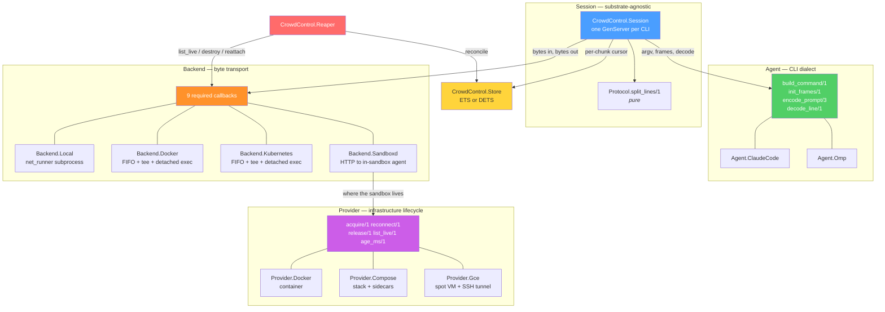
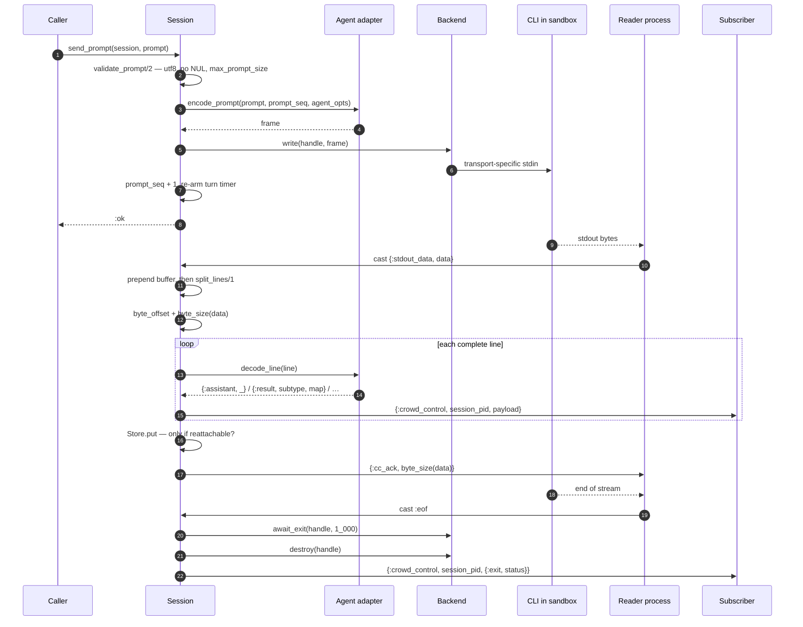
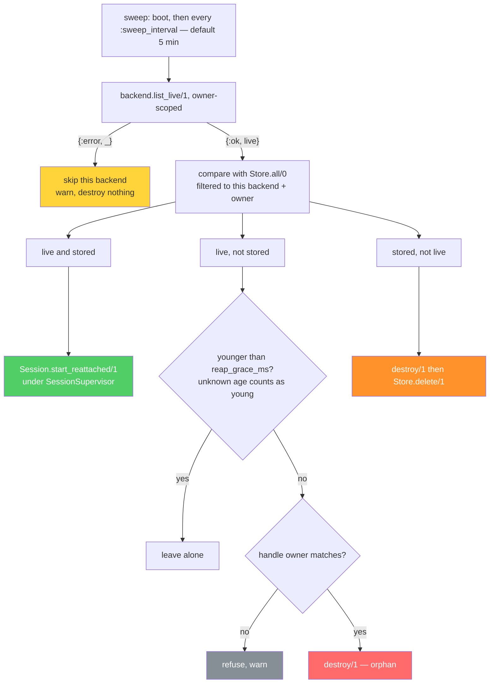

# Architecture

CrowdControl runs untrusted, model-driven CLI processes and reports what they say. Four modules own
four disjoint concerns, and the whole design is about keeping those four ignorant of each other. This
document explains where the seams are and what each side is forbidden from knowing.

It is the *how and why it is built this way* layer. For usage, option tables and quick starts, see
[README.md](../README.md). For the threat model, hardening posture, egress rules and the
NetworkPolicy story, [SECURITY.md](../SECURITY.md) is the authority and is not repeated here. The
other three pages of this layer go one level deeper: [sandboxes.md](sandboxes.md) for how bytes
actually move inside a sandbox, [providers.md](providers.md) for each shipped provider's internals,
and [operations.md](operations.md) for running the thing.

## The four layers



### `CrowdControl.Session` — one GenServer per CLI

Owns line splitting, JSON decoding, message accumulation, subscriber broadcast, the turn timer, and
the cursor. Everything from line splitting onward is transport-agnostic; the session never learns
which backend it is talking to, because every one of its calls into the backend goes through the
behaviour.

What it is forbidden to know: whether the bytes came from a pipe, a `tail -f` over an HTTP stream, a
websocket exec channel or a chunked HTTP body. `Session.handle_cast({:stdout_data, data}, state)` is
the only place output is interpreted, and it does the same three things regardless of substrate:
advance both halves of the cursor together, split lines with `CrowdControl.Protocol.split_lines/1`, and hand each
line to `state.agent.decode_line/1`.

Two options are enforced here rather than in a backend because they are resource-exhaustion guards on
the session's own memory, not on the transport: `:max_line_bytes` (default 1 MiB, chosen to match the
`maxFrameBytes` omp advertises in its ready frame) and `:max_messages` (default 10,000). Both go
through `bound_opt!/3`, which treats `nil` as unset and raises on anything else — because Erlang term
ordering puts every number below every atom, so `byte_size(x) > nil` is always false and a `nil`
silently switches the guard *off*.

The `:timeout` is a ceiling on a single **turn**, not on the conversation. It is armed at start and
re-armed by `send_prompt/2`, deliberately not by output, so a turn that streams for longer than the
window is still killed mid-flight.

### `CrowdControl.Agent` — which CLI, and how to speak to it

Four callbacks: `build_command/1` produces `{executable, args, env}`, `init_frames/1` produces the
handshake frames written immediately after exec, `encode_prompt/3` frames one user prompt, and
`decode_line/1` turns one line of stdout into a `t:CrowdControl.Protocol.message/0`.

The normalization is the point. A subscriber written against Claude Code works unchanged against omp:
the session id still arrives as `{:system_init, %{"session_id" => id}}` and the end of a turn still
arrives as `{:result, subtype, map}`. `CrowdControl.Agent.ClaudeCode` covers Claude Code's
`--output-format stream-json`, also spoken by `open-code`; `CrowdControl.Agent.Omp` covers omp's
`--mode rpc` newline-delimited JSON-RPC.

What an agent is forbidden to know: where the CLI runs. It builds argv and frames bytes; it never
touches a socket. The one exception is declared as an exception — the optional
`c:CrowdControl.Agent.sandbox_files/1`, which returns `{path, bytes, mode}` tuples an adapter needs on
the *sandbox's* filesystem (`Agent.Omp` resolving a custom provider's `baseUrl` out of `models.yml`).
Rendering is the adapter's job; writing is the backend's, since only the backend knows how bytes cross
into its substrate.

Adapter selection: explicit `:agent` wins, otherwise the `:executable` basename decides, otherwise
`Agent.ClaudeCode`. A module that is not a known alias is accepted only if it exports all four
callbacks — checking exports turns a typo into an `ArgumentError` at resolve time instead of an
`UndefinedFunctionError` inside a GenServer init much later. The resolved module is then pinned into
the persisted opts, so a reattached session cannot re-derive a *different* adapter from a backend
config that is no longer in scope.

### `CrowdControl.Backend` — the byte transport

Nine required callbacks: `provision/1`, `exec/4`, `start_reader/3`, `write/2`, `await_exit/2`,
`alive?/1`, `destroy/1`, `list_live/1`, `reattach/2`. Three more are optional and declared as such:
`push_workspace/2`, `pull_artifacts/2`, `scrub/1`.

Two things are deliberately **not** callbacks, and the module doc argues both:

- **`read/1`.** A blocking synchronous read is the right shape for a NIF-backed pipe and the wrong
  shape for a streamed HTTP body. `start_reader/3` inverts the control flow instead: the backend
  receives the session pid and becomes responsible for delivering to it, by whatever means. The
  contract on that inversion is three clauses — deliver output as
  `GenServer.cast(session_pid, {:stdout_data, binary})`, deliver end-of-stream as
  `GenServer.cast(session_pid, :eof)` exactly once *and also on transport error*, and return a pid
  linked to the caller so that a dead reader takes the session down rather than leaving it silently
  deaf.
- **`kill/2`.** `:sigterm`/`:sigkill` is POSIX vocabulary a remote sandbox does not have. `destroy/1`
  is the only teardown primitive, and a backend that does have signals (`Local`) implements its own
  escalation behind it.

`destroy/1` must be idempotent, and "already gone" is success: `Session` calls it from
`handle_cast(:eof, _)`, from `handle_call(:stop, _, _)`, from the `:session_timeout` handler and from
`terminate/2`, and several of those can run for one session. A 404 from a remote API is the desired
end state, not a failure. `Session.destroy_backend/1` also clears `:backend_state`, so the common case
does not call it twice.

Error normalization is the backend's job, not the session's. Remote backends see
`%Req.TransportError{}`, `:timeout`, HTTP 5xx and websocket closes; each backend folds those into one
tagged vocabulary (`{:docker, _}`, `{:k8s, _}`, `{:sandboxd, _}`) so `Session` only ever reasons about
one failure shape. `CrowdControl.Backend.Docker.API`, `…Kubernetes.API` and `…Sandboxd.API` are the
sole places a request is built, for exactly this reason.

### `CrowdControl.Provider` — the infrastructure lifecycle

`acquire/1`, `reconnect/1`, `release/1`, `list_live/1`, plus optional `age_ms/1` and `scrub/1`. A
provider sits *under* `Backend.Sandboxd` and owns **where** the sandbox lives; the backend owns **how
bytes move**. Three ship: `Provider.Docker` (one container), `Provider.Compose` (a per-session stack
with sidecars), `Provider.Gce` (one spot VM reached over an in-memory ed25519 SSH tunnel).

This is the distinction readers get wrong, so it is worth stating twice. `Backend.Docker` is a
transport bolted to a substrate: it knows both how to create a container *and* how to move bytes
through a FIFO and a `tee` file. `Backend.Kubernetes` had to reimplement the second half for Pods. A
VM has no exec API at all, so a third substrate would have meant a third transport.
`Backend.Sandboxd` splits those apart: bytes always move the same way — one HTTP protocol to one
in-sandbox agent — and the provider is provisioning code and nothing else.

Three contracts carry the weight:

1. **`acquire/1` returns only when the agent has answered health.** Not when the API call succeeded,
   not when the container is "created", not when the operation is `DONE`. Every implementation polls
   `GET /v1/health` until `200` or `:ready_timeout`. And a failed `acquire/1` must release whatever it
   created before returning — a leaked container is untidy, a leaked spot VM bills forever.
2. **`release/1` is idempotent and "already gone" is success**, for the same reason `destroy/1` is.
3. **The endpoint is never persisted.** The handle goes into `CrowdControl.Store` and must survive
   `:erlang.term_to_binary/1`; `CrowdControl.Provider.Endpoint` must not, because it holds a derived
   token, a live tunnel resource and a `base_url` whose port is assigned per connection. So the handle
   persists the *resource* — `{container_id}`, `{project_name}`, `{instance_name, zone}` — and
   `reconnect/1` rebuilds the *path*. The token is re-derived from the persisted `session_key` by
   `CrowdControl.Provider.token/1`, an HMAC-SHA256 of that key under `:sandboxd_secret`, so nothing
   secret is written down. Rotating that secret therefore fails reattach closed with
   `{:error, {:sandboxd, :unauthorized}}`; that is the intended trade against a live credential at
   rest in DETS.

Unlike `:backend`, `:provider` has **no default**. A provider decides where untrusted model-driven
code runs, and guessing that is not a service this library provides. What each shipped provider
actually does to satisfy those contracts — the network shapes, the measured timings, the rollback
paths — is in [providers.md](providers.md).

## One prompt, end to end



Four details in that flow are load-bearing.

**The cursor advances in one clause.** `byte_offset` counts every byte the reader has delivered;
`buffer` is the partial line among them that has not been consumed yet. They are updated together in
the same map update in `handle_cast({:stdout_data, _}, _)`, because reattach reads from the offset and
*prepends* the buffer — a guarantee that only holds if the two can never disagree.

**`{:result, subtype, map}` is stamped with the turn.** `subscribe/1` replays accumulated history, so
without the stamp a collector attaching during turn 2 would match turn 1's replayed result and return
stale data instantly. `prompt_seq` is the number of prompts written, which is exactly the turn number,
and `Session.current_turn/1` lets a collector read it *before* subscribing. See
`CrowdControl.collect/2`.

**A result ends a turn, not the process.** `omp --mode rpc` and `claude --input-format stream-json`
both keep reading stdin after emitting a result, so `send_prompt/2` on a `:completed` session moves it
back to `:running`. Only `exited: true`, set on `:eof`, is really terminal.

**Destroy happens before the `{:exit, _}` broadcast**, so a subscriber that receives it is entitled to
assume the sandbox and its env file are already gone.

## The supervision tree

CrowdControl.Application's start/2 installs `CrowdControl.LogRedactor` before starting any child —
a rejected exec upgrade makes kubereq's connection process crash with the whole `%Req.Request{}`,
kubeconfig included, as its last message — then starts exactly three children under
`CrowdControl.Supervisor` with `strategy: :one_for_one`:

| Order | Child | Why here |
|---|---|---|
| 1 | the configured `CrowdControl.Store` | must be up before any session can persist to it |
| 2 | `DynamicSupervisor` named `CrowdControl.SessionSupervisor`, `max_children: max_sessions` | holds every session; `:max_sessions` defaults to 50 and `fetch_max_sessions!/0` raises on a non-positive integer |
| 3 | `CrowdControl.Reaper` | **last**, because its boot reconciliation starts sessions under the supervisor above |

`start_session/1` maps `{:error, :max_children}` to `{:error, :max_sessions_reached}`, so the
`max_children` cap surfaces as a named condition rather than a supervisor internal.

Sessions are `restart: :transient`, and the choice is the opposite of the obvious one. `:temporary` is
right when the OS process dies with the GenServer — and exactly backwards when a *billed* remote
sandbox outlives it. A transient child is restarted on abnormal exit, which is what gives the reaper a
session to reattach the surviving sandbox to. Normal exits (`:normal`, `:shutdown`) are not restarted,
so an ordinary completed session neither respawns nor holds a `max_children` slot.

### The reaper's reconciliation

`Session.terminate/2` is best-effort and never runs on `SIGKILL`, a VM crash, or a hard container
stop. For a local subprocess that barely matters; for a billed sandbox it is the only real guarantee.



Every destructive branch requires positive evidence, and the bias is fail-open in three places: a
backend whose `list_live/1` errors is **skipped**, never read as "nothing is live"; an unknown age
counts as too young to reap; and ownership is filtered daemon-side *and* re-checked locally in
`owned_by?/3`, because destruction is irreversible and one filter is not worth trusting alone. The
`stored, not live` branch destroys before deleting, because "not live" does not mean "gone" — every
`list_live/1` reports what is *reattachable* — and deleting only the record would make that leak
permanent *and* unobservable.

Two architectural consequences are worth naming here rather than in the operational detail. First,
the reaper starts a `Session` from a stored record rather than from caller options —
`Session.start_reattached/1` exists for it and for nothing else — which is why the record has to carry
the resolved agent module and the scrubbed opts. Second, two-node safety rests entirely on the
owner stamp, and the two FIFO backends cannot stamp it the same way: `Backend.Docker` uses a
`crowd_control.owner` label, while `Backend.Kubernetes` cannot, because `nonode@nohost` is not a legal
Kubernetes label value and sanitizing is lossy in exactly the way that lets one node's reaper destroy
another's Pods. So the raw owner goes in an annotation, whose values are unconstrained, and a sha256
prefix goes in a `crowd_control.owner_hash` label for the server-side selector.

[operations.md](operations.md) covers the sweep's configuration, both leak directions, and what to
watch.

### What the store holds

`Store` is four functions — `put/2`, `get/1`, `delete/1`, `all/0` — over `ETS` (default, in-memory)
or `DETS` (disk-backed, survives a node restart). The record is keyed by the **CrowdControl session
key**, a random 32-character hex id — 16 bytes of `:crypto.strong_rand_bytes/1`, hex so it is safe as
a container label value and a filename component — minted in `Session.init/1` *before* the sandbox is
provisioned and stamped onto the sandbox as the `crowd_control.session` label. The CLI's own
`session_id` is a different thing: it does not exist until the CLI emits `system/init`, so keying on
it would leave every session unfindable for the first few hundred milliseconds of its life —
precisely the window in which a crash strands a sandbox nobody can reap.

`:messages`, `:subscribers`, `:timeout_ref` and `:reader` are deliberately not persisted; the first is
already a lossy capped window and rebuildable by replaying from offset 0, the rest are process-local
or meaningless after a restart. Both the handle and the opts are scrubbed on the way in — records
outlive the VM on disk, and nothing about reattaching needs a credential, because the sandbox already
holds whatever environment it was started with. The record's exact shape, the ETS/DETS trade and the
scrub mechanisms are in [operations.md](operations.md).

Persistence is skipped entirely for backends that cannot reattach. That check is the next section.

## Resolution and probing

### `:backend` is a module or a `{module, config}` tuple

`CrowdControl.Backend.resolve/1` takes the session opts, removes `:backend`, and returns
`{module, opts}`:

```elixir
CrowdControl.Backend.resolve([])
#=> {CrowdControl.Backend.Local, []}

CrowdControl.Backend.resolve(backend: {CrowdControl.Backend.Docker, image: "my-cli:latest"})
#=> {CrowdControl.Backend.Docker, [image: "my-cli:latest"]}
```

A bare module is equivalent to `{module, []}`; the tuple's config is merged over the remaining opts,
so a value written inside the tuple wins. Anything else raises `ArgumentError`. `Session.init/1` then
adds `:session_key` and `:owner` to that merged list before `provision/1` sees it, and keeps the
merged list as `:agent_opts` — which is why an option written inside a `{Backend, config}` tuple
reaches the adapter's framing callbacks the same way it already reaches `build_command/1`.

The `:owner` in that list must be resolved the same way the backend stamps it onto the sandbox. If
the record's owner and the sandbox's label can differ, the reaper sees live sandboxes with no matching
record and destroys every one of them as an orphan.

`CrowdControl.Provider.resolve/1` mirrors this exactly, with the one deliberate difference already
noted: no default, and a missing `:provider` raises rather than guessing.

### Two callbacks that are probed, not declared

`reattachable?/0` and `age_ms/1` are not in the `CrowdControl.Backend` behaviour. Both are reached
through `function_exported?/3`:

```elixir
Backend.reattachable?(module)   # Code.ensure_loaded? and function_exported? and module.reattachable?()
Provider.age_ms(module, handle) # nil unless the module exports age_ms/1
```

The probe is what supplies an answer for a module that defines neither, and both fallbacks point the
safe way:

- **`reattachable?/0` absent ⇒ `false` ⇒ no store writes at all.** `Session` consults it once, in
  `init/1`, to set `:persist?`. `Backend.Local` returns `false` explicitly: a local subprocess dies
  with the VM, so there is nothing to reattach to and a store write per stdout chunk would be pure
  overhead. `Docker`, `Kubernetes` and `Sandboxd` all return `true`.
- **`age_ms/1` absent ⇒ `nil` ⇒ the reaper reads "unknown age" as "too young to reap".** That is
  fail-open, and the direction is correct, but it has a sharp edge worth naming: a `Provider` that
  omits `age_ms/1` leaks every orphan forever, because `Backend.Sandboxd` *does* export `age_ms/1`, so
  the reaper always consults it, and `Provider.age_ms/2` returns `nil` for a provider with no
  callback. The `CrowdControl.Provider` moduledoc spells the chain out and says to implement it; both
  shipped Docker-shaped providers read it from the `crowd_control.created_at` label they set at create
  time.

Note the asymmetry, since it is visible in the source: `CrowdControl.Provider` *does* declare
`age_ms/1`, as an `@optional_callbacks` entry. `CrowdControl.Backend` declares neither of the two. The
practical consequence is that a backend cannot be warned about omitting them at compile time, which is
what makes the two defaults above the entire contract.

### `Backend.safe/2` catches `:exit` and never rescues

Every teardown-path call into a backend goes through it:

```elixir
Backend.safe(fn -> module.destroy(record.handle) end, :ok)
```

The discipline is narrow on purpose, and the module states both halves:

- `NetRunner.Process.{await_exit,alive?,kill}` are `GenServer.call`s, so a dead or stale daemon raises
  an `:exit`, never an `:error`. Catching that is the difference between a tidy shutdown and a crashed
  session.
- It catches **only** `:exit`. A `rescue` there would swallow genuine bugs —
  `UndefinedFunctionError`, `FunctionClauseError`, a typo in a backend — and turn them into a silent
  "sandbox unavailable". Those must surface.

The one place that does rescue does it explicitly and at its own call site:
`Reaper.safe_list_live/2` wraps `Backend.safe/2` in a `rescue` that returns
`{:error, {:exception, message}}`, which feeds the fail-open skip rather than a crash. That is a
deliberate exception to the rule above, and it is visible where it happens rather than hidden inside
`safe/2`.

## Choosing a backend

The trade is between what the image must contain and how much code a new substrate costs. Option
names, defaults and hardening flags are in [README.md](../README.md); the transport mechanics are in
[sandboxes.md](sandboxes.md); each provider's internals are in [providers.md](providers.md); the
security posture is in [SECURITY.md](../SECURITY.md).

- **`Backend.Local`** — development, tests, and anything where the CLI may die with the VM. No store
  writes, no reattach, no billing risk. `list_live/1` is `{:ok, []}` and `reattach/2` is
  `{:error, :not_supported}`, both by design.
- **`Backend.Docker`** — one container per session on a Docker host, working with **any** image that
  carries `sh`, `tail`, `tee` and the CLI. Reattachable. `:network_mode` defaults to `"none"`, and the
  backend refuses to guess when `:proxy_url` or `:api_url` is set. Pick this when you cannot control
  the image.
- **`Backend.Kubernetes`** — the same FIFO/`tee` architecture over the API server, session-facing
  semantics indistinguishable from Docker's. Costs two hardening regressions versus Docker, both named
  in its moduledoc and in [SECURITY.md](../SECURITY.md), and adds `automountServiceAccountToken: false`
  and `enableServiceLinks: false` as non-options. Requires an explicit `:network` posture; there is no
  Kubernetes equivalent of `NetworkMode: "none"`.
- **`Backend.Sandboxd` + a `Provider`** — pick this when you control the image and expect to add
  substrates. The image must carry the `sandboxd` release; in exchange, a new substrate is
  provisioning code only, offsets are 0-indexed with no `tail -c +N` hazard, and secrets travel in an
  HTTP request body rather than through a shell. Then choose the provider:
  - `Provider.Docker` for one container. `:egress` is required and has no default, because on one
    container `Internal: true` and a published port are mutually exclusive.
  - `Provider.Compose` when you need a structural egress block *and* a reachable agent — an
    internal-only sandbox plus a dual-homed forwarder is the only shape that gives both, and it needs
    the second container to do it.
  - `Provider.Gce` for one spot VM per sandbox, agent bound to the VM's loopback and reached over an
    in-memory ed25519 SSH tunnel, with `scheduling.maxRunDuration` as a server-side backstop that
    needs no BEAM to collect a VM this node forgot about.

Whatever you choose, if the sandbox can outlive the VM then configure the reaper's `:backends` and a
durable `CrowdControl.Store`. A reattachable backend with an in-memory store survives a session crash
but not a node restart, which is the failure the whole cursor machinery exists to prevent.
[operations.md](operations.md) covers that configuration and what to watch once it is running.
