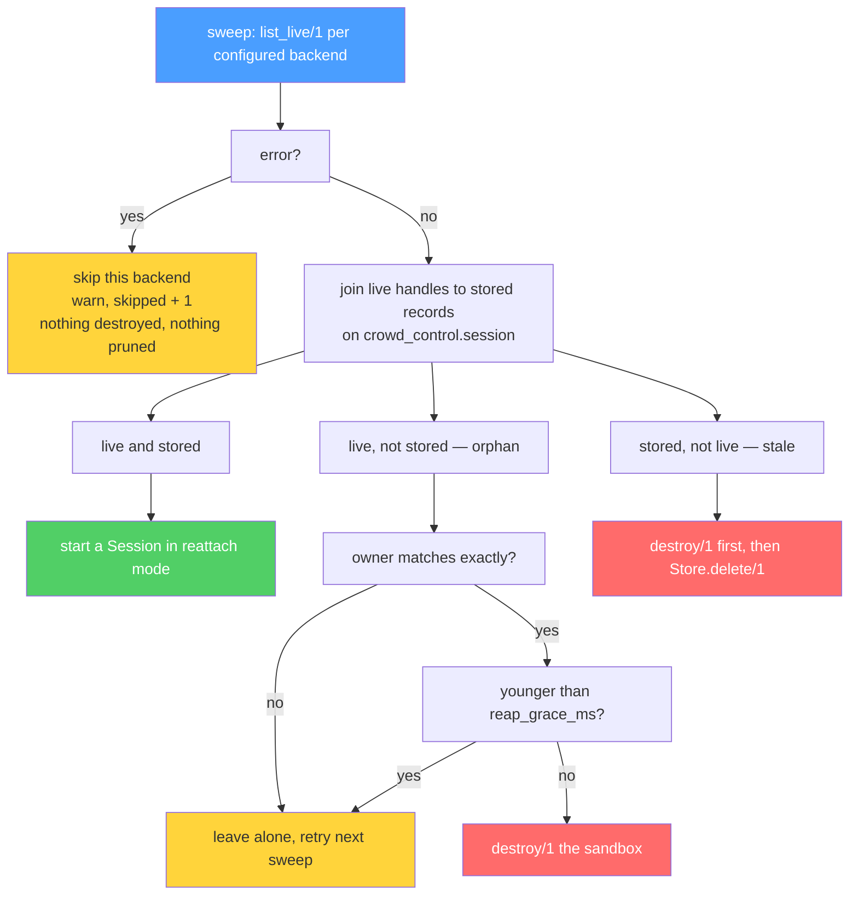
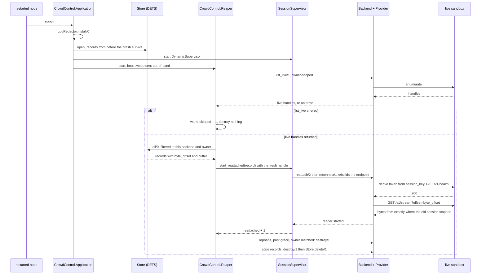

# Operations

This is the layer that has to be right when nobody is watching: what gets written
down, what reconciles a node restart against reality, what keeps a credential out
of a log line, and what to page on.

Nothing here is about running a session — the [README](../README.md) covers usage
and every option table. This document covers the parts of the system that outlive
a session: `CrowdControl.Store`, `CrowdControl.Reaper`,
`CrowdControl.LogRedactor`, and the supervision order that makes them work in that
order. For the layers being operated, see [architecture.md](architecture.md),
[sandboxes.md](sandboxes.md) and [providers.md](providers.md).
[SECURITY.md](../SECURITY.md) is the authority on threat model and hardening
posture.

## Supervision order, and why it is an order

CrowdControl.Application's start/2 does four things, and three of them are
sequenced deliberately:

```elixir
:ok = CrowdControl.LogRedactor.install()

children = [
  {store, store_opts},
  {DynamicSupervisor, name: CrowdControl.SessionSupervisor, strategy: :one_for_one,
   max_children: max_sessions},
  CrowdControl.Reaper
]
```

* The redactor is installed **before anything can fail**. The leak it exists to
  close happens on a routine failed exec upgrade, which can occur during the boot
  sweep itself.
* The store must be up before any session can persist to it.
* The reaper comes **last**, because its boot reconciliation starts sessions under
  `CrowdControl.SessionSupervisor`.

`max_children` comes from `config :crowd_control, :max_sessions` (default `50`), and
a non-positive value raises at boot rather than producing a supervisor that accepts
everything.

## Store

A remote sandbox outlives the `CrowdControl.Session` that created it. When the node
restarts, the only way to find those sandboxes again — and to resume reading their
output without losing or duplicating a byte — is a record written before the crash.

### What a record holds

`t:CrowdControl.Store.t/0`, built by `CrowdControl.Store.build/1`:

| Field | Meaning |
|---|---|
| `:key` | the CrowdControl session key; the store key *and* the sandbox label |
| `:session_id` | the **CLI's** own session id, for `--resume`. `nil` until the CLI emits `system/init` |
| `:backend` | the backend module, so the reaper knows who owns the handle |
| `:handle` | backend-opaque; must survive `:erlang.term_to_binary/1` |
| `:byte_offset` | bytes of sandbox output already delivered to the session |
| `:buffer` | partial line in flight at the last write |
| `:opts` | the session opts, replayed on reattach |
| `:owner` | this node's owner id; scopes reaping |
| `:updated_at` | `System.system_time(:millisecond)` |

The cursor halves are the point of the whole thing. `:byte_offset` says where to
resume reading the sandbox's output file; `:buffer` carries the partial line that
was in-flight when the session died. Reattaching seeds the buffer and reads from the
offset, so **a line split across the failure is rejoined exactly**. That is why the
cursor is two fields and not one: a backend consumes only `:byte_offset`, and
`Session` re-seeds `:buffer` itself, in the state `init/1` returns — necessarily
before any `{:stdout_data, _}` cast is processed, since a GenServer does not touch
its mailbox until `init/1` has returned.

Four things are deliberately **not** stored:

* `messages` / `message_count` — already a lossy window capped by `:max_messages`,
  and rebuildable by replaying the sandbox's output from offset 0 if a caller ever
  needs it;
* `subscribers` — pids, meaningless after a restart; callers re-`subscribe/1`;
* `timeout_ref`, `reader` — process-local, rebuilt on reattach.

### Two different ids

Records are keyed by the **CrowdControl session key**, a random 32-hex-character id
(`Store.new_key/0`) minted by `CrowdControl.Session` at startup, *before* the
sandbox is provisioned, and stamped onto the sandbox as its
`crowd_control.session` label. That label is what lets the reaper match a running
container back to its record.

The CLI's own session id is a different thing: it does not exist until the CLI
emits `system/init`, and it is only useful for `--resume`. Keying on it would leave
every session unfindable for the first few hundred milliseconds of its life —
precisely the window in which a crash strands a sandbox nobody can reap.

### Only reattachable backends write

`CrowdControl.Backend.Local` cannot reattach — a local subprocess dies with the VM —
so a store write per stdout chunk would be pure overhead. `Session` checks
`CrowdControl.Backend.reattachable?/1` and skips persistence entirely for such
backends, both on write (`persist/1`) and on delete (`forget/1`).

### ETS or DETS

Both ship, neither adds a dependency, and the difference is exactly one failure
mode.

`CrowdControl.Store.ETS` (the default) is a named **public** table owned by its
GenServer, with `read_concurrency` and `write_concurrency`. Public is the point:
reads and writes go straight to ETS from the session process, with no serialization
through a single mailbox. `Session` writes on every stdout chunk, and funnelling
that through one process would make the store the bottleneck for every session at
once. It survives a session crash — the sandbox stays labelled, the record stays in
the table, the reaper can reattach — and does **not** survive a node restart.

`CrowdControl.Store.DETS` survives a node restart:

```elixir
config :crowd_control, :store,
  {CrowdControl.Store.DETS, path: "/var/lib/crowd_control/sessions.dets"}
```

Every write is followed by `:dets.sync/1`. That is deliberately the slow, correct
choice: the whole reason this store exists is to survive an ungraceful death, and a
record still sitting in a DETS buffer when the node is `SIGKILL`ed is a leaked
container nobody can find. Sessions that write frequently and can tolerate loss
should use ETS instead.

Two operational notes:

* Without `:path` it opens under `System.tmp_dir!()`, which on a shared host is
  world-readable. The file is chmod'ed to its owner on open, and a failure to do so
  logs a warning rather than refusing to start. Records are not secret by design —
  credentials are stripped before persisting — but they still carry session ids,
  prompt-adjacent buffered output, and sandbox handles. Set `:path` in production.
* It is **node-local durable, not distributed**. Two nodes pointing at two
  different DETS files each see only their own sessions, which is why sandbox
  ownership is enforced by *label* rather than by store contents. Callers wanting a
  shared view implement the four-callback behaviour over Ecto or Redis.

### `owner_id/0`: the coordination primitive

`CrowdControl.Store.owner_id/0` defaults to `to_string(node())` and is configurable:

```elixir
config :crowd_control, :owner_id, "prod-worker-1"
```

Every sandbox is labelled with it, every `list_live/1` filters on it, and the reaper
only ever destroys sandboxes carrying its own. Two nodes with independent stores
therefore cannot reap each other's work. Callers sharing one backend across nodes
with a *shared* store should set a single shared `:owner_id` — the owner stamp is
the coordination primitive either way.

Two substrates cannot carry a raw owner in a label: `nonode@nohost` is not a legal
Kubernetes label value, and GCE labels reject `@` and `.` as well. Sanitizing is
lossy in exactly the way that lets one node's reaper destroy another's work, so both
put the raw owner somewhere unconstrained (a Kubernetes annotation, GCE instance
metadata) and a sha256 prefix in a label for the server-side selector. The reaper's
local re-check compares **raw** owners exactly, so both gates stay honest.

### Nothing credential-bearing is persisted

Two mechanisms, applied on the way to the store, both in `Session.persist/1`:

* `CrowdControl.Store.scrub_opts/1` drops every key in
  `CrowdControl.Store.secret_keys/0` — `:api_key`, `:session_token`, `:env`,
  `:proxy_token`, `:auth_token`, `:sandboxd_secret`, `:gce_config` — from the opts.
  Nothing about reattaching a session needs its API key: the sandbox already holds
  whatever environment it was started with.
* `CrowdControl.Backend.scrub/2` delegates to the backend's (and then the
  provider's) `scrub/1` for the handle. `Backend.Sandboxd` drops the endpoint
  wholesale; `Provider.Gce` rebuilds its handle from five fields;
  `Provider.Compose` additionally strips each service spec's `:env`, because
  `scrub_opts/1` cannot see into `:services` and a service spec's `:env` is exactly
  where a proxy's upstream key or a database password lives.

Two entries in `secret_keys/0` are there for reasons worth naming.
`:sandboxd_secret` is normally read from application config rather than passed in
opts — but a caller *may* pass it, and a stray copy in a persisted record would
defeat the entire point of deriving the agent token instead of storing it.
`:gce_config` is not a secret by name, which is exactly why it needs naming: it
holds a `%GcpCompute.Config{}` carrying a live token-provider argument.

## Reaper

`Session.terminate/2` is best-effort and never runs on `SIGKILL`, a VM crash, or a
hard container stop. For a local subprocess that does not matter much — the OS reaps
it. For a *billed* remote sandbox it matters a great deal: the container keeps
running and keeps costing money with nothing left to stop it. The reaper is the only
real guarantee.

It runs once at boot (out-of-band, via `send(self(), :sweep)`, so a slow or
unreachable daemon cannot block application startup) and then every
`:sweep_interval`, default 5 minutes.

```elixir
config :crowd_control,
  reaper: [
    backends: [{CrowdControl.Backend.Docker, image: "my-cli:latest"}],
    sweep_interval: :timer.minutes(5),
    reap_grace_ms: 60_000,
    reattach: true
  ]
```

With no `:backends` configured the reaper starts and does nothing, which is the
correct default for the local backend. `sweep_on_boot: false` suppresses the boot
sweep when you want to drive sweeps yourself; `CrowdControl.Reaper.sweep/2` runs one
synchronously and returns what it did, which is the operational poke as well as the
test hook.

### What it reconciles, and in which direction

For each configured backend, `list_live/1` is compared against `Store.all/0` —
filtered to records whose `:backend` is *that* module and whose `:owner` is *this*
owner.



A sweep returns `%{reattached:, destroyed:, pruned:, skipped:}`.

### The two directions of leak it closes

**Live but not stored — the orphan.** A sandbox exists, nothing knows why. That is
what a node killed between `provision/1` and its first store write produces. It is
destroyed, subject to two gates below.

**Stored but not live — the stale record.** This one is subtler and its mishandling
was a real leak: two Pods sat on a test cluster for **33 days**. "Not live" does not
mean "gone". Every backend's `list_live/1` reports what is *reattachable* —
`Backend.Kubernetes` filters to phase `Running`, `Backend.Docker` lists with
`all: false` — so a sandbox whose CLI exited without `destroy/1` ever being called
becomes invisible there while its Pod object or exited container lives on forever.
Deleting only the record made the leak permanent *and* unobservable, because the
record was the last thing that knew the sandbox existed.

So `prune_stale/3` destroys **before** deleting. That ordering is safe rather than
merely useful: `c:CrowdControl.Backend.destroy/1` is contractually idempotent and
treats an already-gone resource as success, so the common case (the substrate really
is gone) costs one `404` per stale record. And it cannot destroy a *starting*
sandbox, because a record only exists after `provision/1` returned, and `provision/1`
does not return until the sandbox is running.

### Fail open, three times

Every destructive branch requires **positive evidence**. Three places implement
that, and each one prefers a missed reap over a wrong one.

**A backend whose `list_live/1` errors is skipped**, with a warning, and counted in
`:skipped`. It is never treated as "nothing is live". That misreading is the single
most dangerous bug available here: one unreachable daemon would make every running
sandbox look like a stale record, and the sweep would delete the lot. A network blip
must not prune live, billed work. The listing call is additionally wrapped so an
exit or an exception becomes an error tuple rather than taking the sweep down.

**An unknown age is read as "too young to reap".** `within_grace?/3` consults
`age_ms/1` and treats a non-integer answer — including the `nil` a provider returns
when it cannot date the sandbox — as inside the grace window. A missed reap costs one
sweep interval; a wrong reap costs a live session. This is also why implementing
`age_ms/1` is effectively mandatory for a provider: see
[providers.md](providers.md).

**The grace window itself.** `:reap_grace_ms` (default `60_000`), measured against
the `crowd_control.created_at` label the providers set at create time, protects a
sandbox created by a node that has not yet written its store record. Destroying it
would be a race the caller cannot win.

### Owner scoping, checked twice

Ownership is filtered daemon-side by `list_live/1`. Destruction is irreversible, so
`owned_by?/3` re-checks locally rather than trusting one filter:

* a handle that has no `:owner` concept at all falls through — there is nothing to
  check;
* a handle that *has* the field but carries `nil` or a foreign owner is **refused**,
  with a warning naming both owners.

That warning is a configuration signal, not noise: it means two nodes are looking at
one substrate with mismatched `:owner_id`, or a shared store is in use without a
shared owner. See [What to alarm on](#what-to-alarm-on).

## Reattach across a node restart



Note the one substitution: the reaper re-points each record at the handle the
substrate just reported, because that one is authoritative — the stored handle may
predate the restart. What it keeps from the record is the cursor.

### What has to be true

1. **A durable store.** `Store.ETS` dies with the VM, so its records are gone before
   the sweep runs and every live sandbox looks like an orphan. Use `Store.DETS` (or
   your own implementation).
2. **The same `:owner_id`.** Records are matched on `backend == module and owner ==
   owner`, and `list_live/1` filters owner-side. A node that comes back with a
   different owner id sees neither its records nor its sandboxes. If it is the
   default `to_string(node())`, the node name must be stable.
3. **The same `:sandboxd_secret`**, for anything on `Backend.Sandboxd`. The agent
   token is re-derived from the persisted `session_key`; `Provider.Gce` re-derives
   its ed25519 tunnel keypair from the same token.
4. **Reattach-time configuration for anything `scrub/1` dropped.** `Provider.Gce`
   keeps five fields and nothing else, so a node needs
   `config :crowd_control, gce: [project: …, zone: …]` — and anything non-default
   among `:agent_port`, `:ready_timeout`, `:ssh_port` — from configuration rather
   than from the record.
5. **`reattach: true`** (the default) and the backend configured in the reaper's
   `:backends`.
6. **The sandbox must still be *reattachable*, not merely existing** — `Running`
   phase for Kubernetes, a running container for Docker. Anything else is a stale
   record, and the reaper destroys it rather than resuming it.

### What fails closed

* **A rotated `:sandboxd_secret`.** The re-derived token no longer matches, health
  answers `401`, and reattach fails with `{:error, {:sandboxd, :unauthorized}}`. No
  retry loop with a wrong credential. This is the intended trade against a live
  credential at rest in DETS.
* **`backend.reattach/2` failing.** `Session.init/1` returns `{:stop, reason}`, the
  reaper logs `failed to reattach <key>` and counts nothing. The sandbox is left
  **untouched** and retried on the next sweep — a sandbox this node cannot reattach
  to is still a live sandbox, and destroying it there would turn a transient tunnel
  failure into lost work.
* **The reader failing to start after a successful reattach.**
  `Session.reader_or_destroy/3` destroys the sandbox and returns the error. A
  session that cannot read is deaf, and a deaf session holding a billed sandbox is
  worse than no session.
* **`Backend.Local`.** Not reattachable, so no record is ever written and there is
  nothing to reconcile. That is correct, not a gap.
* **A missing `:sandboxd_secret`** raises at `Provider.token/1` with the
  configuration snippet, rather than defaulting to something per-boot that would
  break reattach silently.

## `CrowdControl.LogRedactor`

A `:logger` primary filter exists because a dependency puts a whole
`%Req.Request{}` — kubeconfig included — into a crash report on a routine failed
upgrade.

`kubereq` 0.4.5 changed how an exec/log websocket is established: its `Req` adapter
answers a synthetic `101` and **casts** the real request to the connection process,
which then performs the upgrade. When that upgrade is rejected — a deleted Pod
(404), a wrong container name (400), an unsupported subprotocol (403) — or the
socket fails, the connection process stops abnormally, and OTP's crash report
includes its **last message**: the cast, carrying the whole request struct.

Measured against a live cluster:

* with a **certificate** kubeconfig, `:connect_options` carries
  `cert: <<48, 130, …>>` — client-certificate DER, in a ~2 KB `:error` line;
* with a **token** kubeconfig — the in-cluster ServiceAccount posture, i.e.
  production — `Req`'s `Inspect` implementation redacts the `authorization` header,
  but `options.kubeconfig.current_user["token"]` is printed **in full**.

A failed exec upgrade is a routine event: a Pod that was reaped mid-session
produces one. Without the filter a cluster credential reaches the log on an ordinary
day.

### It redacts fields; it never drops an event

The reason, the process name and the stacktrace all survive, so a crash is still
diagnosable. Only the credential-bearing terms are replaced with
`:redacted_by_crowd_control`:

* `:last_message`, `:state` and `:client_info` on the report itself —
  `{:gen_server, :terminate}` puts the offending term in `:last_message`;
* inside a `{:proc_lib, :crash}` report's own proplist, `:message_queue`,
  `:messages` and `:dictionary` unconditionally, plus any other entry whose value
  contains a request.

### It only fires on reports that actually carry a request

`leaky?/1` walks `:last_message`, `:state` and `:report` looking for a
`%Req.Request{}` or a Kubereq.Connect, and an event that has neither passes
through untouched. Any other library's crash reports are unaffected.

Two implementation facts matter operationally. The structs are matched by
`__struct__` rather than by pattern, because `:req` and `:kubereq` are optional
dependencies and this module must compile and run in an application that has
neither. And the walk is depth-bounded at **8**: the `{:proc_lib, :crash}` path is
six descents (`report → [props] → {:message_queue, [_]} → [cast] →
{:"$gen_cast", {:request, %Req.Request{}}}`) and `{:gen_server, :terminate}`'s
`:last_message` is two, so eight leaves margin without turning a filter into the
expensive part of a crash. Breadth at each level is a handful of keys, and crashes
are rare.

`install/0` is idempotent — adding a filter under the existing name
`:crowd_control_redact` is a no-op — so a release that restarts the application does
not accumulate filters.

### Opting out

```elixir
config :crowd_control, redact_logs: false
```

Set that if you install your own filter, or if you would rather have the raw reports
and accept what they contain.

## Telemetry

Be clear about the size of this surface: **one `:telemetry` event is emitted today.**

```
[:crowd_control, :gce, :phase]
measurements: %{duration_ms: non_neg_integer()}
metadata:     %{phase: :insert | :running | :ssh | :health,
                result: :ok | :error,
                instance_name: String.t(),
                zone: String.t()}
```

```elixir
:telemetry.attach("gce", [:crowd_control, :gce, :phase], &handler/4, nil)
```

It exists because `Provider.Gce.acquire/1` is minutes long and was opaque:
`:ready_timeout`'s documentation asks a caller to raise it for a heavy bootstrap and
lower it for a prebuilt image, and nothing reported where the minutes actually went.
It is emitted on failure too, with `result: :error`, which is the case a caller most
needs — "it timed out" is not actionable, "`:ssh` timed out after 180s" names the
firewall rule. The four phases and their measured baselines are in
[providers.md](providers.md).

Everything else observable today is `Logger` plus `CrowdControl.Reaper.sweep/2`'s
return value. That return value is the closest thing to a metrics surface for
reconciliation: `%{reattached:, destroyed:, pruned:, skipped:}`, synchronous, safe to
call on a schedule from your own instrumentation.

## What to alarm on

Grounded in the specific failure modes the code actually reports.

### Page

**`skipped > 0` from a sweep**, or the log line
`Reaper: <Module> list_live failed (…); skipping this backend.` The reaper is blind
to that backend: nothing will be destroyed and nothing pruned until the listing
works again. Orphans accumulate and billed sandboxes keep billing. Sustained across
several sweep intervals, this is the expensive failure in the whole system. It is
also, by design, the *safe* one — the alternative would have been destroying every
live sandbox — so it must be visible rather than merely correct.

**`[:crowd_control, :gce, :phase]` with `result: :error`.** Alarm per phase, because
each names a different cause:

* `:insert` — quota, spot capacity, or a bad spec. The provider has already rolled
  back, including the case where the operation poll timed out with a VM created and
  billing.
* `:running` — the guest never reached `RUNNING` with an address within
  `:ready_timeout`.
* `:ssh` — the tunnel could not be established. Firewall rule, `:external_ip:
  false` without same-VPC connectivity, or OS Login re-enabled at the project level.
  Measured baseline is 23.8s; a timeout at the default 180s is not a slow boot.
* `:health` — the agent never answered. Bootstrap script, a wrong
  `:sandboxd_sha256`, or a tarball built for the wrong architecture. This is where a
  checksum mismatch surfaces, because the script refuses to extract and the VM is
  then destroyed.

**`Reaper: refusing to destroy <key> — owner <a> does not match <b>`.** A
misconfiguration, and the last gate before an irreversible operation caught it. Two
nodes are looking at one substrate with mismatched `:owner_id`, or a shared store is
in use without a shared owner. Nothing was destroyed, and nothing will be until it
is fixed — which also means those sandboxes are now nobody's to reap.

### Investigate

**A reader giving up.** Three shapes, all `Logger.warning`, all ending in the
session receiving `:eof`:

* `Kubernetes reader giving up after N consecutive reconnects: …` — the
  reconnect-at-`byte_offset` path exhausted its budget;
* `Kubernetes reader stopped: …` and `Docker reader stopped: …` and
  `sandboxd reader stopped: …` — a terminal transport failure.

The session ends. Whether that is a lost result depends on whether the CLI had
finished, which the log line cannot know — so alarm on the rate, not the instance.

**`Reaper: failed to reattach <key>: <reason>`.** The sandbox is alive and billed;
this node cannot talk to it. Retried next sweep, so a single occurrence is a blip.
Repeating for the same key across sweeps is not: check `:sandboxd_secret` (a
rotation fails this closed with `{:sandboxd, :unauthorized}`) and the reattach-time
configuration `scrub/1` dropped — for `Provider.Gce`, `config :crowd_control, gce:
[project:, zone:]`.

**Teardown warnings.** All of these return `:ok` deliberately, because
`Session.release`/`destroy` runs from several paths that must all complete, and
failing loudly there turns a tidy shutdown into a crash. They are the reaper's
inbox, not errors:

* `compose teardown incomplete for <project>: <failures>`
* `sandboxd container destroy failed for <id>` / `sandboxd network destroy failed`
* `sandboxd GCE instance destroy failed for <instance>` — bounded by
  `maxRunDuration` rather than permanent, which is exactly what that backstop is for
* `sandboxd GCE release could not build a client config` — the same, and it means
  the reaper cannot list that provider either
* `Kubernetes destroy failed for <pod>` / `Docker destroy failed for <id>`

**`Session stream exceeded max_stream_bytes=N; destroying sandbox`** and
**`Session line exceeded max_line_bytes=N; killing subprocess`** — both
`Logger.error`. The cap destroys the sandbox rather than rotating the capture file,
because rotation would invalidate every persisted byte offset and silently corrupt
resume, which is the precise failure the offset cursor exists to prevent. A runaway
CLI, or a cap set too low for the workload.

**`Session timed out after Nms`.** The session's own `:timeout` fired; the sandbox
was destroyed and subscribers got `{:timeout, :session_expired}`. Expected at some
rate; a step change means either a slower model or a cap that no longer fits. On
`Provider.Gce`, note the coupling: `:timeout` feeds the default
`:max_run_duration`.

**`Could not restrict permissions on <path>`** from `Store.DETS`. The store is
running with a file it could not lock down to its owner. On a shared host, fix it.

### Baseline, do not alarm

* `Reaper: pruning stale record <key> and destroying its sandbox` and
  `Reaper: destroying orphaned sandbox <key>` — the reaper doing its job. Worth
  graphing, because a rising `destroyed` count means sessions are dying without
  `terminate/2`, and a rising `pruned` count means sandboxes are exiting without
  anyone calling `destroy/1`.
* `Reaper: <key> is inside the grace window; leaving it alone` (debug) — a sandbox
  mid-provision.
* `Reaper: reattached session <key>` — the restart path worked.

## Configuration checklist

Everything on this page, in one place:

```elixir
config :crowd_control,
  # Durable across a node restart. Set :path; the default is a temp dir.
  store: {CrowdControl.Store.DETS, path: "/var/lib/crowd_control/sessions.dets"},

  # Stable across restarts, and distinct per node unless the store is shared.
  owner_id: "prod-worker-1",

  # Required by Backend.Sandboxd. At least 32 bytes of random data, and stable
  # across restarts, or reattach fails closed with {:sandboxd, :unauthorized}.
  sandboxd_secret: System.fetch_env!("CC_SANDBOXD_SECRET"),

  # DynamicSupervisor max_children. Default 50.
  max_sessions: 50,

  # Default true. Only turn it off if you install your own :logger filter.
  redact_logs: true,

  # Reattach-time client config for Provider.Gce, because scrub/1 drops it.
  gce: [project: "my-project", zone: "us-central1-a"],

  reaper: [
    backends: [{CrowdControl.Backend.Docker, image: "my-cli:latest"}],
    sweep_interval: :timer.minutes(5),
    reap_grace_ms: 60_000,
    reattach: true
  ]
```
