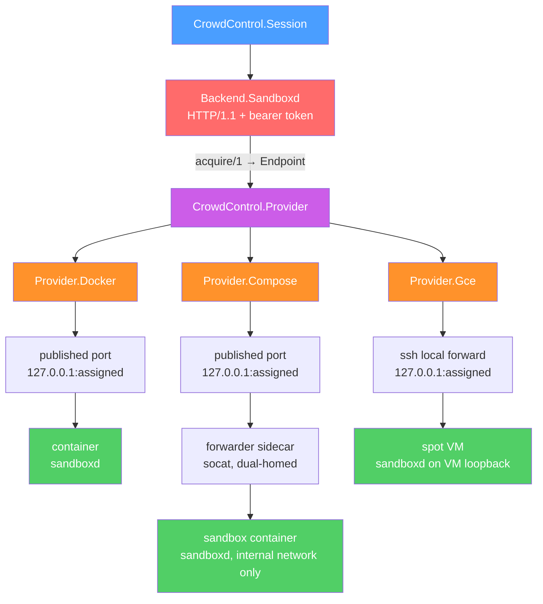
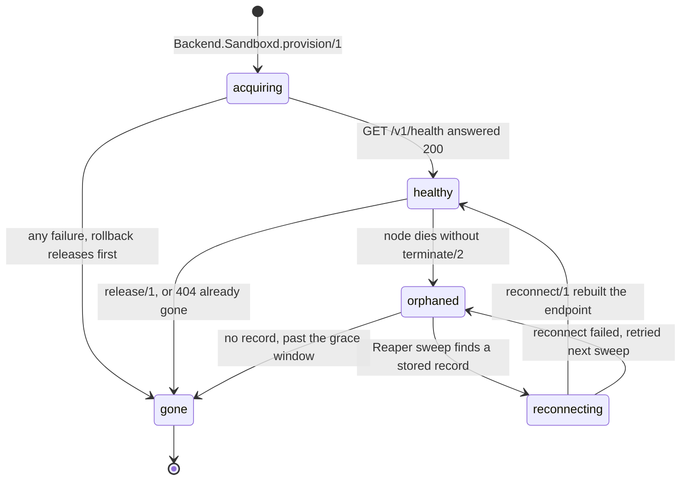
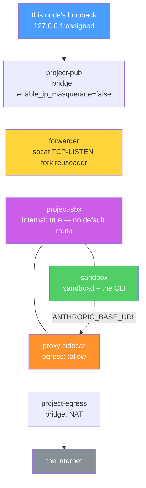
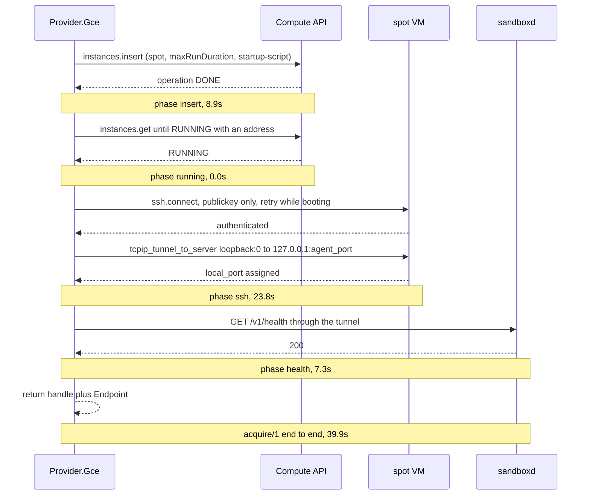

# Providers

A provider owns *where* a sandbox lives. It does not own bytes.

That sentence is the whole design, and it is the distinction readers most often
collapse. `CrowdControl.Backend.Sandboxd` is the byte transport for **every**
provider, because every provider runs the same in-sandbox agent (`sandboxd`) and
speaks the same HTTP protocol to it. A provider's entire job is to produce a
sandbox with that agent running in it, hand back something to speak HTTP to, and
be able to find and destroy the sandbox later.

Before this split existed, `CrowdControl.Backend` already parameterized *where* a
CLI ran — but each substrate also had to bring its own transport: the Docker
backend's FIFO/`tee` pair, the Kubernetes backend's exec stream. A VM has no exec
API at all, so a fourth substrate would have meant a fourth transport. With one
agent, a new substrate is provisioning code and nothing else.

For the layer above this one — `Session`, `Agent`, `Backend` — see
[architecture.md](architecture.md). For what the sandbox looks like from the
inside, see [sandboxes.md](sandboxes.md). For the threat model, egress posture and
NetworkPolicy stance, [SECURITY.md](../SECURITY.md) is the authority; this
document links to it rather than paraphrasing it. For options tables and
quick-start, see the [README](../README.md).

## The same transport on three substrates



Read the diagram left of `Provider` once and it is true for all three columns:
`GET /v1/stream?offset=N`, `POST /v1/exec`, `POST /v1/stdin`, `GET /v1/status`,
`GET /v1/health`. Nothing in `Backend.Sandboxd` branches on which provider it got.
The three columns differ only in what sits between this node's loopback and the
agent — a Docker port binding, a `socat` hop, or an SSH channel.

## The behaviour

Four required callbacks, two optional ones.

| Callback | Required | What it must do |
|---|---|---|
| `acquire/1` | yes | Create a sandbox; return `{:ok, handle, endpoint}` only once `GET /v1/health` has answered `200` |
| `reconnect/1` | yes | Rebuild the *endpoint* for a sandbox that already exists. Creates nothing |
| `release/1` | yes | Destroy the sandbox. Idempotent; already-gone is success |
| `list_live/1` | yes | Every sandbox this provider can still see, owner-scoped, paginated exhaustively |
| `age_ms/1` | no | Age in milliseconds, or `nil`. Optional in the behaviour, mandatory in practice — see below |
| `scrub/1` | no | Strip everything from the handle that must not be persisted |

`CrowdControl.Provider.resolve/1` turns the `:provider` option into
`{module, opts}`, accepting a bare module or `{module, config}` and merging the
config over the remaining opts — the same shape as
`CrowdControl.Backend.resolve/1`, with one deliberate difference: **there is no
default provider**. A provider decides where untrusted model-driven code runs, and
guessing that is not a service this library provides, so a missing `:provider`
raises `ArgumentError` rather than picking one.

### Three load-bearing contracts

**1. `acquire/1` returns only when the agent has answered health.** Not when the
API call succeeded, not when the container is "created", not when the operation is
`DONE`. Provisioning that reports success before the agent answers is the single
largest source of flaky remote backends, and it is the *default* behaviour of the
substrates underneath: `gcp_compute`'s `insert_and_wait/3` waits for the
operation, never for the guest. A failed `acquire/1` must also release whatever it
created before returning. A leaked container is untidy; a leaked spot VM bills
forever.

Both shipped Docker-shaped providers and the GCE provider implement this the same
way, and it is visible in the code as an explicitly staged pipeline rather than one
`with` chain. The reason is worth knowing because it is a real bug that was
avoided: an `else` branch cannot see rebindings made in the `with` body, so a
rollback written the obvious way would run against a handle that still had
`container_id: nil` (or `tunnel: nil`) and would delete the network while leaking
the container — **silently**, since `release/1` returns `:ok` either way. Each step
therefore hands the updated handle to the next, and rollback is called from the
scope that knows what exists.

**2. `release/1` is idempotent, and "already gone" is success.**
`CrowdControl.Session` calls `destroy/1` from both `handle_cast(:eof, _)` and
`terminate/2`, and both can run for one session. A `404` from the substrate means
the sandbox is gone, which is precisely what the caller asked for. Returning an
error there turns a tidy shutdown into a crash.

**3. The endpoint is never persisted.** The handle goes into
`CrowdControl.Store` and must survive `:erlang.term_to_binary/1`. The endpoint must
not. So the handle persists the *resource* — `{container_id}`, `{project_name}`,
`{instance_name, zone}` — and `reconnect/1` rebuilds the *path*.

### `age_ms/1`: optional in the behaviour, mandatory in practice

Omitting it does not mean "no grace period". It means orphans are never collected
at all, and no single link in the chain looks wrong:

`CrowdControl.Backend.Sandboxd` exports `age_ms/1`, so `CrowdControl.Reaper` always
consults it → `CrowdControl.Provider.age_ms/2` returns `nil` for a provider that
defines no callback → the reaper reads an unknown age as "too young to reap",
because fail-open is the right default there. A missed reap costs one sweep
interval; a wrong reap costs a live session.

So a provider without `age_ms/1` leaks every orphan forever. All three shipped
providers implement it: the Docker-shaped ones read the
`crowd_control.created_at` label they set at create time, and the GCE one diffs
`DateTime.utc_now/0` against the instance's own creation timestamp, re-read through
`Gce.API.get_instance/3`. Each returns `nil` rather than `0` on any failure to date
the sandbox — guessing zero would make the reaper destroy a sandbox it could not
date.

### `Provider.Endpoint`: how to reach one agent, right now

`%CrowdControl.Provider.Endpoint{}` is what `acquire/1` and `reconnect/1` return
and what `CrowdControl.Backend.Sandboxd.API` consumes. `:base_url` and `:token`
are enforced keys; every field is ephemeral, each for a different reason:

* `base_url` — a loopback port assigned per-connection. Docker publishes the agent
  on `127.0.0.1:0` and the daemon picks the port; a GCE tunnel opens a fresh local
  listener each time. Persisting it means reattaching to whatever else claimed
  that port.
* `token` — derived, not stored. See below.
* `headers` — extra request headers, merged **over** the `authorization` header
  built from `token`. This exists so a provider whose transport already claims
  `authorization` can say so, rather than the transport silently sending the wrong
  credential.
* `req_options` — transport-specific `Req` options (`:unix_socket`,
  `:connect_options`, custom CA certs), merged into `Req.new/1`.
* `transport` — a resource whose lifetime equals the endpoint's, such as the
  `:ssh` connection ref for a forwarded port, closed by `release/1`. A pid or ref
  here is precisely why this struct cannot round-trip through
  `:erlang.term_to_binary/1` usefully.

`Inspect` is overridden to redact `token` and to replace every header *value* with
`[REDACTED]`, and to print only the *keys* of `req_options`. That is not
decoration: endpoints end up in `Logger` metadata and error tuples on every
failure path. See [operations.md](operations.md) for the related `:logger` filter
that catches the same class of leak from a dependency's crash reports.

### Token derivation, and what rotating the secret costs

```
token = Base.url_encode64(:crypto.mac(:hmac, :sha256, secret, session_key), padding: false)
```

where `secret` is `config :crowd_control, :sandboxd_secret`
(`CrowdControl.Provider.token/1`). Nothing secret is written to disk, and reattach
recomputes the token from the persisted session key. `:sandboxd_secret` is
deliberately **not** defaulted or auto-generated: a per-boot secret would silently
break reattach across a node restart, which is the one thing the derivation exists
to support. `token/1` raises with a configuration snippet if it is unset.

The trade is explicit. Rotating `:sandboxd_secret` invalidates every live
sandbox's token, and reattach fails **closed** with
`{:error, {:sandboxd, :unauthorized}}`. The alternative is a live credential at
rest in DETS.

### What a provider must not do

Infer a security posture. If a sidecar needs egress, the caller says so; if a
network must be reachable, the caller names it. `CrowdControl.Backend.Docker`
already refuses to guess `:network_mode` (returning
`{:error, {:docker, :network_mode_required}}`) and providers inherit that
discipline — `Provider.Docker` refuses to guess `:egress`, `Provider.Compose`
refuses to guess a sidecar's `:egress`.

### The sandbox's life across the callbacks



Note the one asymmetry: `reconnect/1` never rolls back. A sandbox this node cannot
reattach to is still a live sandbox, and destroying it there would turn a transient
tunnel failure into lost work. Reaping is `CrowdControl.Reaper`'s decision, and
only after positive evidence — see [operations.md](operations.md).

### Adding a fourth provider

`CrowdControl.Provider.Kubernetes` is deliberately not shipped, but the behaviour
is graded on admitting it as provisioning code only, and
`CrowdControl.Provider`'s moduledoc carries the full callback-by-callback mapping.
Writing that table changed the behaviour: a pod's agent port is not routable, so
the endpoint would be the API server's pod proxy — which consumes the
`authorization` header for its *own* authentication, so a single `token` field
cannot carry both credentials. That is why `Endpoint` has `headers` and
`req_options` at all. The one-header protocol assumption survives for the three
shipped providers, where the agent is reached through a loopback port and
`authorization` is free.

## `Provider.Docker`

One container per sandbox, running `sandboxd`, reached on a loopback-published
port. Requires the optional `:req` dependency and an image containing the
`sandboxd` release — unlike `CrowdControl.Backend.Docker`, which works with any
image that has `sh` and `tail`.

Both the container and its private bridge network are named `cc-sbx-<session_key>`,
derived rather than random so that a crashed run's resources are found and cleaned
rather than orphaned under a name nothing knows. A `409` from
`POST /networks/create` is treated as success: a network left behind by a crashed
run has the same name, the same labels and the same posture, and `release/1`
removes it either way.

### It does not block egress, and it cannot

This is a documented regression, stated here because a reader deciding whether to
trust this provider with untrusted code needs it before anything else:

> On one container, `Internal: true` and a published port are mutually exclusive.
> Publishing requires at least one *non-internal* endpoint, and attaching one
> restores full internet egress.

That is measured, confirmed six independent ways, and the failure is silent —
`POST /containers/create` answers `201` with `"Warnings": []`. The full account,
including the six configurations tested and what each one did, is in
[SECURITY.md](../SECURITY.md) under "The Docker provider". It is the authority;
this document will not restate it.

The consequence for the API is that `:egress` is **required** and has no default,
exactly as `Backend.Docker` requires an explicit `:network_mode`. A missing value
is `{:error, {:docker, :egress_required}}`, and an unrecognised one is
`{:error, {:docker, {:bad_egress, other}}}`. Two values:

* `:allow` — a private per-sandbox bridge, full outbound access. Correct when the
  sandbox is *supposed* to reach an API, and honest about it.
* `:no_nat` — the same bridge with
  `com.docker.network.bridge.enable_ip_masquerade=false`. It is "no NAT", not
  "dropped": the internet becomes unreachable because return traffic has no SNAT,
  but the Docker host, every container on every other Docker network, and Docker's
  embedded DNS all stay reachable.

For a structural egress block *and* a reachable agent, use `Provider.Compose`.
That shape needs a second container, which is the next section.

### Publishing, and the two details that decide exposure

The agent is bound `0.0.0.0` *inside* the container (`CC_SANDBOXD_BIND`), because a
published port is forwarded from outside the container and an agent bound to the
container's own loopback would never receive it. Non-routability is the network's
job. On the host side the binding is `{"HostIp" => "127.0.0.1", "HostPort" => "0"}`
— and `HostIp` is mandatory, not cosmetic: omitting it yields **two** bindings
(IPv4 and IPv6) bound to every interface, which publishes the agent port to the
network rather than to the host.

The agent's own configuration goes through the create API's first-class `Env`
array: `CC_SANDBOXD_TOKEN`, `CC_SANDBOXD_PORT`, `CC_SANDBOXD_BIND`,
`CC_SANDBOXD_CAPTURE`, plus anything in `:agent_env`. The token is a credential and
never enters argv, a label, or a log line. Note that `:agent_env` configures the
*agent process*, not the CLI — the CLI's environment travels in the
`POST /v1/exec` request body.

### The published port is never persisted

Every `stop`/`start`/`restart` allocates a **new** ephemeral host port, and while a
container is stopped `NetworkSettings.Ports` is `{}` rather than reporting the old
one. So `reconnect/1` always re-reads it. Measured behaviour, not caution.

`CrowdControl.Provider.Docker.host_port_from_inspect/2` is public so the parsing is
testable without a daemon, and it treats four distinct shapes — all four observed
against a live daemon — as `{:error, {:docker, :agent_port_not_published}}`, because
all four mean "there is no usable port":

* the key is present with a `null` value — the binding was discarded because the
  network is internal;
* `HostPort` is `""` — `gateway_mode_ipv4: "routed"` reports a binding it did not
  make;
* `Ports` is `{}` — the container is not running;
* the key is absent — `ExposedPorts` was never set.

### Labels, and the three scopes on `list_live/1`

Containers carry `crowd_control.session`, `crowd_control.owner`,
`crowd_control.created_at`, `crowd_control.agent=sandboxd`, and
`crowd_control.stack=single`. `list_live/1` filters on the last three of those
concepts — owner, agent, stack — and each scope prevents a distinct way of
destroying the wrong thing:

* **owner**, or one node's reaper reaps another node's sandboxes;
* **agent**, or it also picks up `Backend.Docker`'s FIFO containers, which this
  provider cannot drive;
* **stack**, or it picks up `Provider.Compose`'s containers and the reaper tears a
  stack apart one container at a time, orphaning its networks and volumes.

`crowd_control.stack=single` exists as a *positive* discriminator because Docker
label filters cannot express label absence.

`release/1` deletes the container before the network, in that order, because a
network `DELETE` answers `403` while a container is still attached. `404` is
success at both steps.

## `Provider.Compose`

A per-session Docker *stack* — sandbox plus sidecars — over the Engine API. Same
job as `Provider.Docker`, one container more, and one property that provider
provably cannot have: a **structural** egress block on the sandbox that still
leaves the agent reachable from the host.

There is no `docker compose` dependency and there must never be one. The Engine API
has no compose endpoints — compose is a client-side Go plugin that synthesises
exactly the calls this module makes — so shelling out would buy a binary
dependency, a YAML round trip and a second error vocabulary in exchange for
nothing.

### Three networks, because the block needs two containers



The same measured constraint that limits `Provider.Docker` is what forces this
shape: publishing a port requires a non-internal endpoint, and attaching one
restores egress. So the sandbox and the thing the host talks to cannot be the same
container.

1. **`<project>-sbx`** — `Internal: true`. The sandbox sits here and *only* here.
   This is the one strong egress primitive: no default route exists at all, so the
   internet, the Docker host, containers on every other Docker network and
   Docker's own embedded DNS are unreachable structurally rather than by a missing
   NAT rule.
2. **`<project>-pub`** — non-internal, so `PortBindings` actually bind, but with
   `com.docker.network.bridge.enable_ip_masquerade=false` so the one container
   attached to it has no internet either. That option is not configurable here: it
   is the only reason the forwarder has no internet of its own.
3. **`<project>-egress`** — a plain NAT bridge, created **only** if some sidecar
   declares `egress: :allow`. If nothing asks, it never exists.

The **forwarder** sidecar is dual-homed on 1 and 2 and publishes the agent port on
`127.0.0.1:0`, running
`socat TCP-LISTEN:<port>,fork,reuseaddr TCP:<sandbox>:<port>` and addressing the
sandbox by its network alias. `fork` is not decorative: a single-slot forwarder
(`busybox nc -e`) dropped two of three concurrent requests in testing, and
`Backend.Sandboxd` holds a long-lived chunked stream open for the whole session.

The forwarder's second network is attached with `POST /networks/{id}/connect`
*after* create, not by listing two endpoints in `POST /containers/create`:
create-time dual attach is `HTTP 400` below API 1.44, and daemons still report
`MinAPIVersion` 1.40. The connect-after-create path is verified to produce an
identical container.

### Why the egress-proxy contract is enforceable here

`Backend.Docker` provides the proxy wiring but cannot make it *binding*: with
`network_mode: "bridge"` the sandbox has general outbound access, so a CLI that
ignores `ANTHROPIC_BASE_URL` simply reaches the real API and the proxy becomes
advisory. That is why that backend refuses to infer `:network_mode` at all.

Here there is no `bridge` to accidentally choose. The sandbox network is created by
this module, is internal by default, and lives and dies with the session — so the
proxy's alias on `<project>-sbx` is the *only* reachable path to anything, and the
contract in [SECURITY.md](../SECURITY.md) ("Egress proxy contract") is enforced by
routing rather than by convention. This provider consequently needs no explicit
`:network_mode` option.

Naming a sidecar with `:proxy_service` wires both halves:

* the sandbox's environment goes through
  `CrowdControl.Backend.Credentials.apply_credentials/2` — `ANTHROPIC_BASE_URL`
  points at the proxy's alias and `ANTHROPIC_API_KEY` becomes a per-session token,
  with any real `:api_key` **removed** rather than overridden;
* the proxy receives `CC_SESSION_TOKEN` (the minted token, so it can recognise the
  session) and the real `ANTHROPIC_API_KEY` (so it can substitute it upstream).

The proxy must declare `egress: :allow`, or it could not reach the upstream API and
the sandbox would fail in a way that looked like a model bug:
`{:error, {:compose, {:proxy_needs_egress, name}}}`.

With no `:proxy_service`, `:api_key` is placed in the sandbox's own environment
unchanged and no `ANTHROPIC_BASE_URL` is set. That is the honest no-proxy posture —
the sandbox holds a real provider credential — and it is what makes the removal
above observable rather than notional.

### Posture is never inferred

* `:egress` on a sidecar is **required** and has no default. `:none` keeps it on
  the internal network only; `:allow` also attaches it to the NAT bridge. Omitting
  it is `{:error, {:compose, {:egress_required, name}}}`. A sidecar with `:allow`
  sits on both networks and *can* relay the internet into the sandbox — which is
  exactly what an egress proxy is for, and exactly why saying so is mandatory.
* The sandbox service can never carry `:allow`; asking is
  `{:error, {:compose, :sandbox_egress_forbidden}}`.
* `network: [internal: false]` is accepted and gives the sandbox a NAT bridge and
  full internet. It is the one option that throws away the module's reason to
  exist, so it exists only as an explicit, typed-out act.

Hardening (`:cpus`, `:memory`, `:cap_drop`, `:security_opt`, `:pids_limit`,
`:user`, `:readonly_rootfs`, `:tmpfs`) comes from top-level options and applies to
**every** container in the stack, through
`CrowdControl.Backend.Docker.HostConfig`. There are deliberately no per-service
overrides: one posture per stack is the whole reason that module exists, and a
sidecar quietly weaker than the sandbox it shares a network with is not a useful
thing to be able to express.

### Everything is validated before a single byte reaches the daemon

A stack is N resources, and discovering an invalid service spec after four of them
exist means rolling back four resources to report a typo. So `acquire/1` runs every
gate first — session key, project name, network spec, volume declarations, service
specs, mount targets, `:ready` specs, proxy wiring — and only then creates the
networks, the volumes, and the containers in dependency order.

Ordering comes from each spec's `:depends_on`, resolved by a topological sort
(`order_services/1`). Readiness comes from `:ready`, which becomes a container
`Healthcheck` (Engine API durations are nanoseconds; the container config field is
`Healthcheck`, and `HealthConfig` is the name of its *type*, not of the field) and
is then polled from the client side at 250 ms intervals against
`State.Health.Status`:

* `"healthy"` → continue to the next service;
* `"unhealthy"` → **terminal**, `{:error, {:compose, {:unhealthy, name}}}`, and the
  whole stack rolls back. It is terminal rather than slow because a sandbox wired
  to a broken proxy fails later, in a way that looks like the model's fault;
* anything else — `"starting"`, or no `State.Health` yet, which the daemon
  populates a beat after `start` returns — is polled again until
  `:health_timeout` (default `60_000`).

A service with no `:ready` spec is started and not waited on.

### Teardown, and the compose labels that are deliberately absent

`release/1` retries the whole teardown sequence up to three times with a 100 ms
backoff, because a network `DELETE` answers `403` while a container is still
attached and a container that has not finished going away is exactly what produces
that. Retrying the sequence is cheaper than modelling the daemon's intermediate
states. Incomplete teardown logs a warning and still returns `:ok` — see
[operations.md](operations.md) for why that is the right shape and what watches it.

Containers carry `com.docker.compose.project`, `com.docker.compose.service`,
`com.docker.compose.container-number` and `com.docker.compose.oneoff`, so
`docker compose ls` and `docker compose ps` can render the stack for a human
debugging it. `config-hash` and `version` are **deliberately absent**: emitting
them tells the compose CLI it owns the stack, and a `docker compose up` in the same
project would then decide the config had drifted and recreate every container
underneath a live session.

`list_live/1` returns **one handle per stack**, grouped by `crowd_control.session`
rather than by compose project, so the reaper reaps stacks instead of picking
containers off one at a time and leaving a half-torn-down stack behind. The
`com.docker.compose.oneoff=False` label filter additionally excludes
`Provider.Docker`'s single containers, which carry no compose labels at all.
`scrub/1` drops the top-level credential keys via
`CrowdControl.Store.scrub_opts/1` and then strips each service spec's `:env` too,
because `Store.scrub_opts/1` cannot see into `:services` and a service spec's
`:env` is exactly where a proxy's upstream key or a database password lives.

## `Provider.Gce`

One Compute Engine VM per sandbox — spot by default — running `sandboxd`, reached
through an SSH tunnel to the VM's loopback. Requires the optional `:gcp_compute`
dependency and the OTP `:ssh` application. Nothing else: no `gcloud`, no IAP
client, no agent on the host.

### Reachability: loopback agent, in-memory key, forwarded port

The agent binds `127.0.0.1` **on the VM**, so it is not on the network at all. It
is reachable exclusively through the caller's SSH tunnel, whose local listener is
bound to loopback on this node. TCP 22 is therefore the only reachable port,
authenticated by a per-session ed25519 key with `PasswordAuthentication` never in
play. That is why `external_ip` defaults to `true` here and is still the safe
default — but two consequences are worth deciding about rather than discovering:
the default VPC allows `0.0.0.0/0` on port 22 (so the VM's sshd is internet-facing,
publickey-only), and `external_ip: false` is the hardened mode that needs same-VPC
connectivity from the calling node and Cloud NAT or a private artifact mirror. The
provider creates no firewall rules. `SECURITY.md`'s "The GCE provider" section is
the authority on that posture.

`CrowdControl.Provider.Gce.Tunnel` is small and almost entirely composed of
empirical results against OTP 29's `:ssh` and a real `OpenSSH 10.3p1` sshd, which
is what a GCE VM runs. The load-bearing ones:

* **`:loopback` is mandatory.** `tcpip_tunnel_to_server/6` with `ListenHost = :any`
  binds the local listener on *every* interface — publishing the sandbox agent to
  the LAN — and still returns a perfectly normal `{:ok, port}`. There is no error
  to catch, which is why it is a constant in the module and an assertion in the
  tests.
* **`{:ok, port}` is not evidence of reachability.** The call only does a local
  `gen_tcp:listen`; the `direct-tcpip` channel is opened lazily, per accepted
  connection. A tunnel to a closed remote port succeeds identically. `GET
  /v1/health` is the only readiness proof — which is what makes `acquire/1`'s
  contract mandatory rather than stylistic.
* **`silently_accept_hosts` must be `false`.** With `true`, OTP accepts a host key
  the callback rejected with `false`, silently defeating `:host_key_fp`. Only
  `{:error, _}` is honoured on either setting.
* **`save_accepted_host` defaults to `true`**, so it is switched off explicitly: no
  code path may write a `known_hosts` file.
* **A `key_cb` failure reason never reaches the caller** — `:ssh.connect/4`
  collapses everything into `"Key exchange failed"` or `"Unable to connect using
  the available authentication methods"` — so the callback reports to the calling
  process instead.

Connect retries until the deadline on exactly three classes of failure, because all
three are the *normal* state of a booting VM: `:econnrefused` (sshd not listening
yet), `:timeout` (TCP accepts, no SSH banner yet), and authentication failure (the
guest agent has not yet turned the metadata key into an `authorized_keys` line).
Surfacing any of them immediately would fail every acquire.

**Host keys are the one documented regression against `Provider.Docker`**, where
the transport is a loopback socket and there is nothing to authenticate. By default
the first host key presented is accepted. `:host_key_fp` pins it when the caller
has a fingerprint, but nothing supplies one for an ordinary per-session VM: a fresh
guest generates its host key on first boot, and reading it back needs
`instances.getSerialPortOutput`, which `gcp_compute` does not wrap. Two
alternatives were rejected — `silently_accept_hosts: true` is strictly worse
because it also disables pinning when a fingerprint *is* known, and generating the
host key ourselves would mean shipping its private half in instance metadata, i.e.
handing the MITM key to every project viewer.

### The keypair is derived, not random

A random per-session keypair cannot survive `reconnect/1`. The key lives in RAM,
`gcp_compute` has no `instances.setMetadata`, so the VM's `authorized_keys` is
fixed at create time — and a node restart would leave a live sandbox permanently
unreachable.

So the ed25519 seed is `sha256("cc-gce-ssh/v1" <> agent_token)`, where the agent
token is `CrowdControl.Provider.token/1`, itself an HMAC of `:sandboxd_secret` over
the session key. `reconnect/1` re-derives the identical keypair from the persisted
`session_key` alone, and the private half still never exists anywhere but memory.
The seed is one-way from the token (sha256, with a domain tag), so neither derived
secret discloses the other, and both are per-session. Same trade as the agent
token, same failure mode: rotating `:sandboxd_secret` fails reattach closed.

The public half is published as instance metadata `ssh-keys` in the
`USERNAME:KEY_VALUE` form the guest agent's `getUserKeys` parses, for the user
`ccsandbox`. The non-expiring form is deliberate: expiry lives in a
`google-ssh {json}` key *comment*, a malformed `expireOn` makes the guest agent
drop the key entirely — total silent failure — and a custom comment before the
marker silently disables expiry anyway. Exposure is bounded by VM deletion and
`scheduling.maxRunDuration` instead, both enforced server-side.

Two more metadata keys are load-bearing rather than tidy: `enable-oslogin=FALSE`,
because the guest agent ignores metadata `ssh-keys` **entirely** when OS Login is
enabled; and `block-project-ssh-keys=true`, because it otherwise appends every
project-wide key. Without them the tunnel's reachability and the sandbox's exposure
would both be decided by whatever the project happens to default to. The
provider's own metadata keys are merged **over** the caller's `:metadata`, never
under it — a caller-supplied `ssh-keys` would lock the tunnel out of its own
sandbox.

### The startup script, and why `:sandboxd_sha256` is mandatory

`CrowdControl.Provider.Gce.Startup`'s render/1 is pure: options in, string out. That
matters because this script is the one part of the provider that cannot be observed
from the BEAM once it starts running. A rendering bug is otherwise only visible as
a VM that never answers `GET /v1/health`, minutes later, on a substrate that bills
by the second.

**No secret is ever in the script body.** The rendered text is stored in instance
metadata, and instance metadata is readable by anything that can
`compute.instances.get` the VM — a `roles/compute.viewer` on the project included.
So the script contains no token; it fetches `attributes/cc-sandboxd-token` from the
metadata server at service start and exports it into `sandboxd`'s environment only,
so `CC_SANDBOXD_TOKEN` exists in exactly one process's environment and nowhere on
disk. Anything on the VM that can reach the metadata server can read that token,
including the sandboxed CLI — not an escalation, since the token only authorizes
`exec`/`stdin`/`stream` against the agent running beside it, which that code
already drives, but precisely why no *other* credential may travel this way and why
no service account is attached unless `:service_account` is set.

**The release is verified, not trusted.** `:sandboxd_url` is fetched over the
network onto a VM that then runs it as a service, with no credential involved, so
`:sandboxd_sha256` is **mandatory** — a missing checksum is
`{:error, {:gce, :sandboxd_sha256_required}}` rather than a skipped check, because
"no checksum configured" and "checksum verified" must never be the same code path.
`set -euo pipefail` plus an explicit `sha256sum -c` means a mismatched artifact is
never extracted, so the agent never answers health, so `acquire/1` destroys the VM.

Two further orderings are load-bearing:

* The caller's `:bootstrap_script` runs **before** the agent is installed, as root.
  `GET /v1/health` is the provider's only readiness signal, so putting the bootstrap
  first makes a healthy agent *imply* a finished bootstrap. Reversed, a sandbox
  would pass health while `node` and the agent CLI were still installing, and the
  session's first `exec` would fail on a sandbox that looked ready.
* `sandboxd` runs as an unprivileged `ccagent` system user — not as root, and not as
  the SSH user. The guest agent adds metadata SSH users to `google-sudoers`, so
  running the agent as the tunnel's SSH user would hand every `exec` passwordless
  root on the VM. It also means `:agent_port` must be above 1024: the agent gets no
  `CAP_NET_BIND_SERVICE`.

The expected artifact is CI's `sandboxd-linux-amd64.tar.gz` /
`sandboxd-linux-arm64.tar.gz` with a `.sha256` sidecar. The archive's top level is
`sandboxd/`, so it is unpacked with `tar -C /opt` and lands on
`/opt/sandboxd/bin/sandboxd`. Pick the tarball matching the `:machine_type`'s
architecture — an OTP release must run on the glibc and CPU it was built for.

### A leaked spot VM bills forever, so it is defended twice

**Locally:** every failure on the acquire path destroys the instance before
returning, *including* a failed `instances.insert`. That last case is not
belt-and-braces: `insert_and_wait` also fails when the *operation poll* timed out,
and that happens with a VM already created and billing. A delete of something that
never existed is a `404`, i.e. success, so the rollback is safe on every insert
failure — one extra API call on a path that is already failing. The instance name is
derived from the session key (`cc-sbx-<session_key>`, validated against RFC 1035)
*before* the insert, so the rollback can always name the VM. Determinism buys a
third thing: a duplicate acquire is a `409` rather than two live, billed instances.

**Server-side:** `scheduling.maxRunDuration` plus spot's
`instanceTerminationAction: DELETE` needs no BEAM at all. If this node dies
mid-`acquire/1`, nothing local knows the VM exists and `CrowdControl.Reaper` never
sees it; GCE deletes it anyway.

`:max_run_duration` therefore has no "off" — a caller who wants a long-lived
sandbox passes a large number — and it is *derived* rather than fixed. The floor is
`:ready_timeout` (in seconds) plus 300 s of teardown headroom; the default adds the
session's own `:timeout` (or `CrowdControl.Session`'s default 300 s) on top. An
explicit value below the floor is refused with
`{:error, {:gce, {:bad_max_run_duration, other}}}`, because a deadline that can
expire while `acquire/1` is still waiting deletes live work and reports it as a
failed bootstrap. Note the coupling: an inflated `:ready_timeout` inflates the
orphan backstop too.

### `acquire/1`, measured

Measured on a real spot `e2-small` in `us-central1-a`, no `:bootstrap_script`,
release tarball in a same-region bucket:

| phase | telemetry `:phase` | time |
|---|---|---|
| insert accepted, operation DONE | `:insert` | 8.9s |
| RUNNING with an address | `:running` | 0.0s |
| sshd accepts, authenticates, forwards | `:ssh` | 23.8s |
| agent answers `GET /v1/health` | `:health` | 7.3s |
| **`acquire/1` end to end** | | **39.9s** |



`:ready_timeout` bounds the last three phases — it starts once the insert operation
is DONE — so the measured requirement is **31.1s**. The default is `180_000`, about
six times that, because the number it has to survive is not the one above: it is the
same boot with a `:bootstrap_script` that installs a CLI. `:running` costing nothing
is worth noticing — by the time the operation reports DONE the guest is already
RUNNING with an address, so nearly all of the wait is the guest finishing its own
boot, `apt-get`, and the release download.

Raise it for a heavy bootstrap; lower it for a prebuilt image, where 60s is ample.
No behaviour in the module depends on the specific value.

### Telemetry

`acquire/1` emits one event per phase, on success **and** on failure:

```
[:crowd_control, :gce, :phase]
measurements: %{duration_ms: non_neg_integer()}
metadata:     %{phase: :insert | :running | :ssh | :health,
                result: :ok | :error,
                instance_name: String.t(),
                zone: String.t()}
```

The failure case is the one a caller most needs. "It timed out" is not actionable;
"`:ssh` timed out after 180s" names the firewall rule. These four events also exist
so a caller can follow `:ready_timeout`'s own advice — raise it for a heavy
bootstrap, lower it for a prebuilt image — by measuring their own image rather than
guessing. See [operations.md](operations.md) for what to alarm on.

### Labels, and what reattach needs from configuration

GCE label keys and values allow only lowercase letters, digits, `-` and `_`. So
`crowd_control.session` is illegal, and so is a raw owner like `nonode@nohost`.
This provider uses `crowd_control-session`, `crowd_control-owner-hash` (a sha256
prefix) and `crowd_control-agent`, and puts the **raw** owner in instance metadata
(`cc-owner`), where values are unconstrained. `CrowdControl.Reaper` re-checks the
raw owner exactly before destroying anything, so both gates stay honest.

`list_live/1` filters on the owner *hash* server-side and on the agent label
**locally**. That asymmetry is deliberate: the owner filter is what bounds the
number of pages, while a compound `AND` filter expression is the kind of thing that
either works or makes every sweep return an API error — and an erroring
`list_live/1` blinds the reaper completely, whereas a locally-filtered one cannot.
For the same reason `CrowdControl.Provider.Gce.API.list_all/3` treats
non-terminating pagination as `{:gce, {:list_page_limit, pages}}`, an error, rather
than capping it into a short list: a truncated list makes the reaper prune live
sandboxes.

`scrub/1` rebuilds the handle from five fields — project, zone, instance name,
owner, session key — rather than editing it, because `config` can carry `:api_key`,
`:env`, and a `%GcpCompute.Config{}` whose token provider is a live credential, so a
future option would leak by omission. `:tunnel` is a local pid, meaningless in a
record that outlives the node.

The consequence is operational: a *different* node reattaching to a sandbox needs
the client config from configuration rather than from the record.

```elixir
config :crowd_control,
  gce: [project: "my-project", zone: "us-central1-a"]
```

Anything else `reconnect/1` reads from options — `:agent_port`, `:ready_timeout`,
`:ssh_port` — belongs in the same place if it is not the default. The reaper's own
reattach path is unaffected: it passes the handles `list_live/1` returned, which
carry the options it was called with.

### Error vocabulary

`CrowdControl.Provider.Gce.API` is the only file in the project that calls
`gcp_compute`, so it is the one place where `%GcpCompute.Error{}` becomes
`{:error, {:gce, _}}` and the one file to audit when the client library moves. The
provider never handles a `GcpCompute` struct, not even a successful one. Two
entries deserve highlighting:

* `{:gce, {:operation_timeout, message}}` — an `instances.insert` or
  `instances.delete` operation that did not reach `DONE` in time. **The instance may
  exist anyway**, which is why the provider rolls back on it.
* `{:gce, {:list_page_limit, pages}}` — pagination did not terminate. An error,
  never a short list.

Only messages travel, never `%GcpCompute.Error{}`'s `:body`: that field can hold the
`Req` exception whose request headers carry the bearer token. The dependency's own
`Inspect` redacts it, but an error tuple that reaches a crash report or `Logger`
metadata is not always rendered through `Inspect` — which is exactly the leak
[operations.md](operations.md)'s `LogRedactor` section covers from the other side.

## Choosing one

| | `Provider.Docker` | `Provider.Compose` | `Provider.Gce` |
|---|---|---|---|
| Unit | one container | one stack | one spot VM |
| Structural egress block | **no**, and cannot | yes, sandbox is `Internal: true` | not this provider's mechanism; see `SECURITY.md` |
| Enforceable egress proxy | no | yes | no |
| Sidecars | no | yes, with `depends_on` and healthchecks | no |
| Transport to the agent | published loopback port | published loopback port via `socat` | OTP `:ssh` local forward |
| Extra dependency | `:req` | `:req` | `:gcp_compute`, OTP `:ssh` |
| Orphan backstop without the BEAM | none | none | `maxRunDuration` + `DELETE` |
| Health bound on `acquire/1` | `:ready_timeout` default `30_000` | same, plus `:health_timeout` default `60_000` for sidecars | `:ready_timeout` default `180_000`; 39.9s measured end to end |

`Provider.Docker` is the fast local loop. `Provider.Compose` is the one to reach for
when the egress-proxy contract has to be *enforced* rather than declared.
`Provider.Gce` is for work that needs a whole machine, and it is the only one whose
mistakes bill by the second — which is why it is also the only one with a
server-side backstop.
