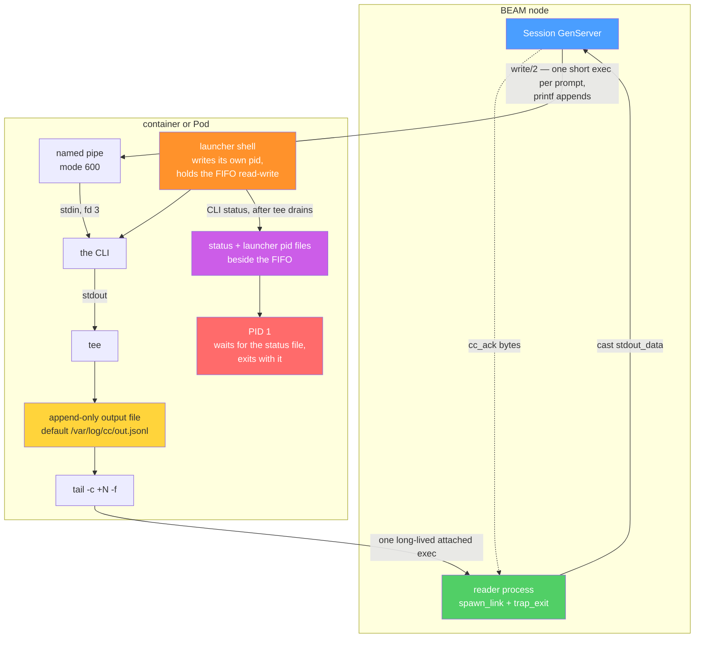
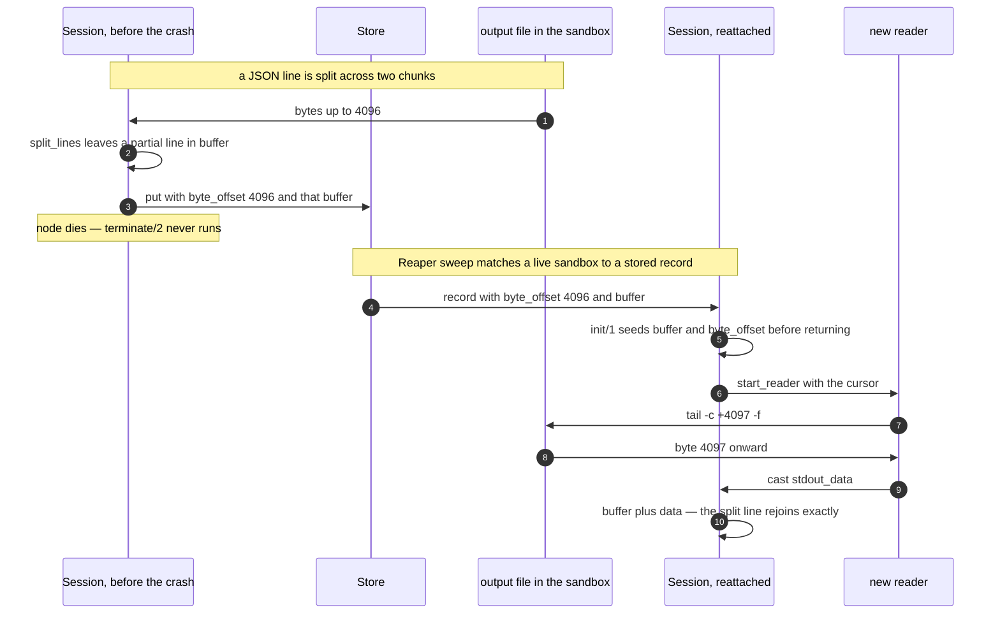
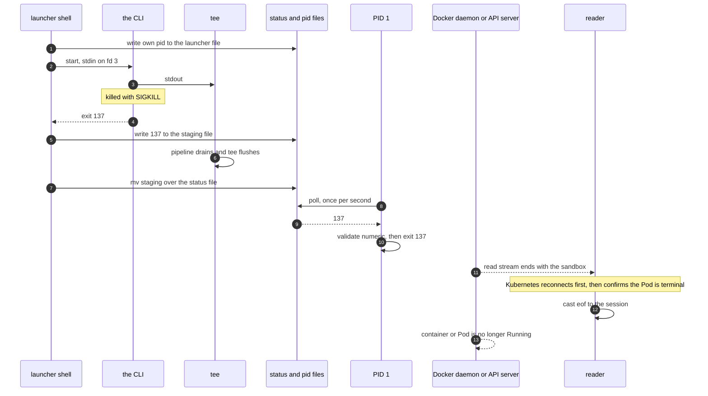
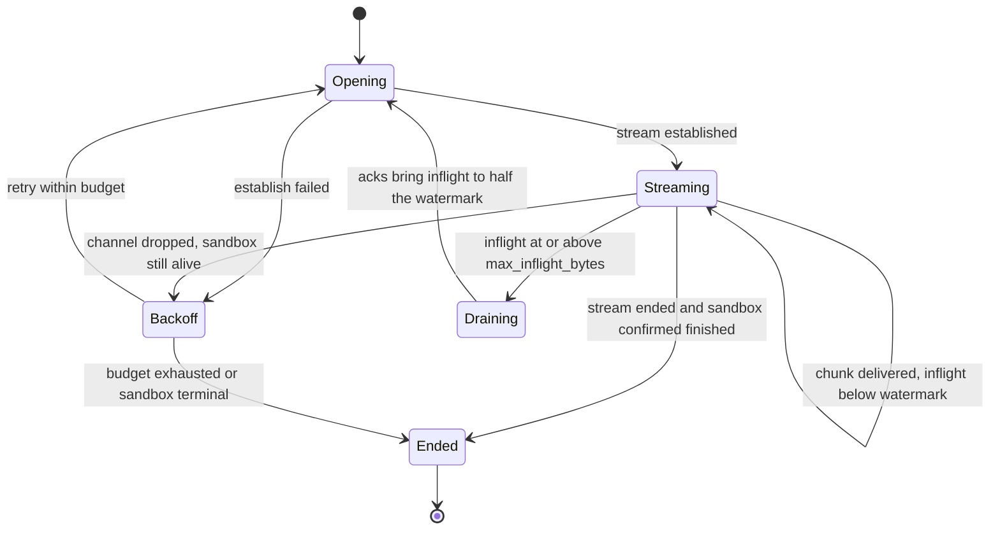

# Sandboxes

A sandbox is one disposable unit that holds one CLI for one session. Two transports reach into one:
the FIFO/`tee` pair used by `CrowdControl.Backend.Docker` and `CrowdControl.Backend.Kubernetes`, and
HTTP to an in-sandbox agent used by `CrowdControl.Backend.Sandboxd`. This document explains how each
one actually moves bytes, why resume is byte-exact, and which failure modes the odd-looking parts are
there to prevent.

Layer boundaries and the backend/provider distinction are in [architecture.md](architecture.md); what
each shipped provider does to *create* a sandbox is in [providers.md](providers.md), and running the
result is [operations.md](operations.md). Options, defaults and hardening flags are in
[README.md](../README.md). The threat model, the egress posture and what is and is not an isolation
boundary are in [SECURITY.md](../SECURITY.md) — this document does not restate them.

## Why a FIFO and a `tee` file at all

The obvious way to drive a container's stdin and stdout is a hijacked attach connection —
`POST /containers/{id}/attach` for Docker, a long-lived exec stream for Kubernetes. Both backends
avoid it, and the reason is a constraint rather than a preference: **stdin cannot be attached to a
detached exec.** The CLI has to be launched detached, because the session must survive the HTTP call
that started it and the `tee` file has to outlive any individual exec. A detached exec has nowhere to
put stdin.

So both directions go through the filesystem instead:

- **In:** a named pipe. `mkfifo -m 600` at provision time; every prompt is a short-lived exec that
  appends to it with `printf %s`.
- **Out:** the CLI's stdout is piped through `tee` to an append-only file. Reading is
  `tail -c +N -f` over that file. Under Docker that read comes back as a plain HTTP 200 with
  `Content-Type: application/vnd.docker.raw-stream` — something `Req` streams happily. No `101
  Upgrade`, no raw socket handling, no `Mint.WebSocket`.

The file is the part that makes resume possible. A stream is a stream; a file has offsets. Every byte
the CLI ever wrote stays addressable, so a reader that knows how many bytes it has consumed can ask
for the rest and get exactly the rest — after a reconnect, a backpressure pause, or a node restart.

The Kubernetes topology is the same picture with three substitutions: an `initContainer` runs the
`mkfifo`, the launch exec detaches with `setsid … </dev/null >/dev/null 2>&1 &` instead of Docker's
`Detach: true`, and reads ride a `Kubereq.PodExec` websocket instead of a raw-stream HTTP body.
Session-facing semantics are indistinguishable.

## Three shell details that are load-bearing

All three were established empirically, and each has a named failure mode.

### 1. The FIFO is held open read-write

The launch command opens the pipe as `exec 3<> <fifo>` and the CLI reads from `<&3`, not from a plain
`< <fifo>` redirect.

A read-only FIFO redirect sees EOF the moment the first writer detaches, and every prompt is a
separate short exec — so the first `printf` finishing *is* a writer detaching. With the plain form the
CLI therefore sees EOF on its stdin right after the first prompt, the pipeline collapses and takes the
container with it, and the second prompt of every session is lost. Both backends state the same
measurement: the plain form dies on the first prompt.

A read-write fd on a FIFO has no such semantics: as long as fd 3 is open in the launcher, there is
always a writer, so no detaching writer is ever observable as EOF.

### 2. `tail -c +N` is 1-indexed

The read command is `tail -c +<byte_offset + 1> -f <tee file>`. `tail -c +1` means "from the first
byte", not "skip one byte".

Getting that `+ 1` wrong duplicates a byte on every resume. The stream is newline-delimited JSON and
the session splits on `\n`, so a duplicated byte does not produce a slightly-wrong message — it
produces a line that does not parse. The adapter's `decode_line/1` returns `{:invalid_json, raw}`, the
session logs the first 200 characters at `:debug` and drops the line. One off-by-one silently loses a
message per resume, with nothing louder than a debug log to say so.

`CrowdControl.Backend.Sandboxd` does not inherit the hazard: the agent serves a 0-indexed byte offset
directly, because there is no shell in that path. `Sandboxd.Router`'s moduledoc says not to
reintroduce a 1-indexed cursor.

### 3. The output file is capped, never rotated

`:max_stream_bytes` destroys the sandbox when total output exceeds it. Rotating the file instead would
invalidate every persisted byte offset and silently corrupt resume — the exact failure the offset
cursor exists to prevent. `Sandboxd.Capture`'s moduledoc carries the same instruction for the agent's
capture file. A hard cap is the right answer for a bounded resource.

## Byte-exact resume

The cursor is `%{byte_offset: non_neg_integer(), buffer: binary()}`, and the split between its halves
is the whole mechanism:

- **`byte_offset` counts bytes already *delivered to the session*.** Not bytes the transport read, not
  bytes the file holds — bytes handed over. Every reader advances it only in the same expression that
  casts `{:stdout_data, _}`, so anything buffered mid-frame or dropped by a cancelled request is
  simply re-read next time.
- **`buffer` holds the partial line among those bytes.** A backend consumes only `byte_offset`;
  `Session` re-seeds `buffer` itself.

Both halves are updated in one clause of `Session.handle_cast({:stdout_data, _}, _)`, because resume
reads from the offset and prepends the buffer, and that only rejoins correctly if the two can never
disagree.

**Live streaming and resume are the same code path.** There is exactly one read implementation per
backend: `start_reader/3` (`Backend.Docker.do_read/3`, `Backend.Kubernetes.do_read/3`) opens
`tail -c +<offset + 1> -f` and nothing else varies. `reattach/2` does not read at all — it confirms
the sandbox is still there and still usable, and `Session` then calls `start_reader/3` with the
persisted cursor. A live start is the same call at offset 0. So there is no separate resume
implementation to keep correct, which is why an ordinary backpressure pause and a node restart use
the same machinery and neither is a special case.

The seeding step is where it is on purpose. `Session.init({:reattach, record})` puts `buffer` and
`byte_offset` into the state it *returns*, which is necessarily before any `{:stdout_data, _}` cast is
processed — a GenServer does not touch its mailbox until `init/1` has returned. The partial line is in
place before the first resumed byte arrives.

Subscribers are not restored: the pids in a record belong to a previous VM state and are meaningless.
Callers re-`subscribe/1`, and `subscribe/1` replays accumulated history, so nothing is lost by that.

## PID 1 relays the CLI's exit status

This is the most recently changed load-bearing part of both FIFO backends, and it is worth
understanding as a chain rather than as a feature.

PID 1 cannot *be* the CLI. The `tee` file has to outlive any individual exec, and `exec/4` runs after
the container is already up, so the CLI is started later — by a detached exec under Docker, by a
`setsid`-detached background pipeline under Kubernetes. Either way the CLI is a grandchild that PID 1
never spawned and cannot reap.

PID 1 used to be `sleep infinity`. Measured on a live daemon, and again on a live cluster, that
produced the following chain when the CLI was killed:

| observation | consequence |
|---|---|
| the container / Pod stayed `Running` | `alive?/1` answered `true` |
| no container status ever changed | `await_exit/2` answered `:timeout` forever |
| `tail -f` never ended | no `:eof` was ever cast to the session |
| nothing ever told the session the CLI was gone | the sandbox billed on |

So PID 1 now waits for a status file and exits with it, and the launcher shell produces that status.
`await_exit/2` reports **137** for a SIGKILLed CLI — 128 + SIGKILL, the CLI's own status rather than a
fiction — and **1** for a launcher that vanished before it could report.

Four ordering decisions in that diagram are the design:

**The launcher writes its own pid first, before the CLI exists.** That is what lets PID 1 tell "the
launcher has not started yet" from "the launcher is gone". An OOM kill of the process group, or a
`kill -9` on the pipeline, leaves a status that will never arrive; waiting on it forever would
reintroduce exactly the hang the fix removes, one level up. So PID 1's wait loop also checks
`/proc/<pid>` for the launcher and, if the pid file exists but the process does not, writes `1` and
stops. `/proc` rather than `kill -0` because it needs no signal permission and no opinion about which
builtins the image's `sh` shipped with.

**The status is checked before the launcher.** The launcher writes the status *before* exiting, so a
normal end is never misread as a vanished launcher.

**The CLI's status is captured, not the pipeline's.** The command is
`{ <cli> <&3; echo $? > <staging>; } | tee <file>`. `$?` after a bare pipeline is `tee`'s status,
which is `0` even when the CLI died, and POSIX `sh` has no `PIPESTATUS` to reach for. The braces
capture the CLI's own status inside the pipeline's left-hand side.

**The status is published only after `tee` drains.** The `echo` writes a `.partial` file and an
`mv -f` moves it into place, and the `mv` runs after the pipeline has finished. Writing the final path
directly would let PID 1 see the status, exit, and take the sandbox down while `tee` still held
buffered bytes — silently truncating the tail of the session's output. `mv` is atomic within a
filesystem, so PID 1 never observes a partial file either.

Finally, PID 1 validates the value before using it: a non-numeric status makes `sh` fail in a way that
reports the wrong thing, so an unreadable status becomes `1` — "something went wrong", which is the
honest answer. Inventing a specific code would be a lie, which is why a vanished launcher reports `1`
and not `137`.

Both paths have live tests: `test/crowd_control/backend/docker_test.exs` and
`kubernetes_test.exs` assert `{:ok, 137}` for the killed CLI and `{:ok, 1}` for the killed launcher.

## `exec/4` runs at most once

`tee` opens its output file with `O_TRUNC`. A second `exec/4` therefore truncates it silently, after
which `tail -c +N` restarts from a new byte 0 and **every persisted cursor points at the wrong
place** — no error, just a session replaying or skipping output. All three remote backends refuse:

| backend | how it refuses | error |
|---|---|---|
| `Backend.Docker` | one extra attached exec probes the container for the launcher or status file | `{:docker, :already_started}` |
| `Backend.Kubernetes` | the guard rides on the env-file write and exits `99` | `{:k8s, :already_started}` |
| `Backend.Sandboxd` | the agent answers `409` — one exec per sandbox lifetime | `{:sandboxd, :already_executed}` |

Two details in the refusals are deliberate:

**Docker asks the container, not the handle.** A handle rebuilt by `list_live/1` on another node knows
nothing about a previous exec; the launcher and status files are the only durable record. That costs
one extra round trip, once per session, on a path that has just made several — and unlike Kubernetes
it cannot ride along inside the launch command, because that exec is detached and its exit code is
never observable. The probe fails **closed**: an unanswerable probe refuses the exec, because refusing
wrongly is a clear error on a retryable path while allowing wrongly corrupts every persisted cursor
with no error at all.

**Kubernetes checks before writing.** The guard is the first thing in `env_write_command/2`, ahead of
the `head -c` that receives the credentials, because only the launcher unlinks the env file — a
refused launch that had already written it would leave the secret sitting in the sandbox. Exit code
`99` is out of the way of anything `head` or `sh` produces by itself, so it is unambiguous evidence of
the guard rather than of a failed write.

## Backpressure

`net_runner`'s NIF read gives free backpressure. Nothing else in the stack does: `Req`'s `into: :self`
and a `PodExec` socket both pile chunks into the reader's mailbox whether or not the session keeps up.
Neither has a pause primitive.

But every one of these reads is *resumable by construction* — it is an offset into a file — so
"pause" is implemented as **stop reading**, and "resume" as **re-request from the offset already
delivered**. Nothing is lost or duplicated because the offset is exact.

The session closes the loop: after processing a chunk it sends `{:cc_ack, byte_size(data)}` to the
reader, which decrements `inflight`. Backends whose reader never pauses — `Local` — simply ignore it.
Resume happens at *half* the watermark rather than at zero, so a busy session does not thrash between
cancel and re-open on every chunk.

`:max_inflight_bytes` defaults to 4 MiB in all three remote backends. What differs is the mechanism
and what each does when the stream ends:

| | pause | resume | stream ends |
|---|---|---|---|
| `Backend.Docker` | `Req.cancel_async_response/1` | re-issue `tail -c +offset+1 -f` in a new exec | `:done` casts `:eof` — the read exec ends with the container |
| `Backend.Kubernetes` | `API.close_exec/1` on the exec channel | open a fresh exec from the offset | a close is a *channel* failure, so it reconnects |
| `Backend.Sandboxd` | `Req.cancel_async_response/1` | re-request `GET /v1/stream?offset=N` | asks `GET /v1/status` before believing it |

### Why Kubernetes reconnects where Docker ends the session

`tail -f` never ends while the Pod lives, so a websocket close frame means the channel dropped, not
the stream. Casting `:eof` there would end a live session over a blip. Resume is free by construction,
so the reader reconnects instead, with jittered backoff whose ceiling is
`min(100 * 2^(attempt-1), 2_000)` ms. `:eof` is cast only when the Pod is confirmed not `Running`, or
after five consecutive failures to *establish* a stream.

"Consecutive failures to establish" is a correction of something that used to be measured differently
and made idle sessions guaranteed to die. Counting reconnects *since the last delivered byte* looks
equivalent until you notice that an idle session legitimately emits nothing for hours, while a CRI
streaming server closes an idle exec stream every 4 h and a load balancer may do it every 60 s. Any
five such closes with no output in between — however far apart — exhausted the budget and ended a
healthy session. A stream that stayed open for at least 30 s now counts as progress and clears the
count.

Three more Kubernetes-specific corrections in the same reader are worth knowing because they are all
the same shape — never infer "gone" from "did not answer":

- `alive?/1` returns a boolean, which cannot distinguish "the Pod is gone" from "the API server did
  not answer". `liveness/1` is tri-state (`:running | :terminal | :unknown`) and only `:terminal`
  justifies EOF; `:unknown` means ask again. Collapsing `{:error, _}` to `false` meant one 429, 500 or
  DNS blip ended a live session and orphaned a billed Pod — while `await_exit/2` already failed *open*
  on the same error, so the boolean was the inconsistent one.
- Liveness answers are memoized for 1 s, which collapses a reconnect burst — the first four backoffs
  total 700 ms, so one blip asks the API server once instead of five times. Steady-state volume is
  unchanged and is one `GET /pods/{name}` per session per `:pod_poll_ms` (60 s by default), roughly
  `sessions / 60` requests per second: about 5 QPS at 300 concurrent sessions. If that ever becomes
  the constraint, the answer is a watch, not a cache.
- The drain wait is a monitor on the session, not a wall clock. The previous 60 s timeout was a silent
  truncation of a healthy session: at that moment the Pod is `Running`, the CLI is running, the file is
  still growing, and nothing is reading it — yet the session was told the stream had *ended*. A
  consumer that stalled for 61 s, a blocked LiveView or a long GC pause, lost the remainder of its
  output with no way to know. `Backend.Docker`'s drain still gives up after 60 s without an ack;
  `Backend.Sandboxd`'s waits indefinitely and relies on the link to the session.

### Two smaller reader invariants

**Docker must drop demux state on reconnect, and must keep the offset.** Docker frames stdout with an
8-byte header per frame (`stream_type`, then a 32-bit big-endian length); those frames are
per-connection, but `offset` is a position in the *file*. If a backpressure cancel landed mid-frame,
the leftover header bytes belong to a connection that no longer exists — carrying them forward
prepends them to the new connection's first frame and desyncs the parser permanently. The payload they
described was never delivered, since `offset` only advances on delivery, so re-reading from `offset`
re-sends it in fresh frames. `Backend.Docker.attach_stream/2` is exposed doc-false so that invariant
is testable without a live daemon and a precisely-timed mid-frame cancellation. Kubernetes has the
complement: kubereq owns channel framing, so there is no demux state, and the thing that must survive
the swap is the offset.

**Every reader traps exits, and that is correctness rather than hygiene.** `Req`'s `into: :self`
machinery and `Kubereq.PodExec` both link a worker to the reader process. Without trapping, an
abnormal worker exit kills the reader before it can cast `:eof`, and `Session` never monitors its
reader — so the session dies with no end-of-stream at all, which is the exact hazard the reader
contract exists to prevent. The second-order consequence has to be handled explicitly: a trapping
reader no longer dies with the session it is linked to, so every reader stops on the session's own
exit, and a session going away produces no `:eof` because there is nobody left to tell.

Stderr never mixes into the session's stdout — Docker demuxes it away and `AttachStderr` is `false`,
Kubernetes keeps channel 2 out of `{:stdout_data, _}`. It is not discarded, though: Kubernetes keeps
the last trimmed stderr line and the channel-3 exec `Status` separately, because that line is the only
thing that explains a failing read. Measured against a live cluster, a missing tee file with stderr
off produces only an opaque "command terminated with non-zero exit code"; with it on, the same failure
also delivers `tail: can't open '/var/log/cc/out.jsonl': No such file or directory`.

## The second transport: an agent inside the sandbox

`CrowdControl.Backend.Sandboxd` speaks HTTP/1.1 to an OTP release (`sandboxd`) running inside the
sandbox, authenticated with a bearer token. Seven routes:

| Method | Path | Notes |
|---|---|---|
| `GET` | `/v1/health` | readiness; the only unauthenticated route, and it returns nothing but `{"ok": true}` |
| `POST` | `/v1/exec` | `{executable, args, env}`; one exec per sandbox lifetime, second call is `409` |
| `POST` | `/v1/stdin` | `{data: base64}`, so arbitrary bytes survive JSON |
| `GET` | `/v1/stream` | `?offset=N`, chunked bytes from a 0-indexed offset |
| `GET` | `/v1/status` | `{alive, exit_status, bytes, started}`, long-pollable with `?wait_ms=N` |
| `PUT` | `/v1/files/*path` | raw bytes at a given mode, inside the sandbox |
| `POST` | `/v1/shutdown` | kills the CLI; destroying the *sandbox* is the provider's job |

The transport stops being per-substrate, and that is the entire point: `Backend.Docker` knows both how
to create a container and how to move bytes; `Backend.Kubernetes` had to reimplement the second half
for Pods; a VM has no exec API at all. With one agent, a new substrate is
`CrowdControl.Provider` code and nothing else.

`Sandboxd.Capture` writes byte-for-byte the same artifact as the `tee` file, which is why the cursor
type did not change. Two differences follow from having no shell in the path: offsets are 0-indexed,
and readers are *notified* by the writer rather than polling. The polling alternative was measured —
at a 25 ms interval it costs a mean ~12 ms of added latency per line, and an agent streaming a few
hundred lines pays seconds of pure jitter — while `:file_monitor` is not in OTP and the agent release
keeps its dependency list deliberately short. Every byte is written by `Capture.append/1`, so
waiters are woken in the same call that writes them: zero added latency, no timer, no extra
dependency. The file remains the source of truth for bytes; only liveness is in memory.

Two protocol details exist because a stream ending is ambiguous:

- **`/v1/stream` also ends when nothing new arrived within the agent's idle window** (25 s), not only
  when the CLI is finished. Those cannot be distinguished in-band without injecting a keepalive byte
  into a stream whose offsets are load-bearing, so the reader asks `GET /v1/status`: still alive, or
  more bytes than it has consumed, means re-request from the current offset. Only `alive: false` with
  `bytes <= offset` is EOF.
- **The client's `:receive_timeout` is the silent-sandbox watchdog.** It is the only thing that turns
  "container is up, agent answers nothing, ever" into an `:eof` — nothing else notices, because the
  connection stays open and no bytes are owed. It is 40 s, deliberately longer than the agent's own
  25 s idle window, so an ordinary interactive pause produces a clean `:done` and a re-request rather
  than looking like a dead sandbox.

`Capture.finalize/0` is what distinguishes "EOF, wait for more" from "EOF, that is all there will ever
be", which is what lets `/v1/stream` terminate a chunked response instead of hanging forever on a
finished process. It is also what wakes `await_exit/2`'s long poll, so that call parks rather than
spins and still returns promptly.

### The honest comparison

Neither transport is deprecated and neither is strictly better.

| | FIFO/`tee` — `Backend.Docker`, `Backend.Kubernetes` | agent — `Backend.Sandboxd` + a `Provider` |
|---|---|---|
| image requirement | the CLI plus a POSIX shell and the usual utilities. `Backend.Kubernetes` documents it as `sh`, `tail`, `tee` and `head`; busybox and coreutils both suffice | the CLI **plus the `sandboxd` release** |
| a new substrate costs | a new transport. A VM has no exec API, so there is nothing to reimplement it with | provisioning code only |
| offsets | `tail -c +N`, 1-indexed, `+ 1` documented as a hazard | 0-indexed, hazard absent |
| how secrets reach the CLI | Docker: the exec API's first-class `Env` array. Kubernetes: a `0600` file written over the exec stdin channel, sourced and unlinked before the CLI starts, because `pods/exec` has no `env` parameter at all | a JSON request body, never argv, never a query string |
| shell exposure | prompts and argv cross an `sh -c` boundary and are escaped with `Backend.Shell.escape/1` | no shell in the byte path |
| exit status | relayed by PID 1 through a status file | reported directly by the agent |

Both paths keep secrets out of the sandbox's own `ps` — which matters because `ps` works inside the
sandbox and the code running there is model-driven and untrusted. Docker uses the exec API's `Env`
array rather than interpolating `export KEY=…` into the command string, which would put every secret
in the shell's argv, readable inside the container and retrievable afterwards from
`GET /exec/{id}/json`; `docker_test.exs` greps the container's own `ps` output to keep that honest.
Kubernetes cannot use that mechanism, because the exec API has no `env` parameter and both obvious
replacements are worse than the problem — `env` in the Pod spec puts the key in etcd, readable by
anyone with `get pods` and printed by `kubectl describe`, and a `Secret` plus `envFrom` has the same
etcd residency plus `secrets` RBAC plus a second object left behind on a crash. So the env arrives as
a file at `umask 077` over the exec stdin channel, and the launch command sources *and unlinks* it
before the CLI starts.

One detail of that channel is worth repeating because it was a real silent failure: the receiving
command is `head -c <n>`, not `cat`. `cat` ends only on stdin EOF, and the only way to signal EOF is
to close the websocket — which makes the API server tear the exec down *before* it writes the
channel-3 status, so a write that failed reported success and the CLI started with no credentials.
Reading exactly the payload makes the command self-terminating, so the status arrives on its own.

## Where to go next

- [architecture.md](architecture.md) — the four layers, what each is forbidden to know, the
  supervision tree, and the reaper's reconciliation table.
- [providers.md](providers.md) — how each provider acquires the sandbox this document reads bytes out
  of.
- [operations.md](operations.md) — configuring the store and the reaper, and what to watch.
- [SECURITY.md](../SECURITY.md) — the threat model, the hardening posture, egress, and what is and is
  not an isolation boundary.
- [README.md](../README.md) — every option, default and hardening flag, per backend and per provider.
